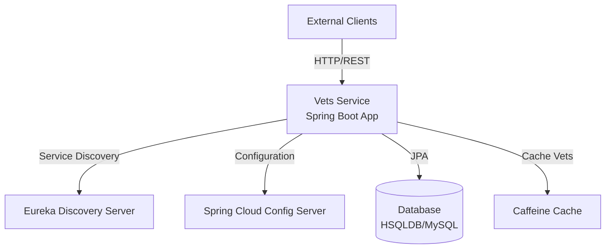
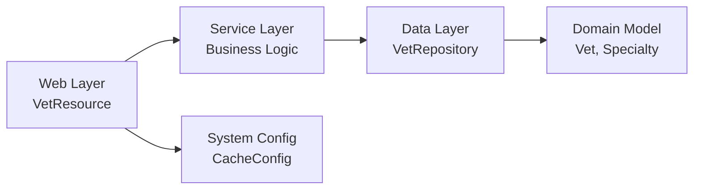

# Application Architecture Diagram

## Overview

| Property | Value |
|----------|-------|
| **Application Name** | Spring PetClinic Vets Service |
| **Type** | Microservice |
| **Framework** | Spring Boot 3.4.1 |
| **Java Version** | 17 |
| **Build Tool** | Maven |
| **Packaging** | JAR |
| **Primary Language** | Java |

## Application Architecture

### High-Level Architecture

### Component Architecture

## Code Structure

### Components

| Component | Type | Description | Location |
|-----------|------|-------------|----------|
| VetsServiceApplication | Main Class | Spring Boot application entry point with discovery client | src/main/java/.../VetsServiceApplication.java |
| VetResource | REST Controller | REST API endpoint for veterinarian operations | src/main/java/.../web/VetResource.java |
| VetRepository | Repository | JPA repository for Vet entity data access | src/main/java/.../model/VetRepository.java |
| Vet | Entity | Domain model representing a veterinarian | src/main/java/.../model/Vet.java |
| Specialty | Entity | Domain model representing vet specialties | src/main/java/.../model/Specialty.java |
| CacheConfig | Configuration | Caffeine cache configuration for vets | src/main/java/.../system/CacheConfig.java |
| VetsProperties | Configuration | Application properties configuration | src/main/java/.../system/VetsProperties.java |

### Folder Structure

| Folder | Purpose | Key Files |
|--------|---------|-----------|
| src/main/java/.../model | Domain models and repositories | Vet.java, Specialty.java, VetRepository.java |
| src/main/java/.../web | REST controllers and web resources | VetResource.java |
| src/main/java/.../system | System configuration and properties | CacheConfig.java, VetsProperties.java |
| src/main/resources | Application configuration and SQL scripts | application.yml, schema.sql, data.sql |
| src/main/resources/db/hsqldb | HSQLDB database scripts | schema.sql, data.sql |
| src/main/resources/db/mysql | MySQL database scripts | schema.sql, data.sql |
| src/test/java | Unit and integration tests | VetResourceTest.java |

## Technology Stack

| Technology | Version | Purpose | Category |
|------------|---------|---------|----------|
| Spring Boot | 3.4.1 | Application framework | Framework |
| Spring Cloud | 2024.0.0 | Microservices patterns | Framework |
| Spring Cloud Config | 2024.0.0 | Centralized configuration | Configuration |
| Spring Cloud Netflix Eureka | 2024.0.0 | Service discovery | Service Registry |
| Spring Data JPA | 3.4.1 | Data access layer | Persistence |
| Spring Web | 3.4.1 | REST API development | Web |
| Spring Boot Actuator | 3.4.1 | Monitoring and management | Operations |
| Spring Cache | 3.4.1 | Caching abstraction | Performance |
| Azure Spring Cloud JDBC | 5.20.1 | Azure MySQL connectivity | Cloud Integration |
| Caffeine | Latest | In-memory caching | Cache |
| HSQLDB | Latest | Embedded database (dev) | Database |
| MySQL Connector | Latest | MySQL database driver | Database |
| Lombok | Latest | Code generation | Development |
| JUnit Jupiter | Latest | Testing framework | Testing |
| Micrometer Prometheus | Latest | Metrics collection | Monitoring |
| Chaos Monkey | 3.1.0 | Chaos engineering | Resilience |
| Jolokia | 1.7.1 | JMX over HTTP | Monitoring |

## Assessment Summary

Based on the AppCAT analysis, the following findings were identified:

### Total Issues: 7
- **Mandatory Issues**: 6
- **Optional Issues**: 4
- **Potential Issues**: 1

### Issue Categories
- **Embedded Cache Management**: 3 incidents (Caffeine cache usage needs migration to distributed cache for cloud)
- **Remote Communication**: 4 incidents (Service discovery and config server considerations)
- **Spring Migration**: 2 incidents (Spring Cloud Config and Eureka migration to Azure)
- **Framework Upgrade**: 1 incident (Jakarta EE version consideration)
- **Containerization**: 1 incident (Container readiness)

### Azure Migration Targets
The application has been assessed for migration to:
- Azure Kubernetes Service (AKS)
- Azure App Service
- Azure Container Apps

### Key Recommendations
1. **Cache Migration**: Replace Caffeine in-memory cache with Azure Cache for Redis for distributed caching
2. **Service Discovery**: Consider migrating from Eureka to Azure Service Discovery or Kubernetes DNS
3. **Configuration**: Migrate Spring Cloud Config to Azure App Configuration
4. **Database**: Use Azure Database for MySQL instead of embedded HSQLDB in production
5. **Monitoring**: Leverage Azure Application Insights for comprehensive monitoring

### Estimated Migration Effort
Total Story Points: **35**
