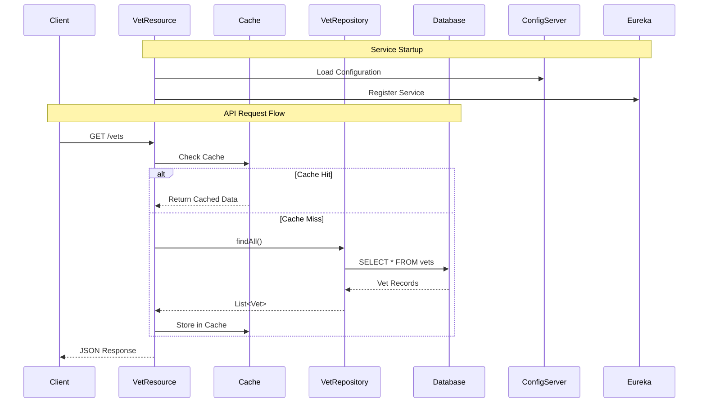

# Spring PetClinic Vets Service - Architecture Diagram

## Overview

| Property | Value |
|----------|-------|
| **Application Name** | vets-service |
| **Application Type** | Spring Boot Microservice |
| **Framework** | Spring Boot 3.4.1 |
| **Java Version** | 17 |
| **Build Tool** | Maven |
| **Packaging** | JAR |
| **Port** | 8081 |

## Application Architecture

### High-Level Architecture

```mermaid
graph TB
    subgraph "External Services"
        ConfigServer[Config Server<br/>Port 8888]
        EurekaServer[Eureka Discovery<br/>Service Registry]
    end
    
    subgraph "Vets Service"
        subgraph "Presentation Layer"
            REST[REST Controller<br/>VetResource<br/>/vets endpoint]
        end
        
        subgraph "Business Layer"
            Cache[Caffeine Cache<br/>vets cache]
        end
        
        subgraph "Data Access Layer"
            Repo[VetRepository<br/>JPA Repository]
            Entity[Domain Model<br/>Vet, Specialty]
        end
    end
    
    subgraph "Data Storage"
        DB[(Database<br/>MySQL/HSQLDB)]
    end
    
    subgraph "Monitoring & Observability"
        Actuator[Spring Actuator<br/>Health & Metrics]
        Prometheus[Prometheus<br/>Metrics Registry]
        Jolokia[Jolokia<br/>JMX Monitoring]
    end
    
    Client[API Client] -->|HTTP GET /vets| REST
    REST -->|@Cacheable| Cache
    Cache -->|Cache Miss| Repo
    Repo -->|JPA/Hibernate| Entity
    Entity -->|JDBC| DB
    
    REST -->|Service Discovery| EurekaServer
    REST -->|Configuration| ConfigServer
    
    REST -->|Expose Metrics| Actuator
    Actuator --> Prometheus
    Actuator --> Jolokia
    
    style REST fill:#90EE90
    style Cache fill:#FFE4B5
    style Repo fill:#87CEEB
    style DB fill:#DDA0DD
    style ConfigServer fill:#F0E68C
    style EurekaServer fill:#F0E68C
```

### Component Interactions



## Code Structure

### Package Organization

| Package | Purpose | Key Components |
|---------|---------|----------------|
| `org.springframework.samples.petclinic.vets` | Root package | VetsServiceApplication (main class) |
| `org.springframework.samples.petclinic.vets.web` | REST API layer | VetResource (REST controller) |
| `org.springframework.samples.petclinic.vets.model` | Domain model & data access | Vet, Specialty, VetRepository |
| `org.springframework.samples.petclinic.vets.system` | System configuration | CacheConfig, VetsProperties |

### Folder Structure

| Directory | Contents |
|-----------|----------|
| `/src/main/java` | Application source code |
| `/src/main/resources` | Configuration files (application.yml) |
| `/src/test/java` | Unit and integration tests |
| `/src/test/resources` | Test configuration files |
| `/pom.xml` | Maven build configuration |

## Technology Stack

### Core Frameworks & Libraries

| Technology | Version | Purpose |
|------------|---------|---------|
| **Spring Boot** | 3.4.1 | Application framework |
| **Spring Cloud** | 2024.0.0 | Microservices infrastructure |
| **Spring Data JPA** | (from Spring Boot) | Data access layer |
| **Spring Cache** | (from Spring Boot) | Caching abstraction |
| **Spring Actuator** | (from Spring Boot) | Health checks & metrics |

### Cloud & Microservices

| Technology | Purpose |
|------------|---------|
| **Spring Cloud Config** | Externalized configuration |
| **Netflix Eureka Client** | Service discovery & registration |
| **Azure Spring Cloud JDBC** | Azure MySQL integration |

### Data & Caching

| Technology | Version | Purpose |
|------------|---------|---------|
| **MySQL Connector** | Runtime | Production database driver |
| **HSQLDB** | Runtime | Development/testing database |
| **Caffeine Cache** | (managed) | High-performance in-memory cache |
| **Jakarta Persistence (JPA)** | 3.x | ORM specification |

### Monitoring & Observability

| Technology | Version | Purpose |
|------------|---------|---------|
| **Micrometer Prometheus** | (managed) | Metrics collection |
| **Jolokia** | 1.7.1 | JMX monitoring over HTTP |
| **Spring Boot Actuator** | 3.4.1 | Application health & info endpoints |

### Development Tools

| Technology | Version | Purpose |
|------------|---------|---------|
| **Lombok** | (managed) | Reduce boilerplate code |
| **JUnit Jupiter** | (managed) | Unit testing framework |
| **Chaos Monkey** | 3.1.0 | Resilience testing |

### Build & Deployment

| Technology | Version | Purpose |
|------------|---------|---------|
| **Maven** | (pom.xml) | Build automation |
| **Docker Maven Plugin** | 1.2.0 | Container image creation |

## Key Architectural Patterns

1. **Microservice Architecture**: Service is part of a larger microservices ecosystem
2. **Service Registry Pattern**: Uses Eureka for service discovery
3. **Externalized Configuration**: Configuration managed by Spring Cloud Config Server
4. **Repository Pattern**: JPA repositories for data access
5. **Cache-Aside Pattern**: Caffeine cache with `@Cacheable` annotation
6. **RESTful API**: Exposes veterinarian data via REST endpoints

## Database Schema

The service manages two main entities:

- **vets**: Stores veterinarian information (id, first_name, last_name)
- **specialties**: Stores veterinary specialties
- **vet_specialties**: Join table for many-to-many relationship

## API Endpoints

| Endpoint | Method | Description | Caching |
|----------|--------|-------------|---------|
| `/vets` | GET | Get all veterinarians | Yes (vets cache) |

## Azure Migration Considerations

Based on the assessment, key areas for Azure migration:

1. **Service Discovery**: Replace Eureka with Azure Service Discovery or use Azure Container Apps' built-in service discovery
2. **Configuration Management**: Migrate to Azure App Configuration
3. **Database**: Migrate to Azure Database for MySQL
4. **Caching**: Consider Azure Cache for Redis
5. **Monitoring**: Integrate with Azure Application Insights
6. **Deployment**: Target platforms - Azure Kubernetes Service (AKS), Azure App Service, or Azure Container Apps
