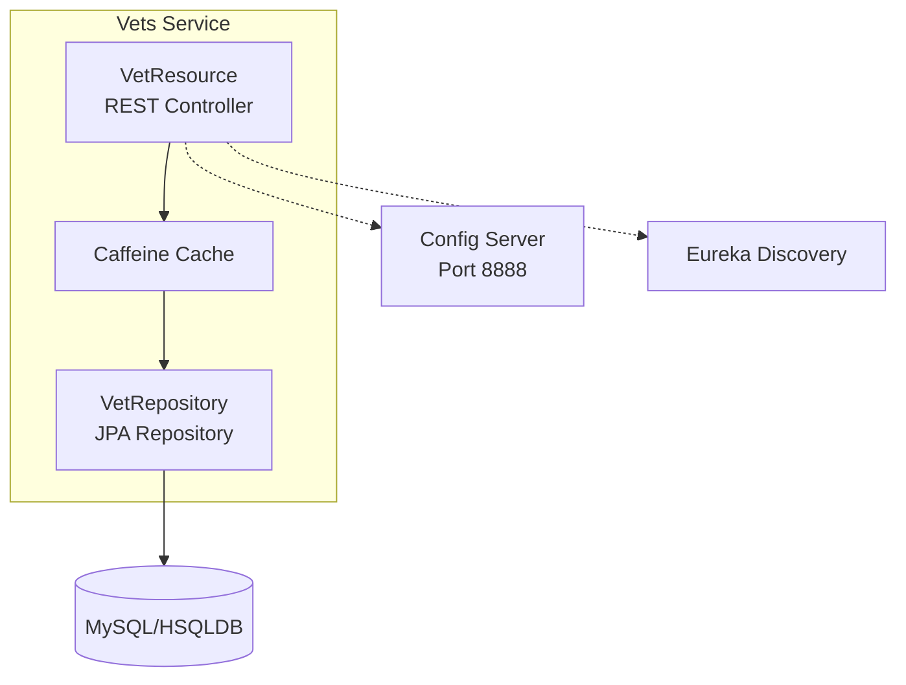
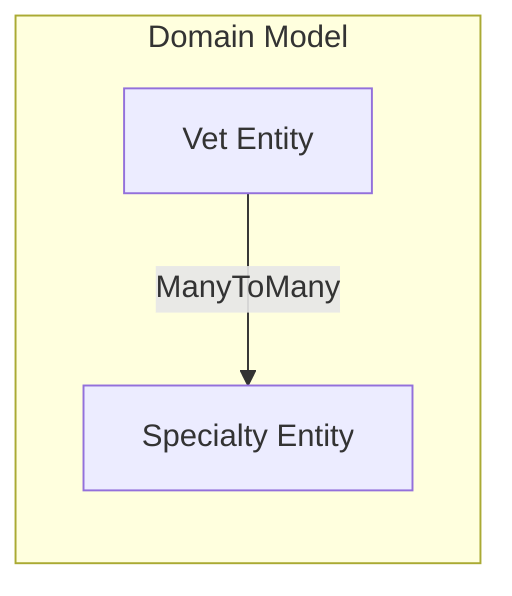

# Spring PetClinic Vets Service

| Property | Value |
|----------|-------|
| Type | Spring Boot Microservice |
| Framework | Spring Boot 3.4.1 |
| Java Version | 17 |
| Database | MySQL / HSQLDB |
| ORM | Spring Data JPA |
| Service Discovery | Netflix Eureka |
| Configuration | Spring Cloud Config |

## Application Architecture

<!-- DIAGRAM:architecture -->

<!-- DIAGRAM:architecture -->

## Code Structure

| Component | Location | Responsibility |
|-----------|----------|----------------|
| VetsServiceApplication | VetsServiceApplication.java | Main application entry point |
| VetResource | web/VetResource.java | REST API controller for vet endpoints |
| VetRepository | model/VetRepository.java | JPA repository for vet data access |
| Vet | model/Vet.java | Vet entity with specialties |
| Specialty | model/Specialty.java | Specialty entity |
| CacheConfig | system/CacheConfig.java | Cache configuration |
| VetsProperties | system/VetsProperties.java | Application properties |

| Folder | Purpose |
|--------|---------|
| web/ | REST controllers and API endpoints |
| model/ | Domain entities and repositories |
| system/ | Configuration and system components |

## Technology Stack

| Category | Technologies |
|----------|--------------|
| Runtime | Java 17 |
| Framework | Spring Boot 3.4.1 |
| Web | Spring Web (REST) |
| Data Access | Spring Data JPA |
| Database | MySQL (production), HSQLDB (development) |
| Caching | Caffeine Cache |
| Service Discovery | Spring Cloud Netflix Eureka |
| Configuration | Spring Cloud Config |
| Monitoring | Spring Boot Actuator, Micrometer Prometheus |
| Resilience | Chaos Monkey for Spring Boot |
| Azure Integration | Spring Cloud Azure JDBC MySQL |
| Build Tool | Maven |
