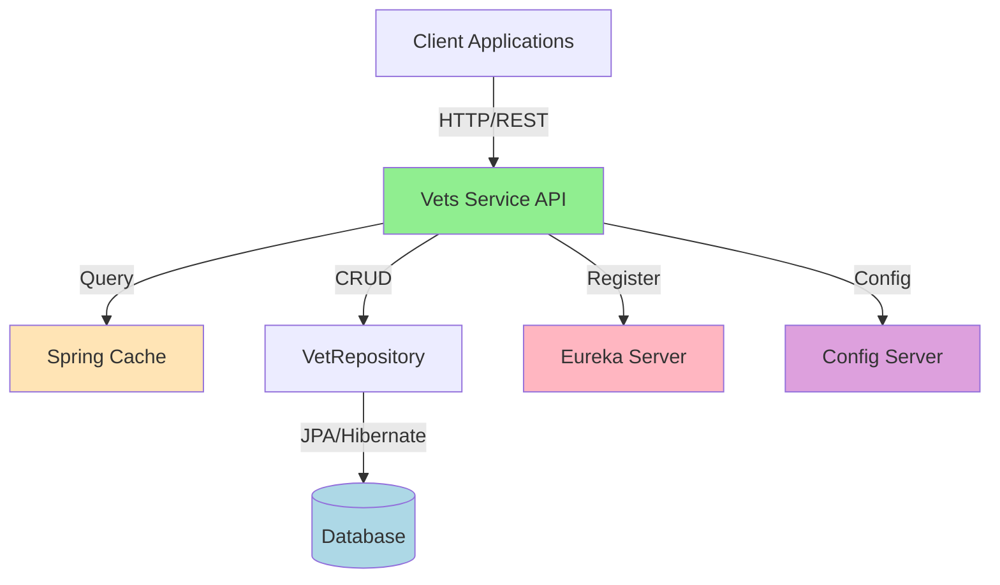
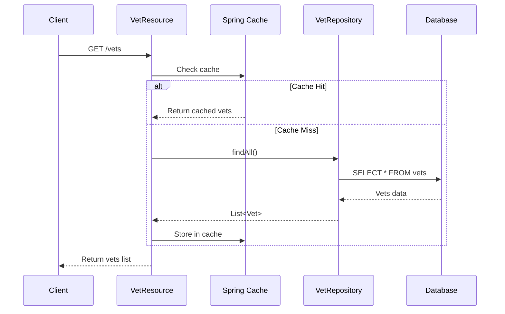

# Application Architecture Diagram

## Overview

| Property | Value |
|----------|-------|
| Application Name | Spring PetClinic Vets Service |
| Type | Microservice |
| Primary Language | Java 17 |
| Build Tool | Maven |
| Framework | Spring Boot 3.4.1 |
| Packaging | JAR |
| Port | 8081 |

## Application Architecture

### Component Flow

## Code Structure

### Components

| Component | Type | Responsibilities |
|-----------|------|------------------|
| VetsServiceApplication | Application Entry | Main Spring Boot application class with service discovery |
| VetResource | REST Controller | Exposes REST API endpoints for veterinarian data |
| Vet | Entity | Domain model representing a veterinarian |
| Specialty | Entity | Domain model representing a veterinary specialty |
| VetRepository | Data Access | JPA repository for veterinarian CRUD operations |
| CacheConfig | Configuration | Configures Spring caching with Caffeine |
| VetsProperties | Configuration | Application-specific configuration properties |

### Folder Structure

| Path | Purpose |
|------|---------|
| `/src/main/java/.../vets` | Root package for vets service |
| `/src/main/java/.../vets/model` | Domain entities and repositories |
| `/src/main/java/.../vets/web` | REST controllers and web layer |
| `/src/main/java/.../vets/system` | System configuration and properties |
| `/src/main/resources` | Configuration files and resources |
| `/src/main/resources/db` | Database initialization scripts |
| `/src/test/java` | Test classes |

## Technology Stack

| Category | Technology | Version | Purpose |
|----------|-----------|---------|---------|
| Language | Java | 17 | Core programming language |
| Framework | Spring Boot | 3.4.1 | Application framework |
| Framework | Spring Cloud | 2024.0.0 | Microservices framework |
| Web | Spring Web | 3.4.1 | REST API development |
| Data Access | Spring Data JPA | 3.4.1 | Database ORM |
| Database | HSQLDB | runtime | In-memory database (development) |
| Database | MySQL | runtime | Production database |
| Database | Azure MySQL JDBC | 5.20.1 | Azure MySQL integration |
| Caching | Spring Cache | 3.4.1 | Caching abstraction |
| Caching | Caffeine | (managed) | Cache implementation |
| Service Discovery | Eureka Client | (managed) | Service registration and discovery |
| Configuration | Spring Cloud Config | (managed) | Centralized configuration |
| Monitoring | Spring Actuator | 3.4.1 | Health checks and metrics |
| Monitoring | Micrometer Prometheus | (managed) | Metrics collection |
| Monitoring | Jolokia | 1.7.1 | JMX over HTTP |
| Resilience | Chaos Monkey | 3.1.0 | Chaos engineering |
| Build | Maven | 4.0.0 | Build and dependency management |
| Utilities | Lombok | (provided) | Boilerplate code reduction |
| Validation | Jakarta Validation | (managed) | Bean validation |
| XML Binding | Jakarta XML Bind | (managed) | XML serialization |
| Testing | JUnit Jupiter | (test) | Unit testing framework |
| Testing | Spring Boot Test | (test) | Integration testing |

## Key Features

### Service Discovery
- Integrated with Netflix Eureka for service registration
- Enables dynamic service discovery in microservices architecture

### Caching
- Spring Cache abstraction with Caffeine implementation
- Caches veterinarian list to reduce database queries
- Configured cache named "vets"

### Configuration Management
- Spring Cloud Config client for centralized configuration
- Supports multiple profiles (production, docker)
- Configurable config server URL

### Data Persistence
- JPA/Hibernate for object-relational mapping
- Supports both HSQLDB (development) and MySQL (production)
- Azure MySQL integration for cloud deployment

### RESTful API
- Single endpoint: `GET /vets` - Returns list of all veterinarians
- Returns veterinarians with their specialties
- Cached responses for improved performance

### Monitoring and Observability
- Spring Actuator for health checks and metrics
- Prometheus metrics export
- Jolokia for JMX monitoring over HTTP

## Architecture Characteristics

### Microservice Pattern
This service follows the microservices architecture pattern:
- **Single Responsibility**: Manages only veterinarian-related data
- **Independent Deployment**: Can be deployed and scaled independently
- **Service Discovery**: Registers with Eureka for dynamic discovery
- **Centralized Configuration**: Uses Config Server for externalized configuration

### Cloud-Ready Features
- Configurable external dependencies (database, config server, eureka)
- Actuator endpoints for health monitoring
- Prometheus metrics for observability
- Profile-based configuration (production, docker)

### Data Access Pattern
- Repository pattern using Spring Data JPA
- Entity relationships (Vet has many Specialties)
- Eager loading of specialties for performance

## Migration Considerations (from AppCAT Assessment)

### Issues Identified
1. **No Dockerfile** - Containerization needed for Azure deployment
2. **Embedded Cache** - Consider migrating to Azure Cache for Redis
3. **Hardcoded URLs** - Config server and Eureka URLs should be externalized
4. **Unsecured Protocols** - HTTP URLs should be replaced with HTTPS
5. **Spring Cloud Config** - Consider migrating to Azure App Configuration
6. **Eureka Client** - Azure Container Apps provides managed Eureka
7. **Jakarta EE Version** - Not using latest stable version

### Recommended Azure Services
- **Compute**: Azure Container Apps, Azure Kubernetes Service, or Azure App Service
- **Database**: Azure Database for MySQL
- **Caching**: Azure Cache for Redis
- **Configuration**: Azure App Configuration
- **Service Discovery**: Managed Eureka (Container Apps) or Azure Service Discovery
- **Monitoring**: Azure Monitor, Application Insights

### Effort Estimate
- Total Story Points: **35**
- Mandatory Issues: 6
- Optional Issues: 4
- Potential Issues: 1
