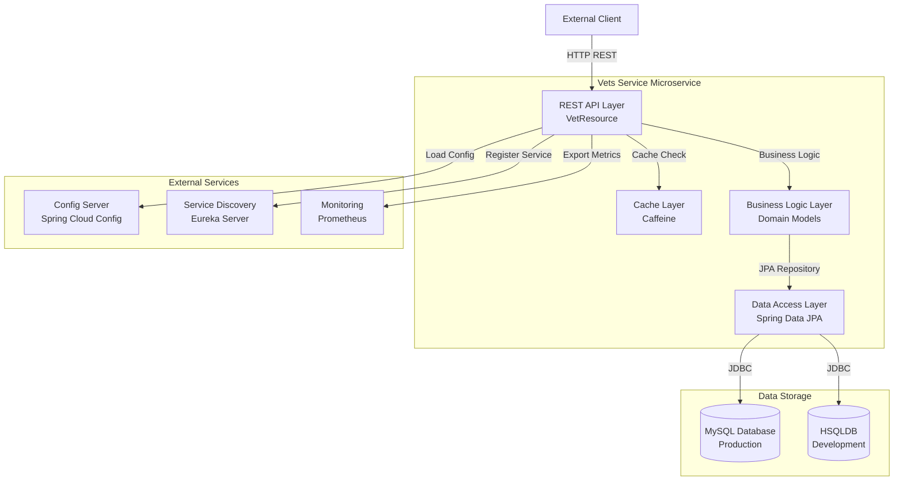
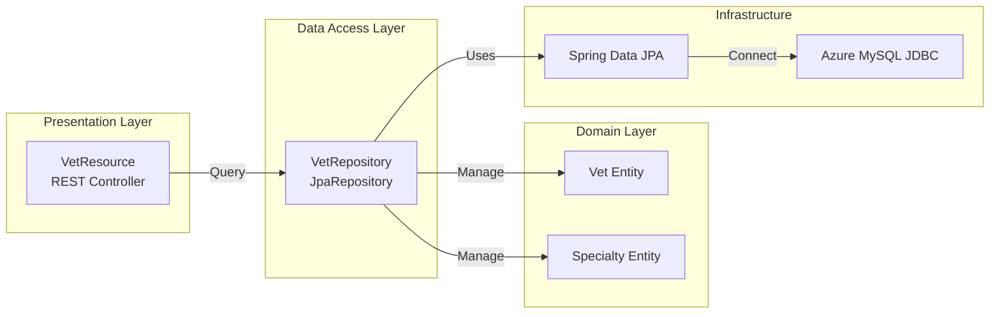

# Spring PetClinic Vets Service - Architecture Diagram

## Overview

| Property | Value |
|----------|-------|
| **Application Name** | Spring PetClinic Vets Service |
| **Application Type** | Spring Boot Microservice |
| **Framework** | Spring Boot 3.4.1 |
| **Language** | Java 17 |
| **Build Tool** | Maven |
| **Packaging** | JAR |

## Application Architecture

### High-Level Architecture

### Component Architecture

## Code Structure

### Main Components

| Component | Type | Description | Location |
|-----------|------|-------------|----------|
| VetsServiceApplication | Application | Spring Boot main application class | `src/main/java/...vets/VetsServiceApplication.java` |
| VetResource | REST Controller | Exposes vet listing API endpoint | `src/main/java/...vets/web/VetResource.java` |
| VetRepository | Repository | JPA repository for vet data access | `src/main/java/...vets/model/VetRepository.java` |
| Vet | Entity | Vet domain model with specialties | `src/main/java/...vets/model/Vet.java` |
| Specialty | Entity | Specialty domain model | `src/main/java/...vets/model/Specialty.java` |
| CacheConfig | Configuration | Cache configuration for vets | `src/main/java/...vets/system/CacheConfig.java` |
| VetsProperties | Configuration | Application properties | `src/main/java/...vets/system/VetsProperties.java` |

### Folder Structure

| Folder | Purpose | Key Files |
|--------|---------|-----------|
| `src/main/java/.../vets` | Root package | VetsServiceApplication.java |
| `src/main/java/.../vets/model` | Domain models and repositories | Vet.java, Specialty.java, VetRepository.java |
| `src/main/java/.../vets/web` | REST controllers | VetResource.java |
| `src/main/java/.../vets/system` | Configuration and properties | CacheConfig.java, VetsProperties.java |
| `src/main/resources` | Configuration files | application.yml |
| `src/test/java` | Test files | VetResourceTest.java |

## Technology Stack

| Category | Technology | Version | Purpose |
|----------|-----------|---------|---------|
| **Framework** | Spring Boot | 3.4.1 | Application framework |
| **Language** | Java | 17 | Programming language |
| **Cloud** | Spring Cloud | 2024.0.0 | Microservices infrastructure |
| **Cloud Config** | Spring Cloud Config | - | Centralized configuration |
| **Service Discovery** | Netflix Eureka Client | - | Service registration and discovery |
| **Azure Integration** | Spring Cloud Azure | 5.20.1 | Azure services integration |
| **Database (Prod)** | MySQL | - | Production database |
| **Database (Dev)** | HSQLDB | - | Development/testing database |
| **JDBC** | MySQL Connector/J | - | MySQL JDBC driver |
| **Azure JDBC** | Azure MySQL JDBC Starter | - | Azure-managed MySQL connectivity |
| **Data Access** | Spring Data JPA | - | JPA abstraction layer |
| **Caching** | Caffeine | - | In-memory cache implementation |
| **Cache API** | javax.cache | - | JSR-107 caching standard |
| **Monitoring** | Spring Boot Actuator | - | Application monitoring endpoints |
| **Metrics** | Micrometer Prometheus | - | Metrics collection for Prometheus |
| **JMX** | Jolokia | 1.7.1 | JMX over HTTP |
| **Resilience** | Chaos Monkey | 3.1.0 | Resilience testing |
| **Utilities** | Lombok | - | Boilerplate code reduction |
| **XML Binding** | Jakarta XML Bind API | - | XML serialization support |
| **Testing** | JUnit Jupiter | - | Unit testing framework |
| **Testing** | Spring Boot Test | - | Spring Boot testing utilities |
| **Build** | Maven | - | Build and dependency management |
| **Container** | Docker | - | Containerization (optional profile) |

## Architecture Patterns

### Design Patterns Used

1. **Repository Pattern**: VetRepository provides data access abstraction
2. **Entity Pattern**: Domain models (Vet, Specialty) represent business entities
3. **REST Resource Pattern**: VetResource exposes RESTful endpoints
4. **Cache-Aside Pattern**: Caching implemented with @Cacheable annotation
5. **Service Discovery Pattern**: Eureka client for dynamic service location
6. **Externalized Configuration**: Spring Cloud Config for configuration management

### Key Features

- **Microservice Architecture**: Designed as an independent, deployable service
- **Cloud-Native**: Spring Cloud integration for distributed systems
- **Azure-Ready**: Azure MySQL JDBC starter for Azure deployment
- **RESTful API**: Standard REST endpoint for vet listing
- **Caching**: Performance optimization with Caffeine cache
- **Monitoring**: Actuator endpoints and Prometheus metrics
- **Service Discovery**: Automatic registration with Eureka
- **Centralized Config**: Configuration management via Config Server
- **Resilience Testing**: Chaos Monkey integration for fault tolerance testing
- **Database Flexibility**: Supports both MySQL (production) and HSQLDB (development)

## API Endpoints

| Endpoint | Method | Description | Caching |
|----------|--------|-------------|---------|
| `/vets` | GET | List all veterinarians with their specialties | Yes (vets cache) |
| `/actuator/**` | GET | Spring Boot Actuator endpoints | No |
| `/actuator/prometheus` | GET | Prometheus metrics | No |

## Database Schema

### Main Entities

- **vets**: Stores veterinarian information (id, first_name, last_name)
- **specialties**: Stores specialty information (id, name)
- **vet_specialties**: Join table for many-to-many relationship between vets and specialties
