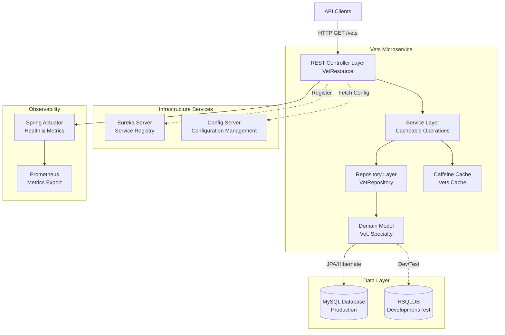
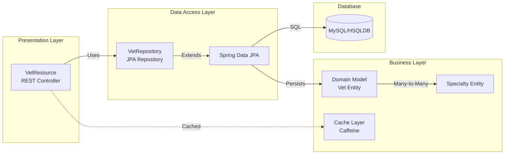

# Spring PetClinic Vets Service - Architecture Diagram

## Overview

| Property | Value |
|----------|-------|
| **Application Name** | Spring PetClinic Vets Service |
| **Type** | Microservice |
| **Framework** | Spring Boot 3.4.1 |
| **Language** | Java 17 |
| **Build Tool** | Maven |
| **Architecture Pattern** | Layered Architecture (MVC) |
| **Service Discovery** | Netflix Eureka |
| **Configuration** | Spring Cloud Config |
| **Primary Function** | Veterinarian management service |

## Application Architecture

### High-Level Architecture

### Layered Architecture Detail

## Code Structure

### Main Components

| Component | Type | Description | Location |
|-----------|------|-------------|----------|
| VetsServiceApplication | Application Entry | Spring Boot main class with Eureka discovery | `VetsServiceApplication.java` |
| VetResource | REST Controller | Exposes GET /vets endpoint with caching | `web/VetResource.java` |
| VetRepository | JPA Repository | Data access interface for Vet entities | `model/VetRepository.java` |
| Vet | Entity | Domain model for veterinarian with specialties | `model/Vet.java` |
| Specialty | Entity | Domain model for veterinary specialty | `model/Specialty.java` |
| CacheConfig | Configuration | Enables caching for production profile | `system/CacheConfig.java` |
| VetsProperties | Configuration | Custom configuration properties | `system/VetsProperties.java` |

### Folder Structure

| Folder | Purpose | Key Files |
|--------|---------|-----------|
| `src/main/java/.../vets` | Application source root | VetsServiceApplication.java |
| `src/main/java/.../vets/web` | REST API controllers | VetResource.java |
| `src/main/java/.../vets/model` | Domain models and repositories | Vet.java, Specialty.java, VetRepository.java |
| `src/main/java/.../vets/system` | Configuration classes | CacheConfig.java, VetsProperties.java |
| `src/main/resources` | Configuration and data | application.yml, db scripts |
| `src/main/resources/db/mysql` | MySQL database scripts | schema.sql, data.sql |
| `src/main/resources/db/hsqldb` | HSQLDB database scripts | schema.sql, data.sql |
| `src/test/java` | Test classes | VetResourceTest.java |

## Technology Stack

### Core Technologies

| Category | Technology | Version | Purpose |
|----------|-----------|---------|---------|
| **Framework** | Spring Boot | 3.4.1 | Application framework |
| **Language** | Java | 17 | Programming language |
| **Build Tool** | Maven | - | Dependency management and build |
| **Cloud** | Spring Cloud | 2024.0.0 | Microservices infrastructure |

### Spring Boot Components

| Component | Purpose |
|-----------|---------|
| spring-boot-starter-web | RESTful web services |
| spring-boot-starter-data-jpa | Database access with JPA/Hibernate |
| spring-boot-starter-actuator | Production monitoring and management |
| spring-boot-starter-cache | Caching abstraction |
| spring-boot-starter-test | Testing support |

### Spring Cloud Components

| Component | Purpose |
|-----------|---------|
| spring-cloud-starter-config | Centralized configuration |
| spring-cloud-starter-netflix-eureka-client | Service discovery and registration |

### Database & Persistence

| Technology | Purpose | Environment |
|------------|---------|-------------|
| MySQL | Relational database with Azure JDBC support | Production |
| HSQLDB | In-memory database | Development/Testing |
| Spring Data JPA | Data access abstraction | All |
| Hibernate | JPA implementation | All |

### Caching

| Technology | Purpose |
|------------|---------|
| Caffeine | High-performance in-memory cache |
| Spring Cache | Cache abstraction layer |

### Cloud & Azure Integration

| Component | Purpose |
|-----------|---------|
| spring-cloud-azure-starter-jdbc-mysql | Azure MySQL integration |
| Azure Spring Cloud | Cloud deployment platform (optional) |

### Observability & Monitoring

| Component | Purpose |
|-----------|---------|
| Spring Actuator | Health checks, metrics, info endpoints |
| Micrometer | Metrics collection abstraction |
| Prometheus Registry | Metrics export to Prometheus |
| Jolokia | JMX over HTTP |
| Chaos Monkey | Resilience testing |

### Utilities

| Library | Purpose |
|---------|---------|
| Lombok | Reduce boilerplate code with annotations |
| Jakarta XML Bind | XML binding for API responses |
| Jakarta Validation | Bean validation |

## API Endpoints

| Endpoint | Method | Description | Cache |
|----------|--------|-------------|-------|
| `/vets` | GET | List all veterinarians with their specialties | Yes (Caffeine) |

## Database Schema

### Tables

1. **vets** - Veterinarian information (id, first_name, last_name)
2. **specialties** - Veterinary specialties (id, name)
3. **vet_specialties** - Many-to-many relationship (vet_id, specialty_id)

## Configuration

### Profiles

- **production** (default): Enables caching
- **docker**: Uses Docker-based config server
- **test**: Testing configuration with HSQLDB

### External Dependencies

- **Config Server**: `http://localhost:8888` (or `http://config-server:8888` in Docker)
- **Eureka Server**: Configured via Spring Cloud Config
- **Database**: MySQL (production) or HSQLDB (development)

## Key Features

1. **Service Discovery**: Auto-registers with Eureka for service mesh
2. **Centralized Configuration**: Fetches configuration from Spring Cloud Config Server
3. **Caching**: Implements caching for vet list to improve performance
4. **Cloud-Ready**: Azure integration for MySQL with managed identity support
5. **Monitoring**: Full observability with Actuator and Prometheus
6. **Database Flexibility**: Supports both MySQL (production) and HSQLDB (development)
7. **Chaos Engineering**: Integrated Chaos Monkey for resilience testing

## Design Patterns

- **Repository Pattern**: Data access abstraction (VetRepository)
- **Dependency Injection**: Spring-based IoC
- **RESTful API**: Resource-oriented architecture
- **Cache-Aside**: Application-level caching with @Cacheable
- **Service Registry**: Eureka-based service discovery
- **Externalized Configuration**: Spring Cloud Config
