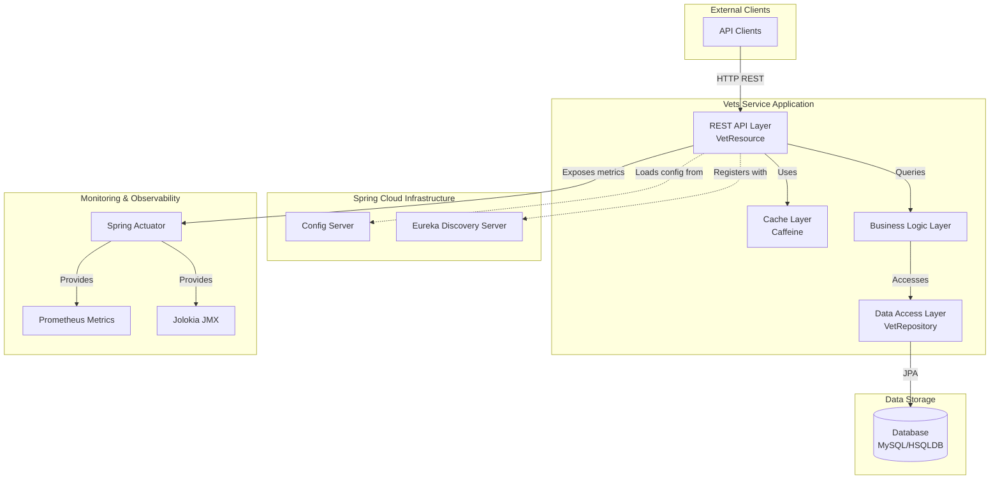
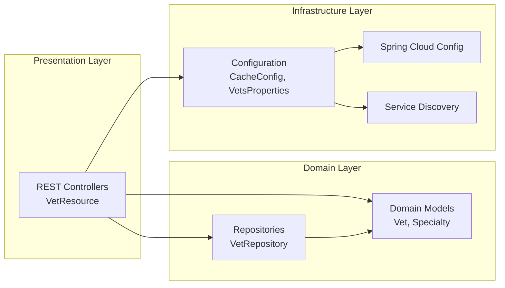

# Spring PetClinic Vets Service - Architecture Diagram

## Overview

| Property | Value |
|----------|-------|
| Project Name | Spring PetClinic Vets Service |
| Application Type | Microservice |
| Language | Java 17 |
| Framework | Spring Boot 3.4.1 |
| Build Tool | Maven |
| Packaging | JAR |

## Application Architecture

### High-Level Architecture

### Component Architecture

## Code Structure

### Main Components

| Component | Description | Location |
|-----------|-------------|----------|
| VetsServiceApplication | Main Spring Boot application class | org.springframework.samples.petclinic.vets |
| VetResource | REST controller for veterinarian endpoints | org.springframework.samples.petclinic.vets.web |
| VetRepository | JPA repository for vet data access | org.springframework.samples.petclinic.vets.model |
| Vet | Domain entity for veterinarian | org.springframework.samples.petclinic.vets.model |
| Specialty | Domain entity for vet specialty | org.springframework.samples.petclinic.vets.model |
| CacheConfig | Caching configuration | org.springframework.samples.petclinic.vets.system |
| VetsProperties | Application properties configuration | org.springframework.samples.petclinic.vets.system |

### Folder Structure

| Folder | Purpose |
|--------|---------|
| src/main/java/org/springframework/samples/petclinic/vets | Main application source code |
| src/main/java/.../vets/model | Domain models and repositories |
| src/main/java/.../vets/web | REST API controllers |
| src/main/java/.../vets/system | System configuration classes |
| src/main/resources | Application configuration files |
| src/test | Test source code |

## Technology Stack

### Core Technologies

| Technology | Version | Purpose |
|------------|---------|---------|
| Java | 17 | Programming language |
| Spring Boot | 3.4.1 | Application framework |
| Spring Cloud | 2024.0.0 | Microservices infrastructure |
| Maven | - | Build tool |

### Key Dependencies

| Dependency | Version | Purpose |
|------------|---------|---------|
| Spring Boot Starter Web | 3.4.1 | REST API development |
| Spring Boot Starter Data JPA | 3.4.1 | Database access |
| Spring Boot Starter Actuator | 3.4.1 | Health checks and metrics |
| Spring Boot Starter Cache | 3.4.1 | Caching support |
| Spring Cloud Config | 2024.0.0 | External configuration |
| Spring Cloud Netflix Eureka Client | 2024.0.0 | Service discovery |
| Spring Cloud Azure JDBC MySQL | 5.20.1 | Azure MySQL integration |
| Caffeine | - | In-memory caching |
| MySQL Connector | - | MySQL database driver |
| HSQLDB | - | In-memory database (dev/test) |
| Lombok | - | Code generation |
| Micrometer Prometheus | - | Metrics export |
| Jolokia | 1.7.1 | JMX monitoring |
| Chaos Monkey | 3.1.0 | Resilience testing |

### External Integrations

| Integration | Purpose |
|-------------|---------|
| Config Server | Centralized configuration management |
| Eureka Server | Service discovery and registration |
| MySQL Database | Persistent data storage (production) |
| HSQLDB | In-memory database (development) |
| Prometheus | Metrics collection and monitoring |

## API Endpoints

| Endpoint | Method | Description |
|----------|--------|-------------|
| /vets | GET | Retrieve list of all veterinarians |
| /actuator/health | GET | Health check endpoint |
| /actuator/metrics | GET | Application metrics |
| /actuator/prometheus | GET | Prometheus metrics endpoint |

## Key Features

- **RESTful API**: Provides veterinarian information via REST endpoints
- **Service Discovery**: Registers with Eureka for dynamic service discovery
- **External Configuration**: Loads configuration from Spring Cloud Config Server
- **Caching**: Uses Caffeine for in-memory caching of vet data
- **Database Support**: Supports both MySQL (production) and HSQLDB (development)
- **Azure Integration**: Integrated with Azure Spring Cloud JDBC for MySQL
- **Monitoring**: Exposes metrics via Actuator and Prometheus
- **Resilience Testing**: Includes Chaos Monkey for failure injection testing
- **Health Checks**: Provides health check endpoints for container orchestration
