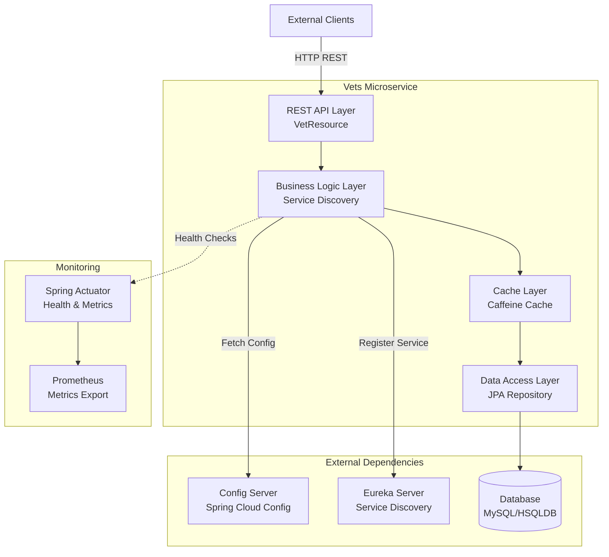
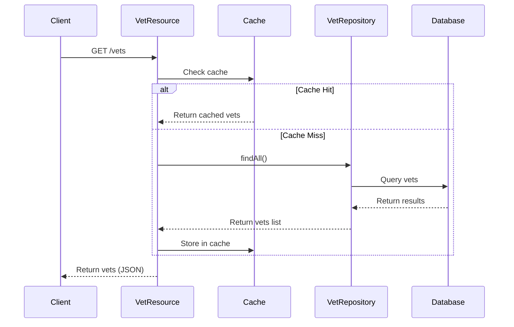

# Spring PetClinic Vets Service - Architecture Diagram

## Overview

| Property | Value |
|----------|-------|
| Application Name | Spring PetClinic Vets Service |
| Application Type | Microservice (REST API) |
| Primary Language | Java 17 |
| Framework | Spring Boot 3.4.1 |
| Build Tool | Maven |
| Packaging | JAR |

## Application Architecture

### High-Level Architecture



### Data Flow Architecture



## Code Structure

### Component Organization

| Component | Package | Purpose |
|-----------|---------|---------|
| Main Application | `org.springframework.samples.petclinic.vets` | Application entry point with service discovery |
| REST Controllers | `org.springframework.samples.petclinic.vets.web` | REST API endpoints (VetResource) |
| Domain Models | `org.springframework.samples.petclinic.vets.model` | JPA entities (Vet, Specialty) |
| Data Access | `org.springframework.samples.petclinic.vets.model` | JPA repositories (VetRepository) |
| System Configuration | `org.springframework.samples.petclinic.vets.system` | Cache config and application properties |

### Folder Structure

```
src/main/java/org/springframework/samples/petclinic/vets/
├── VetsServiceApplication.java (Main application)
├── model/
│   ├── Vet.java (Domain entity)
│   ├── Specialty.java (Domain entity)
│   └── VetRepository.java (JPA repository)
├── web/
│   └── VetResource.java (REST controller)
└── system/
    ├── CacheConfig.java (Caching configuration)
    └── VetsProperties.java (Configuration properties)
```

## Technology Stack

### Core Technologies

| Technology | Version | Purpose |
|------------|---------|---------|
| Java | 17 | Programming language |
| Spring Boot | 3.4.1 | Application framework |
| Spring Cloud | 2024.0.0 | Microservices infrastructure |
| Maven | - | Build and dependency management |

### Spring Ecosystem

| Component | Version/Details | Purpose |
|-----------|-----------------|---------|
| Spring Web | 3.4.1 | REST API development |
| Spring Data JPA | 3.4.1 | Database access and ORM |
| Spring Actuator | 3.4.1 | Health checks and monitoring |
| Spring Cache | 3.4.1 | Caching abstraction |
| Spring Cloud Config | - | Centralized configuration |
| Spring Cloud Netflix Eureka | - | Service discovery client |
| Spring Cloud Azure | 5.20.1 | Azure integration |

### Data & Persistence

| Technology | Purpose |
|------------|---------|
| MySQL | Production database (via Azure JDBC) |
| HSQLDB | Development/testing database |
| Hibernate/JPA | ORM framework |
| Caffeine | In-memory caching |

### Azure Integration

| Component | Version | Purpose |
|-----------|---------|---------|
| Azure JDBC MySQL Starter | 5.20.1 | Azure MySQL connectivity |

### Monitoring & Observability

| Technology | Purpose |
|------------|---------|
| Spring Actuator | Application health and metrics |
| Micrometer Prometheus | Metrics export |
| Jolokia | JMX over HTTP |

### Development & Testing

| Technology | Purpose |
|------------|---------|
| Lombok | Code generation (reduce boilerplate) |
| JUnit Jupiter | Testing framework |
| Spring Boot Test | Integration testing |
| Chaos Monkey | Resilience testing |

## Architecture Patterns

### Design Patterns Used

1. **Repository Pattern**: Data access through JpaRepository
2. **MVC Pattern**: REST controller → Service → Repository
3. **Dependency Injection**: Spring-managed beans
4. **Cache-Aside Pattern**: Caffeine cache with Spring annotations
5. **Service Discovery**: Eureka client registration
6. **Externalized Configuration**: Spring Cloud Config
7. **Health Check Pattern**: Spring Actuator endpoints

### Key Features

- **RESTful API**: Exposes `/vets` endpoint for veterinarian data
- **Caching**: Caffeine-based in-memory caching for performance
- **Service Discovery**: Auto-registration with Eureka
- **Centralized Config**: External configuration via Config Server
- **Database Flexibility**: Supports MySQL (production) and HSQLDB (development)
- **Cloud-Ready**: Azure integration with passwordless authentication
- **Observable**: Actuator endpoints + Prometheus metrics
- **Resilient**: Chaos engineering support

## Deployment Considerations

### Container Support
- Dockerfile configuration ready (referenced in pom.xml)
- Docker plugin configured for containerization
- Exposed port: 8081

### Azure Compatibility
- Azure MySQL JDBC integration
- Spring Cloud Azure dependencies
- Ready for Azure App Service, AKS, or Container Apps

### Configuration Profiles
- **Production**: Uses MySQL database
- **Docker**: Config server at `config-server:8888`
- **Test**: Uses HSQLDB for testing

## API Endpoints

| Endpoint | Method | Description | Cache |
|----------|--------|-------------|-------|
| `/vets` | GET | List all veterinarians | Yes (Caffeine) |
| `/actuator/health` | GET | Health check | No |
| `/actuator/metrics` | GET | Application metrics | No |
| `/actuator/prometheus` | GET | Prometheus metrics | No |
