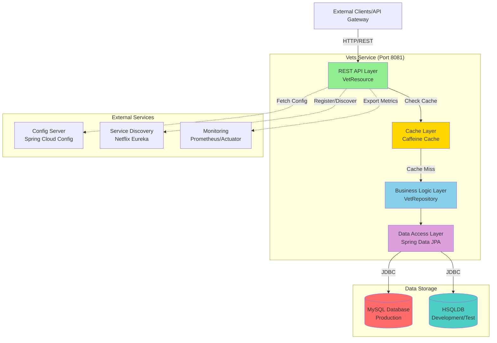
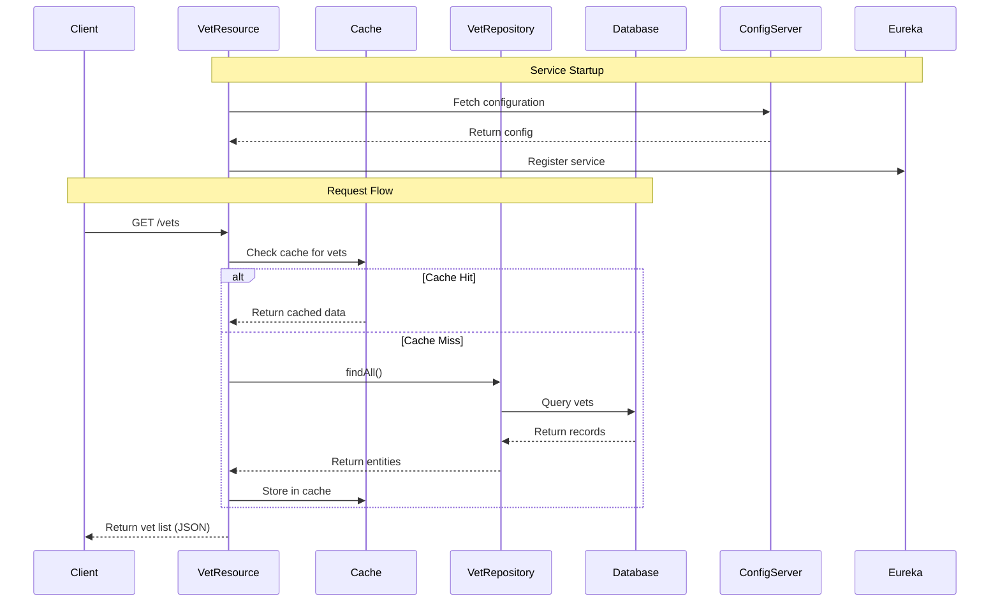

# Spring PetClinic Vets Service - Architecture Diagram

## Overview

| Property | Value |
|----------|-------|
| Application Name | Spring PetClinic Vets Service |
| Application Type | RESTful Microservice |
| Framework | Spring Boot 3.4.1 |
| Language | Java 17 |
| Build Tool | Maven |
| Packaging | JAR |

## Application Architecture

### High-Level Architecture

### Component Interaction Flow

## Code Structure

### Main Components

| Component | Location | Purpose |
|-----------|----------|---------|
| VetsServiceApplication | `src/main/java/.../VetsServiceApplication.java` | Main Spring Boot application entry point |
| VetResource | `src/main/java/.../web/VetResource.java` | REST controller for vet endpoints |
| VetRepository | `src/main/java/.../model/VetRepository.java` | Data repository interface (Spring Data JPA) |
| Vet | `src/main/java/.../model/Vet.java` | Entity model for veterinarian |
| Specialty | `src/main/java/.../model/Specialty.java` | Entity model for vet specialties |
| CacheConfig | `src/main/java/.../system/CacheConfig.java` | Cache configuration |
| VetsProperties | `src/main/java/.../system/VetsProperties.java` | Application properties |

### Project Structure

| Folder | Description |
|--------|-------------|
| `src/main/java/.../web` | REST API controllers |
| `src/main/java/.../model` | Domain models and repositories |
| `src/main/java/.../system` | System configuration and properties |
| `src/main/resources/db/mysql` | MySQL database schema and data |
| `src/main/resources/db/hsqldb` | HSQLDB schema and data |
| `src/test/java` | Unit and integration tests |

## Technology Stack

| Technology | Version | Purpose |
|------------|---------|---------|
| Java | 17 | Programming language |
| Spring Boot | 3.4.1 | Application framework |
| Spring Cloud | 2024.0.0 | Microservices infrastructure |
| Spring Data JPA | (inherited) | Data access layer |
| Spring Cloud Config | (inherited) | Centralized configuration |
| Netflix Eureka | (inherited) | Service discovery |
| MySQL | runtime | Production database |
| HSQLDB | runtime | Development/test database |
| Azure Spring Cloud JDBC | 5.20.1 | Azure MySQL integration |
| Caffeine | (inherited) | In-memory cache |
| Micrometer/Prometheus | (inherited) | Metrics and monitoring |
| Actuator | (inherited) | Health checks and endpoints |
| Chaos Monkey | 3.1.0 | Resilience testing |
| Jolokia | 1.7.1 | JMX over HTTP |
| Lombok | (provided) | Code generation |
| JUnit Jupiter | (test) | Testing framework |

## Key Features

### Caching Strategy
- Uses Caffeine cache for vet data
- Cache name: `vets`
- Improves read performance for frequently accessed data

### Service Discovery
- Registers with Netflix Eureka for service discovery
- Enables dynamic service location in microservices architecture

### Configuration Management
- Fetches configuration from Spring Cloud Config Server
- Supports multiple profiles (production, docker)
- Default config server: http://localhost:8888/

### Database Support
- **Production**: MySQL with Azure Spring Cloud JDBC
- **Development/Test**: HSQLDB (in-memory)
- Uses Spring Data JPA for data access abstraction

### Monitoring and Observability
- Spring Boot Actuator for health checks
- Prometheus metrics export
- Jolokia for JMX monitoring

### Resilience
- Chaos Monkey integration for testing failure scenarios
- Helps validate service resilience

## API Endpoints

| Endpoint | Method | Description | Cache |
|----------|--------|-------------|-------|
| `/vets` | GET | Retrieve all veterinarians | Yes (Cacheable) |

## Deployment Considerations

### Port Configuration
- Default exposed port: 8081
- Configurable via `docker.image.exposed.port` property

### Profiles
- **production**: Default active profile
- **docker**: Docker-specific configuration with internal service discovery

### Docker Support
- Maven profile `buildDocker` available
- Docker Maven plugin version: 1.2.0
- Dockerfile directory: `../docker`

## Azure Migration Readiness

### Azure-Compatible Components
- ✅ Spring Boot 3.x compatible with Azure Spring Apps
- ✅ Azure Spring Cloud JDBC for MySQL integration
- ✅ Cloud-native configuration with Config Server
- ✅ Service discovery ready
- ✅ Actuator endpoints for health monitoring

### Recommended Azure Services
- **Compute**: Azure Container Apps or Azure Spring Apps
- **Database**: Azure Database for MySQL
- **Config**: Azure App Configuration or Spring Cloud Config
- **Monitoring**: Azure Application Insights
- **Service Discovery**: Azure Spring Apps Service Registry or API Management
