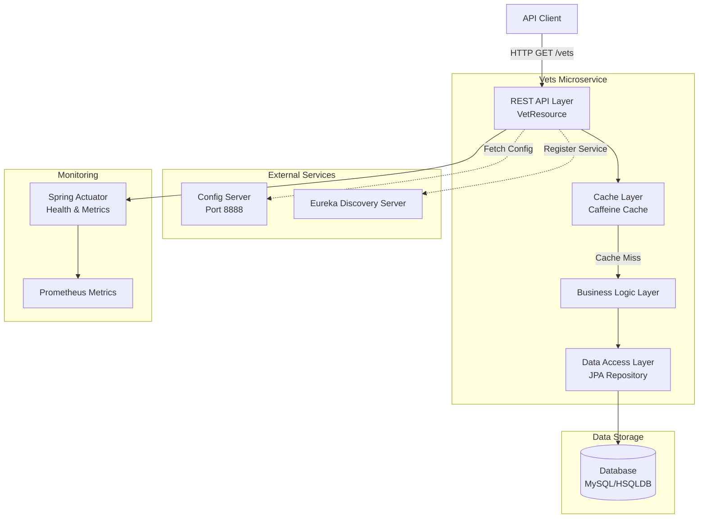
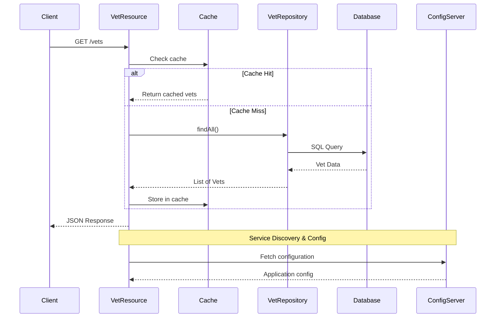

# Spring PetClinic Vets Service - Architecture Diagram

This document provides a visual representation of the Spring PetClinic Vets Service architecture based on the application assessment.

## Overview

| Property | Value |
|----------|-------|
| **Application Name** | Spring PetClinic Vets Service |
| **Application Type** | RESTful Microservice |
| **Primary Language** | Java 17 |
| **Framework** | Spring Boot 3.4.1 |
| **Build Tool** | Maven |
| **Packaging** | JAR |
| **Service Port** | 8081 |

## Application Architecture

### High-Level Architecture



### Component Interaction Flow



## Code Structure

### Main Components

| Component | Package | Description |
|-----------|---------|-------------|
| **VetsServiceApplication** | `org.springframework.samples.petclinic.vets` | Main Spring Boot application entry point with Service Discovery enabled |
| **VetResource** | `org.springframework.samples.petclinic.vets.web` | REST controller exposing `/vets` endpoint with caching |
| **Vet** | `org.springframework.samples.petclinic.vets.model` | Domain entity representing a veterinarian |
| **Specialty** | `org.springframework.samples.petclinic.vets.model` | Domain entity for vet specialties |
| **VetRepository** | `org.springframework.samples.petclinic.vets.model` | JPA repository for data access |
| **CacheConfig** | `org.springframework.samples.petclinic.vets.system` | Cache configuration |
| **VetsProperties** | `org.springframework.samples.petclinic.vets.system` | Configuration properties |

### Project Structure

```
vets-service/
├── src/
│   ├── main/
│   │   ├── java/
│   │   │   └── org/springframework/samples/petclinic/vets/
│   │   │       ├── VetsServiceApplication.java
│   │   │       ├── model/
│   │   │       │   ├── Vet.java
│   │   │       │   ├── Specialty.java
│   │   │       │   └── VetRepository.java
│   │   │       ├── web/
│   │   │       │   └── VetResource.java
│   │   │       └── system/
│   │   │           ├── CacheConfig.java
│   │   │           └── VetsProperties.java
│   │   └── resources/
│   │       ├── application.yml
│   │       ├── logback-spring.xml
│   │       └── db/
│   │           ├── mysql/
│   │           │   ├── schema.sql
│   │           │   └── data.sql
│   │           └── hsqldb/
│   │               ├── schema.sql
│   │               └── data.sql
│   └── test/
│       └── java/
│           └── org/springframework/samples/petclinic/vets/
│               └── web/
│                   └── VetResourceTest.java
└── pom.xml
```

## Technology Stack

### Core Technologies

| Technology | Version | Purpose |
|------------|---------|---------|
| **Java** | 17 | Programming Language |
| **Spring Boot** | 3.4.1 | Application Framework |
| **Spring Cloud** | 2024.0.0 | Microservices Framework |
| **Maven** | N/A | Build Tool |

### Key Dependencies

| Dependency | Version | Category | Purpose |
|------------|---------|----------|---------|
| **Spring Boot Starter Web** | 3.4.1 | Web Framework | REST API development |
| **Spring Boot Starter Data JPA** | 3.4.1 | Data Access | ORM and database operations |
| **Spring Boot Starter Cache** | 3.4.1 | Caching | Response caching |
| **Spring Boot Starter Actuator** | 3.4.1 | Monitoring | Health checks and metrics |
| **Spring Cloud Config** | 2024.0.0 | Configuration | Centralized configuration |
| **Spring Cloud Netflix Eureka Client** | 2024.0.0 | Service Discovery | Service registration |
| **Spring Cloud Azure JDBC MySQL** | 5.20.1 | Cloud Integration | Azure MySQL connectivity |
| **Caffeine** | Latest | Caching | In-memory cache implementation |
| **MySQL Connector** | Latest | Database Driver | MySQL database access |
| **HSQLDB** | Latest | Database | In-memory database for testing |
| **Lombok** | Latest | Code Generation | Reduce boilerplate code |
| **Micrometer Prometheus** | Latest | Metrics | Prometheus metrics export |
| **Jolokia** | 1.7.1 | Monitoring | JMX over HTTP |
| **Chaos Monkey** | 3.1.0 | Resilience Testing | Chaos engineering |

### Database Support

| Database | Environment | Schema Location |
|----------|-------------|-----------------|
| **HSQLDB** | Development/Testing | `src/main/resources/db/hsqldb/` |
| **MySQL** | Production | `src/main/resources/db/mysql/` |
| **Azure MySQL** | Cloud | Via Spring Cloud Azure JDBC |

## Assessment Summary

Based on the AppCAT assessment:

- **Total Issues Found**: 7
- **Total Incidents**: 11
- **Estimated Migration Effort**: 35 story points

### Issue Categories

| Category | Count | Severity Distribution |
|----------|-------|----------------------|
| **Remote Communication** | 4 incidents | Requires attention for cloud deployment |
| **Embedded Cache Management** | 3 incidents | Cache configuration for distributed systems |
| **Spring Migration** | 2 incidents | Framework compatibility |
| **Framework Upgrade** | 1 incident | Version compatibility |
| **Containerization** | 1 incident | Docker/Kubernetes readiness |

### Severity Breakdown

| Severity | Count | Description |
|----------|-------|-------------|
| **Mandatory** | 6 | Must be addressed before migration |
| **Optional** | 4 | Recommended improvements |
| **Potential** | 1 | Potential issues to consider |

## Deployment Considerations

### Azure Target Services

This microservice can be deployed to:

1. **Azure Kubernetes Service (AKS)** - Containerized deployment with orchestration
2. **Azure App Service** - Platform-as-a-Service deployment
3. **Azure Container Apps** - Serverless container platform

### Key Integration Points

- **Service Discovery**: Eureka client for microservice registration
- **Configuration Management**: Spring Cloud Config Server integration
- **Database**: Supports Azure MySQL with passwordless authentication
- **Monitoring**: Spring Actuator with Prometheus metrics
- **Caching**: Caffeine in-memory cache (consider Redis for distributed scenarios)

### Migration Recommendations

1. **Address Remote Communication Issues**: Review service-to-service communication patterns
2. **Update Cache Strategy**: Consider distributed caching (Redis) for cloud environments
3. **Database Configuration**: Leverage Azure MySQL managed service with managed identity
4. **Containerization**: Ensure Docker readiness and Kubernetes manifests
5. **Observability**: Integrate with Azure Monitor and Application Insights
