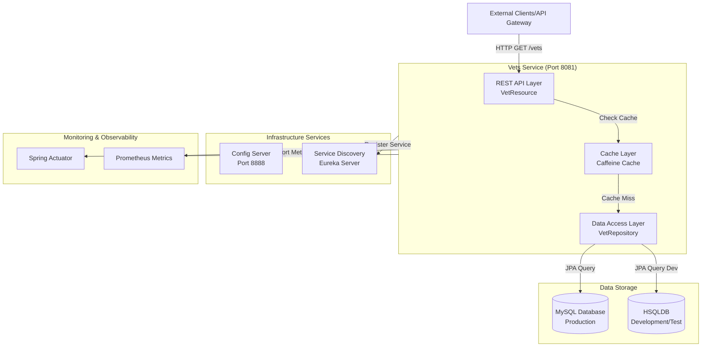

# Application Architecture Diagram

## Overview

| Property | Value |
|----------|-------|
| Application Name | Spring PetClinic Vets Service |
| Application Type | RESTful Microservice |
| Framework | Spring Boot 3.4.1 |
| Java Version | 17 |
| Build Tool | Maven |
| Packaging | JAR |

## Application Architecture

### High-Level Architecture



### Component Architecture

```mermaid
graph LR
    subgraph Presentation["Presentation Layer"]
        REST[VetResource<br/>@RestController]
    end
    
    subgraph Business["Business Logic Layer"]
        CacheMgr[Cache Manager<br/>@Cacheable]
    end
    
    subgraph Data["Data Access Layer"]
        Repo[VetRepository<br/>JpaRepository]
        Entity[Vet & Specialty<br/>@Entity]
    end
    
    subgraph Integration["Integration Layer"]
        Azure[Azure JDBC Starter<br/>MySQL Connection]
        CloudConfig[Spring Cloud Config]
        Discovery[Eureka Discovery]
    end
    
    REST --> CacheMgr
    CacheMgr --> Repo
    Repo --> Entity
    Repo --> Azure
    REST --> CloudConfig
    REST --> Discovery
```

## Code Structure

### Main Components

| Component | Path | Description |
|-----------|------|-------------|
| Application Entry Point | `VetsServiceApplication.java` | Main Spring Boot application class with Eureka discovery enabled |
| REST Controller | `web/VetResource.java` | Exposes GET /vets endpoint with caching |
| Data Repository | `model/VetRepository.java` | JPA repository for Vet entity |
| Domain Models | `model/Vet.java`, `model/Specialty.java` | JPA entities for veterinarians and specialties |
| Cache Configuration | `system/CacheConfig.java` | Caffeine cache configuration |
| Application Properties | `system/VetsProperties.java` | Custom configuration properties |

### Project Structure

| Directory | Purpose |
|-----------|---------|
| `src/main/java/...vets/` | Main application source code |
| `src/main/java/...vets/web/` | REST API controllers |
| `src/main/java/...vets/model/` | Domain entities and repositories |
| `src/main/java/...vets/system/` | Configuration classes |
| `src/main/resources/` | Configuration files and database scripts |
| `src/main/resources/db/hsqldb/` | HSQLDB schema and data scripts |
| `src/main/resources/db/mysql/` | MySQL schema and data scripts |
| `src/test/` | Unit and integration tests |

## Technology Stack

| Technology | Version | Purpose |
|------------|---------|---------|
| Java | 17 | Runtime platform |
| Spring Boot | 3.4.1 | Application framework |
| Spring Cloud | 2024.0.0 | Microservices patterns |
| Spring Data JPA | 3.4.1 | Data access layer |
| Spring Cloud Config | 2024.0.0 | Centralized configuration |
| Netflix Eureka Client | 2024.0.0 | Service discovery |
| Azure Spring Cloud JDBC | 5.20.1 | Azure MySQL integration |
| MySQL Connector | Runtime | Production database driver |
| HSQLDB | Runtime | Development/test database |
| Caffeine Cache | Latest | In-memory caching |
| Lombok | Provided | Code generation |
| Micrometer Prometheus | Latest | Metrics collection |
| Spring Actuator | 3.4.1 | Health checks and monitoring |
| Chaos Monkey | 3.1.0 | Resilience testing |
| JUnit Jupiter | Test | Unit testing framework |

## Key Features

### Microservices Patterns
- **Service Discovery**: Registers with Eureka for dynamic service location
- **Centralized Configuration**: Retrieves configuration from Config Server
- **Caching**: Implements application-level caching for vet data
- **Health Monitoring**: Exposes actuator endpoints for health checks
- **Metrics**: Exports Prometheus metrics for observability

### Data Management
- **Multi-Database Support**: HSQLDB for development, MySQL for production
- **Azure Integration**: Uses Azure Spring Cloud JDBC for managed MySQL
- **JPA/Hibernate**: ORM for database operations
- **Database Migration Scripts**: SQL scripts for schema and data initialization

### Cloud Readiness
- **Containerization Ready**: Can be packaged as Docker image (port 8081)
- **12-Factor App**: Externalized configuration, stateless design
- **Azure Native**: Integration with Azure MySQL and Spring Cloud services
- **Monitoring**: Built-in actuator endpoints and Prometheus metrics

## API Endpoints

| Endpoint | Method | Description | Cache |
|----------|--------|-------------|-------|
| `/vets` | GET | Retrieve list of all veterinarians with specialties | Yes (Caffeine) |
| `/actuator/health` | GET | Health check endpoint | No |
| `/actuator/prometheus` | GET | Prometheus metrics | No |

## Dependencies and Integrations

### External Services
- **Config Server**: `http://localhost:8888` (configurable via `CONFIG_SERVER_URL`)
- **Eureka Server**: Configured via Spring Cloud discovery
- **MySQL Database**: Via Azure Spring Cloud JDBC starter

### Internal Integration Points
- Eureka service registration for discovery
- Config server for centralized configuration
- Prometheus for metrics scraping
- Actuator for health checks and management
