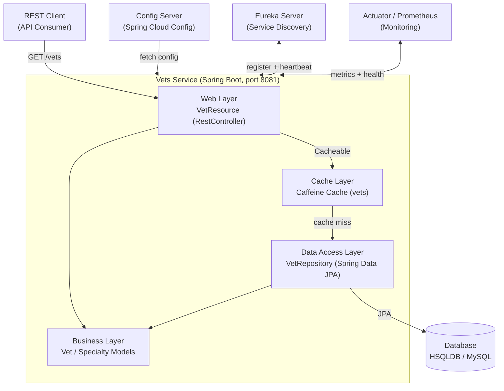

```mermaid
flowchart TD
    Client["REST Client\n(API Consumer)"] -->|GET /vets| WebLayer

    subgraph VetsService["Vets Service (Spring Boot, port 8081)"]
        WebLayer["Web Layer\nVetResource (RestController)"]
        CacheLayer["Cache Layer\nCaffeine Cache (vets)"]
        BusinessLayer["Business Layer\nVet / Specialty Models"]
        DataLayer["Data Access Layer\nVetRepository (Spring Data JPA)"]

        WebLayer -->|Cacheable| CacheLayer
        CacheLayer -->|cache miss| DataLayer
        WebLayer --> BusinessLayer
        DataLayer --> BusinessLayer
    end

    DataLayer -->|JPA| DB[("Database\nHSQLDB / MySQL")]

    ConfigServer["Config Server\n(Spring Cloud Config)"] -->|fetch config| VetsService
    EurekaServer["Eureka Server\n(Service Discovery)"] <-->|register + heartbeat| VetsService
    Actuator["Actuator / Prometheus\n(Monitoring)"] <-->|metrics + health| VetsService
```
