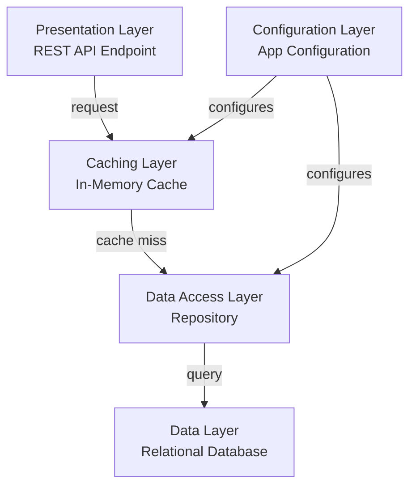

# Architecture Diagram

Application architecture showing logical layers and data flow for the veterinarian management microservice.

## Application Architecture

This diagram shows the logical layers of the application and how requests flow through them.

