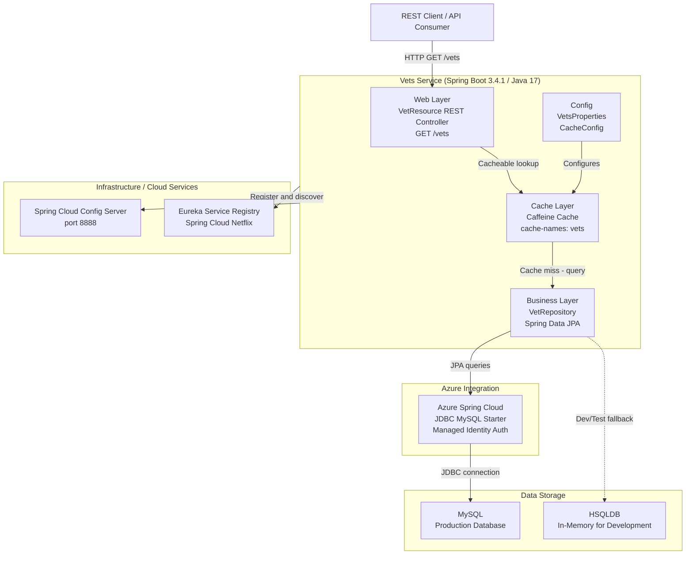

# Architecture Diagram

This diagram shows the high-level architecture of the Spring PetClinic Vets Service, a Spring Boot microservice that manages veterinarian data.

## Application Architecture

