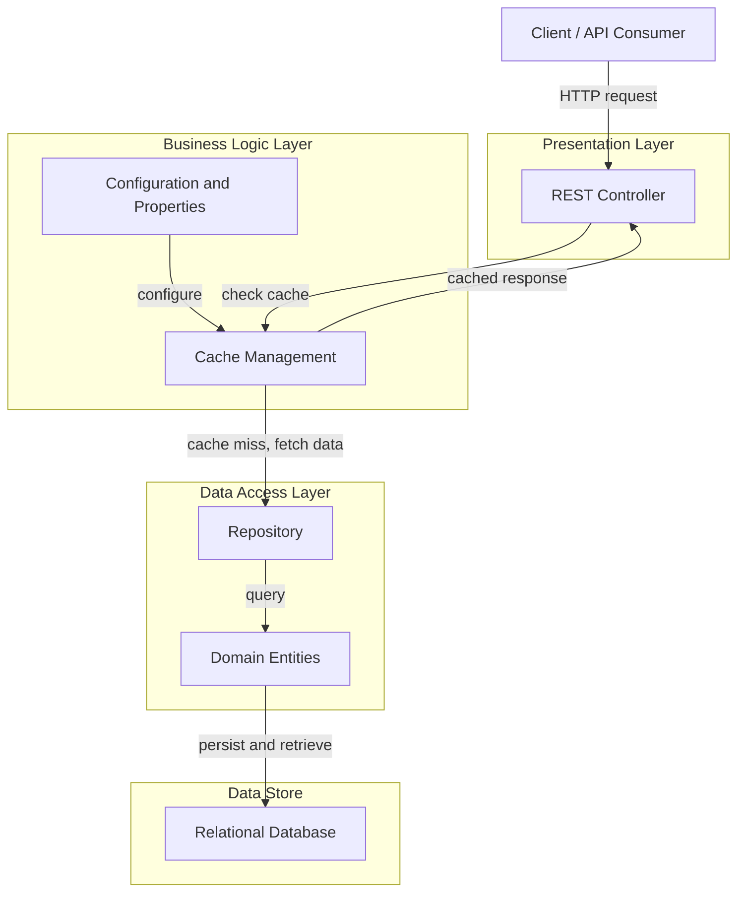

# Architecture Diagram

Application architecture showing logical layers and data flow.

## Application Architecture

The following diagram shows the logical layers and their relationships within the application.

