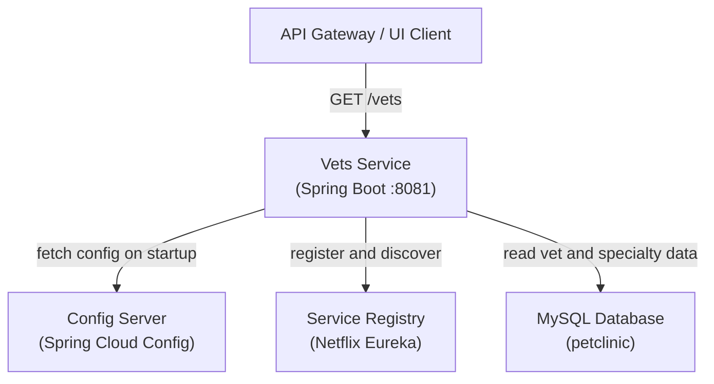
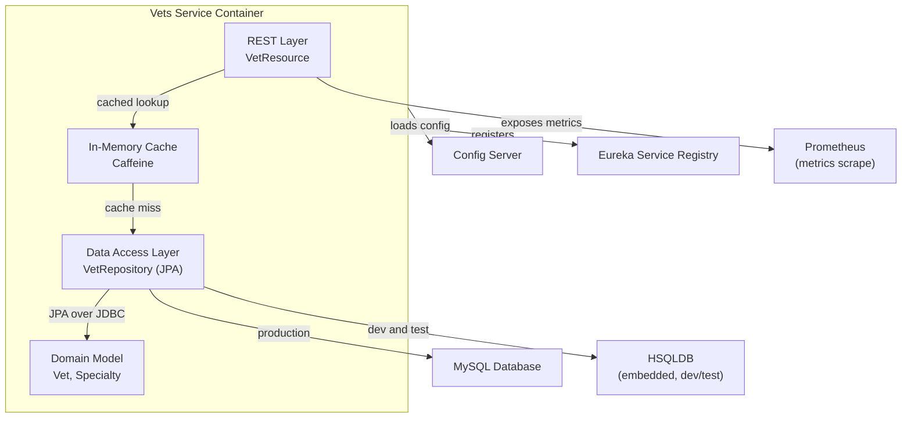
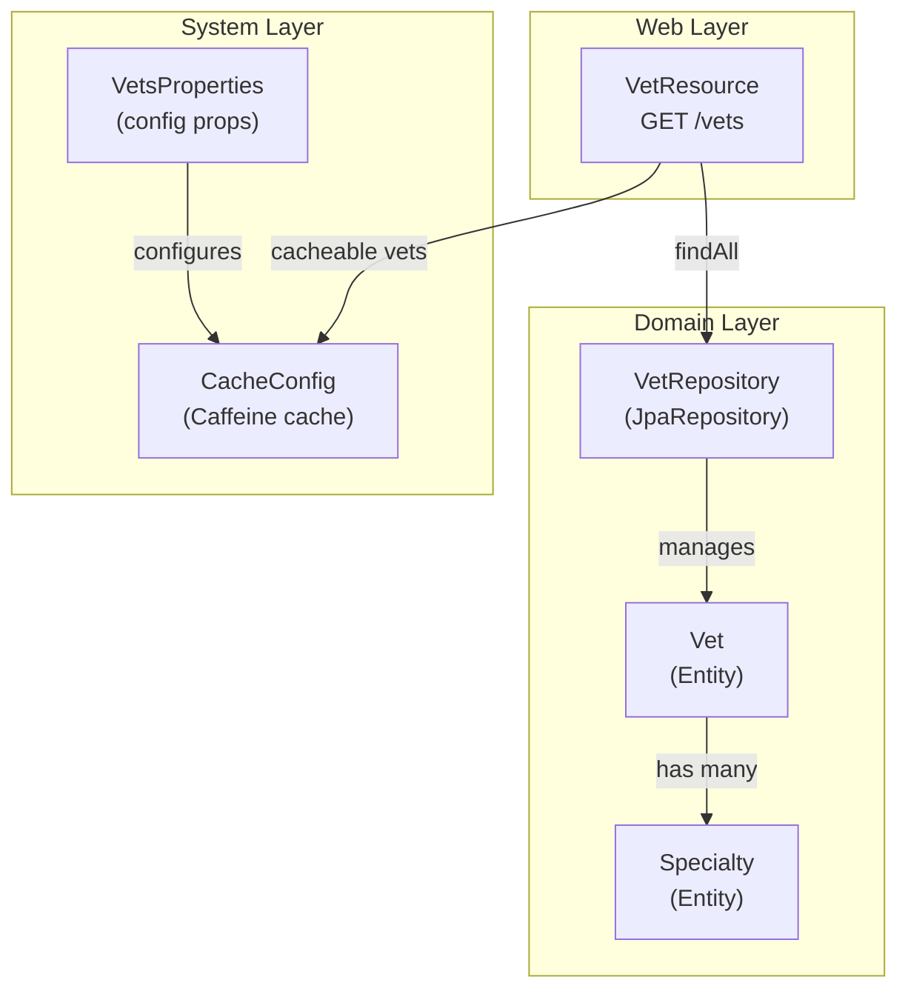

# Architecture Diagram

The Spring PetClinic Vets Service is a Spring Boot microservice that exposes a REST API for managing veterinarian data, backed by a relational database and integrated with the Spring Cloud ecosystem.

## System Context

This diagram shows how the Vets Service interacts with external systems in the PetClinic microservices landscape.

## Container View

This diagram shows the major containers inside the Vets Service and how they interact with each other and with external dependencies.

## Component View

This diagram shows the internal components of the Vets Service and their relationships.

