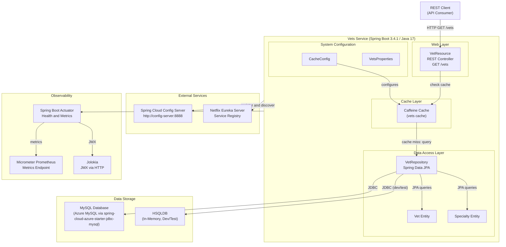

# Architecture Diagram

This diagram illustrates the high-level architecture of the Spring PetClinic Vets Service, a Spring Boot 3.4.1 microservice that manages veterinarian data within the PetClinic microservices ecosystem.

## Application Architecture

