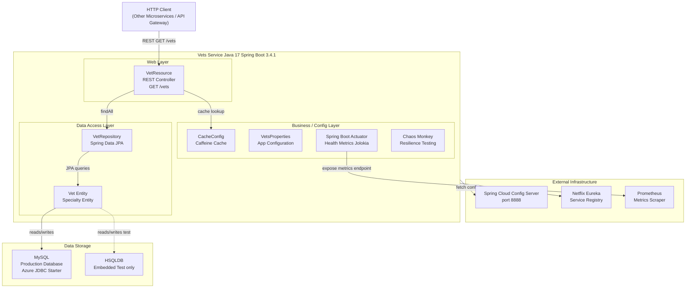

# Architecture Diagram

The Spring PetClinic Vets Service is a Spring Boot microservice responsible for managing veterinarian data, exposing a REST API for vet listings with in-memory caching, backed by a relational database.

## Application Architecture

