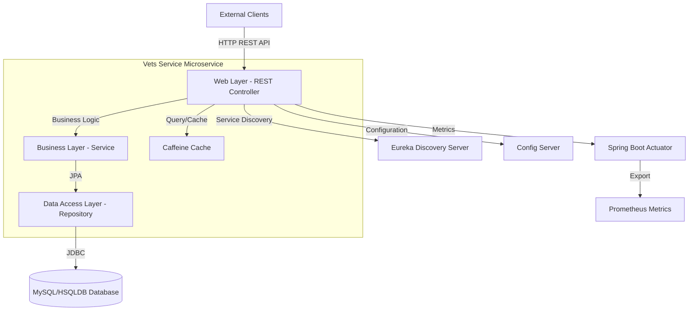
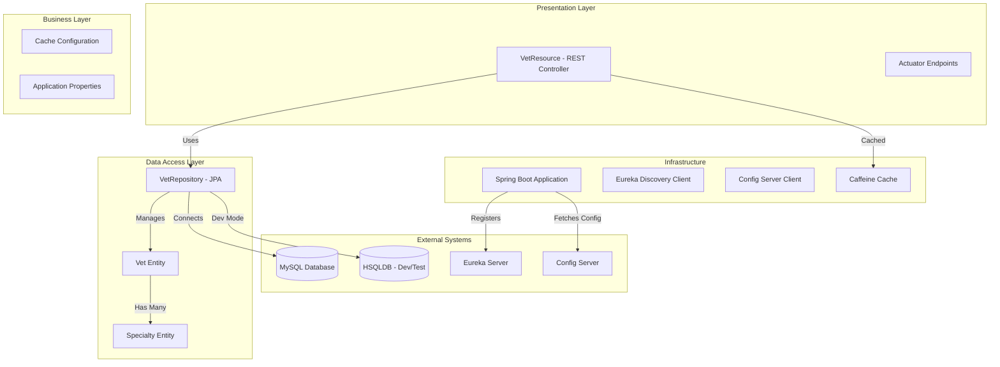

# Spring PetClinic Vets Service - Architecture Diagram

## Overview

| Property | Value |
|----------|-------|
| **Application Name** | Spring PetClinic Vets Service |
| **Application Type** | Microservice - REST API |
| **Framework** | Spring Boot 3.4.1 |
| **Java Version** | 17 |
| **Build Tool** | Maven |
| **Packaging** | JAR |

## Application Architecture

### High-Level Architecture



### Layered Architecture



## Code Structure

### Main Components

| Component | Package | Purpose |
|-----------|---------|---------|
| **VetsServiceApplication** | `org.springframework.samples.petclinic.vets` | Main Spring Boot application entry point with discovery client |
| **VetResource** | `org.springframework.samples.petclinic.vets.web` | REST controller exposing `/vets` endpoint with caching |
| **VetRepository** | `org.springframework.samples.petclinic.vets.model` | JPA repository for Vet entities |
| **Vet** | `org.springframework.samples.petclinic.vets.model` | Domain entity representing a veterinarian |
| **Specialty** | `org.springframework.samples.petclinic.vets.model` | Domain entity for vet specialties |
| **CacheConfig** | `org.springframework.samples.petclinic.vets.system` | Caffeine cache configuration |
| **VetsProperties** | `org.springframework.samples.petclinic.vets.system` | Configuration properties |

### Folder Structure

```
src/main/java/org/springframework/samples/petclinic/vets/
├── VetsServiceApplication.java    # Main application class
├── model/                          # Domain models and repositories
│   ├── Vet.java                   # Vet entity
│   ├── Specialty.java             # Specialty entity
│   └── VetRepository.java         # JPA repository
├── web/                            # REST controllers
│   └── VetResource.java           # Vets REST endpoint
└── system/                         # System configuration
    ├── CacheConfig.java           # Cache setup
    └── VetsProperties.java        # App properties
```

## Technology Stack

### Core Framework

| Technology | Version | Purpose |
|------------|---------|---------|
| **Spring Boot** | 3.4.1 | Application framework and runtime |
| **Java** | 17 | Programming language (LTS version) |
| **Maven** | Default | Build and dependency management |

### Spring Framework Components

| Component | Purpose |
|-----------|---------|
| **Spring Boot Starter Web** | REST API and web layer |
| **Spring Boot Starter Data JPA** | Data access and ORM |
| **Spring Boot Starter Actuator** | Health checks and monitoring |
| **Spring Boot Starter Cache** | Application-level caching |
| **Spring Cloud Config Client** | Externalized configuration |
| **Spring Cloud Netflix Eureka Client** | Service discovery and registration |
| **Azure Spring Cloud JDBC MySQL** | Azure MySQL connectivity |

### Data Storage

| Technology | Usage | Notes |
|------------|-------|-------|
| **MySQL** | Production database | Via Azure JDBC connector |
| **HSQLDB** | Development/test database | In-memory for testing |
| **Caffeine** | In-memory cache | Caching vet listings |

### Third-Party Libraries

| Library | Version | Purpose |
|---------|---------|---------|
| **Lombok** | Latest | Reduce boilerplate code |
| **Micrometer Prometheus** | Latest | Metrics export to Prometheus |
| **Jolokia** | 1.7.1 | JMX over HTTP |
| **Chaos Monkey for Spring Boot** | 3.1.0 | Resilience testing |

### Testing

| Tool | Purpose |
|------|---------|
| **JUnit 5** | Unit testing framework |
| **Spring Boot Test** | Integration testing support |

### Monitoring and Observability

| Tool | Purpose |
|------|---------|
| **Spring Boot Actuator** | Health, metrics, and info endpoints |
| **Prometheus** | Metrics collection and monitoring |
| **Micrometer** | Application metrics facade |

## API Endpoints

| Endpoint | Method | Description | Caching |
|----------|--------|-------------|---------|
| `/vets` | GET | List all veterinarians | Yes (Caffeine) |
| `/actuator/health` | GET | Health check endpoint | No |
| `/actuator/metrics` | GET | Application metrics | No |
| `/actuator/prometheus` | GET | Prometheus metrics | No |

## Configuration

### Application Configuration
- **Config Server URL**: `http://localhost:8888/` (configurable via `CONFIG_SERVER_URL`)
- **Service Name**: `vets-service`
- **Cache Names**: `vets`
- **Active Profile**: `production`
- **Docker Profile**: Uses `config-server:8888` for configuration

### External Dependencies
- **Eureka Server**: Service discovery and registration
- **Config Server**: Centralized configuration management
- **MySQL Database**: Persistent data storage (production)

## Cloud Readiness Features

| Feature | Implementation | Benefit |
|---------|----------------|---------|
| **Service Discovery** | Eureka Client | Dynamic service location |
| **Externalized Config** | Spring Cloud Config | Environment-specific configuration |
| **Health Checks** | Spring Boot Actuator | Kubernetes/cloud platform integration |
| **Metrics** | Prometheus + Micrometer | Monitoring and observability |
| **Caching** | Caffeine | Performance optimization |
| **Cloud Databases** | Azure JDBC MySQL | Cloud-native database connectivity |
| **Containerization** | Docker support | Cloud deployment ready |

## Notes

- This is a microservice component of the larger Spring PetClinic application
- Designed to run in cloud environments (Azure, Kubernetes)
- Uses Spring Cloud patterns for resilience and scalability
- Supports both local development (HSQLDB) and production (MySQL) databases
- Implements caching to reduce database load
- Exposes standard health and metrics endpoints for monitoring
