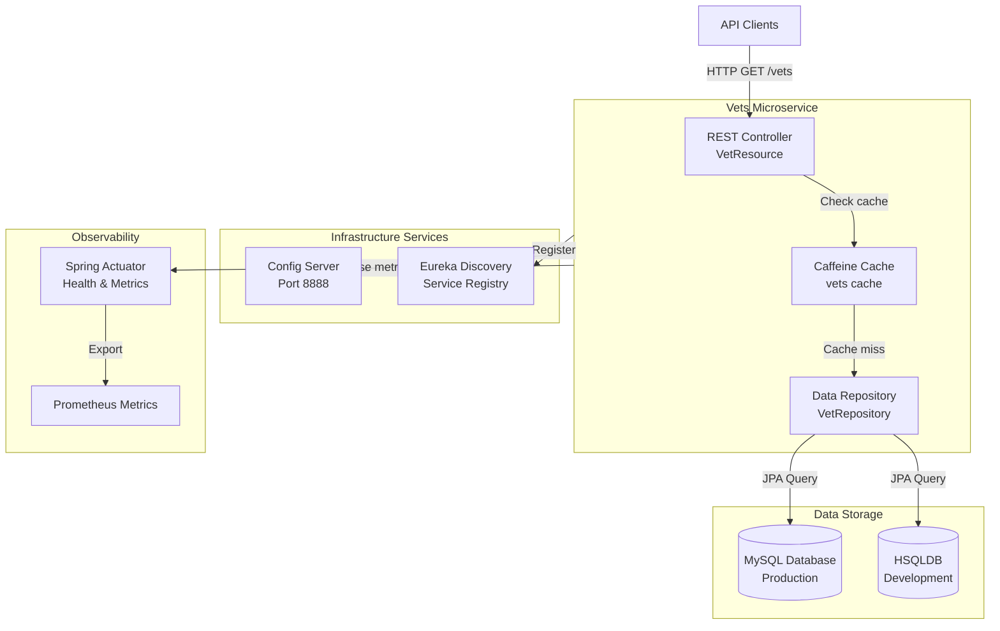

# Spring PetClinic Vets Service - Architecture Diagram

## Overview

| Property | Value |
|----------|-------|
| Application Name | Spring PetClinic Vets Service |
| Application Type | Microservice |
| Framework | Spring Boot 3.4.1 |
| Java Version | 17 |
| Build Tool | Maven |
| Packaging | JAR |

## Application Architecture

### High-Level Architecture



### Layered Architecture

```mermaid
graph TB
    subgraph PresentationLayer[Presentation Layer]
        REST[REST API<br/>@RestController]
    end
    
    subgraph CachingLayer[Caching Layer]
        CacheManager[Cache Manager<br/>Caffeine]
    end
    
    subgraph DataAccessLayer[Data Access Layer]
        JPA[Spring Data JPA<br/>@Repository]
        Entities[Domain Entities<br/>Vet, Specialty]
    end
    
    subgraph PersistenceLayer[Persistence Layer]
        DB[(Relational Database<br/>MySQL/HSQLDB)]
    end
    
    REST -->|@Cacheable| CacheManager
    CacheManager -->|Cache miss| JPA
    JPA -->|Manage| Entities
    Entities -->|Persist| DB
```

## Code Structure

### Component Organization

| Component | Package | Purpose |
|-----------|---------|---------|
| Main Application | org.springframework.samples.petclinic.vets | Application entry point with Spring Boot configuration |
| Web Layer | org.springframework.samples.petclinic.vets.web | REST controllers for API endpoints |
| Model Layer | org.springframework.samples.petclinic.vets.model | Domain entities and repositories |
| System Configuration | org.springframework.samples.petclinic.vets.system | Cache and application properties configuration |

### Key Components

| File | Type | Description |
|------|------|-------------|
| VetsServiceApplication.java | Application | Main Spring Boot application class with @EnableDiscoveryClient |
| VetResource.java | Controller | REST controller exposing /vets endpoint with caching |
| VetRepository.java | Repository | JPA repository for Vet entity data access |
| Vet.java | Entity | Domain entity representing a veterinarian |
| Specialty.java | Entity | Domain entity representing veterinarian specialties |
| CacheConfig.java | Configuration | Caffeine cache configuration |
| VetsProperties.java | Configuration | Application-specific configuration properties |

### Directory Structure

```
src/
├── main/
│   ├── java/
│   │   └── org/springframework/samples/petclinic/vets/
│   │       ├── VetsServiceApplication.java
│   │       ├── model/
│   │       │   ├── Vet.java
│   │       │   ├── Specialty.java
│   │       │   └── VetRepository.java
│   │       ├── web/
│   │       │   └── VetResource.java
│   │       └── system/
│   │           ├── CacheConfig.java
│   │           └── VetsProperties.java
│   └── resources/
│       ├── application.yml
│       ├── logback-spring.xml
│       └── db/
│           ├── hsqldb/
│           │   ├── schema.sql
│           │   └── data.sql
│           └── mysql/
│               ├── schema.sql
│               └── data.sql
└── test/
    └── java/
        └── org/springframework/samples/petclinic/vets/
            └── web/
                └── VetResourceTest.java
```

## Technology Stack

### Core Technologies

| Technology | Version | Purpose |
|------------|---------|---------|
| Java | 17 | Programming language |
| Spring Boot | 3.4.1 | Application framework |
| Spring Cloud | 2024.0.0 | Microservices framework |
| Maven | Default | Build tool |

### Spring Framework Components

| Component | Purpose |
|-----------|---------|
| Spring Web | REST API development with @RestController |
| Spring Data JPA | Database access with repository pattern |
| Spring Cache | Declarative caching with @Cacheable |
| Spring Actuator | Application monitoring and health checks |
| Spring Cloud Config | Externalized configuration management |
| Spring Cloud Netflix Eureka | Service discovery and registration |

### Data & Caching

| Technology | Version/Type | Purpose |
|------------|--------------|---------|
| MySQL | Runtime | Production relational database |
| HSQLDB | Runtime | Development/testing in-memory database |
| Caffeine | Latest | High-performance in-memory cache |
| Azure MySQL JDBC | 5.20.1 | Azure-optimized MySQL connectivity |
| Spring Data JPA | 3.4.1 | ORM and data access abstraction |

### Azure Integration

| Component | Version | Purpose |
|-----------|---------|---------|
| spring-cloud-azure-starter-jdbc-mysql | 5.20.1 | Azure MySQL connectivity with managed identity support |

### Monitoring & Observability

| Technology | Purpose |
|------------|---------|
| Spring Actuator | Health checks, metrics, and application info |
| Micrometer Prometheus | Metrics export in Prometheus format |
| Jolokia | JMX-HTTP bridge for monitoring |

### Additional Libraries

| Library | Version | Purpose |
|---------|---------|---------|
| Lombok | Provided | Reduce boilerplate code with annotations |
| Jakarta XML Bind | Latest | XML binding API |
| JUnit Jupiter | Latest | Unit testing framework |
| Chaos Monkey for Spring Boot | 3.1.0 | Chaos engineering and resilience testing |

## Architecture Patterns

### Design Patterns

- **Microservice Architecture**: Single-responsibility service focused on veterinarian management
- **Repository Pattern**: Data access abstraction via Spring Data JPA repositories
- **Cache-Aside Pattern**: Transparent caching with @Cacheable annotation
- **Service Discovery**: Dynamic service registration with Eureka
- **Externalized Configuration**: Centralized config via Spring Cloud Config Server
- **RESTful API**: Resource-oriented API design with standard HTTP methods

### Key Features

- **Caching**: Caffeine-based in-memory caching for vet list queries
- **Service Discovery**: Automatic registration with Eureka for service-to-service communication
- **Externalized Configuration**: Configuration loaded from central Config Server
- **Database Flexibility**: Support for both MySQL (production) and HSQLDB (development)
- **Azure Integration**: Native Azure MySQL support with connection pooling
- **Monitoring**: Comprehensive observability via Actuator and Prometheus metrics
- **Resilience**: Chaos engineering capabilities for testing failure scenarios

## Data Model

### Database Schema

The service manages two primary entities:

1. **Vet (Veterinarian)**
   - Core entity representing veterinarians in the clinic
   - JPA-managed entity with automatic persistence

2. **Specialty**
   - Represents veterinarian specializations
   - Related to Vet entity (likely many-to-many relationship)

Database initialization scripts are provided for both MySQL and HSQLDB:
- Schema: `src/main/resources/db/{mysql|hsqldb}/schema.sql`
- Data: `src/main/resources/db/{mysql|hsqldb}/data.sql`

## Configuration

### Application Configuration

- **Application Name**: `vets-service`
- **Config Server URL**: `http://localhost:8888/` (configurable via `CONFIG_SERVER_URL`)
- **Cache Names**: `vets`
- **Active Profile**: `production`
- **Docker Profile**: Uses `config-server:8888` for configuration

### Environment Profiles

- **Default/Production**: External config server, production database
- **Docker**: Container-optimized configuration with service discovery
