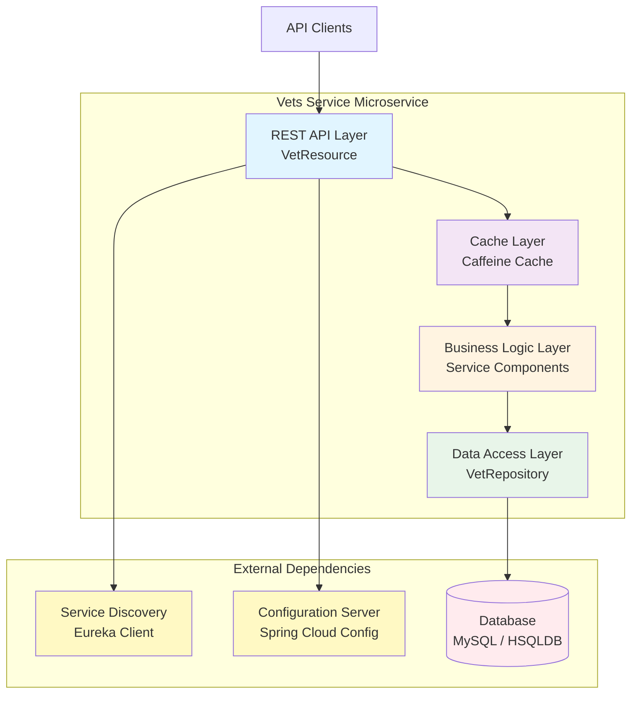
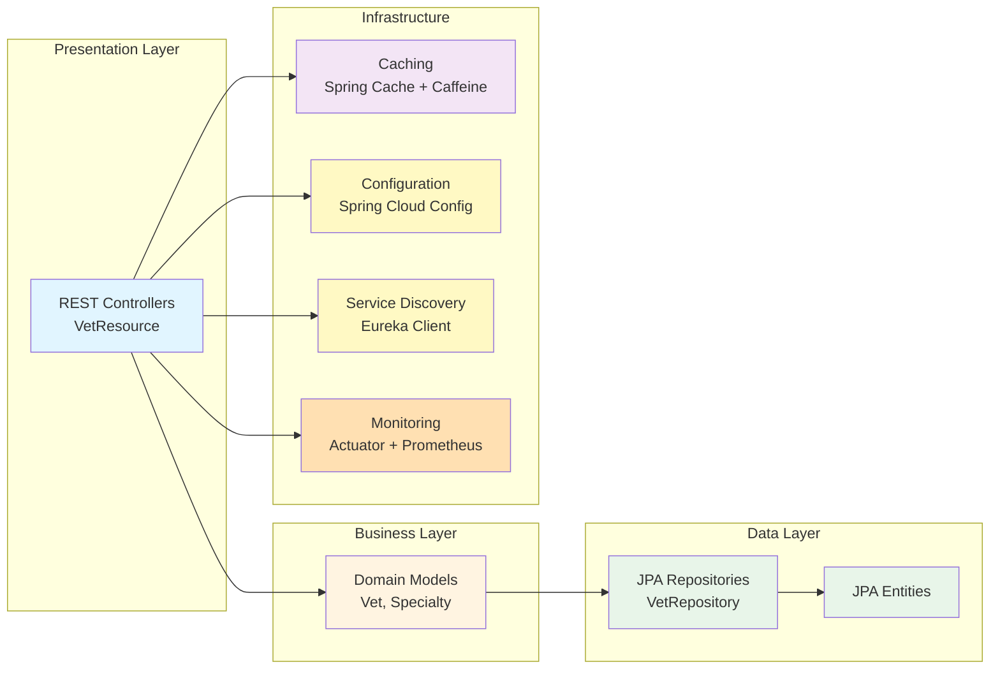
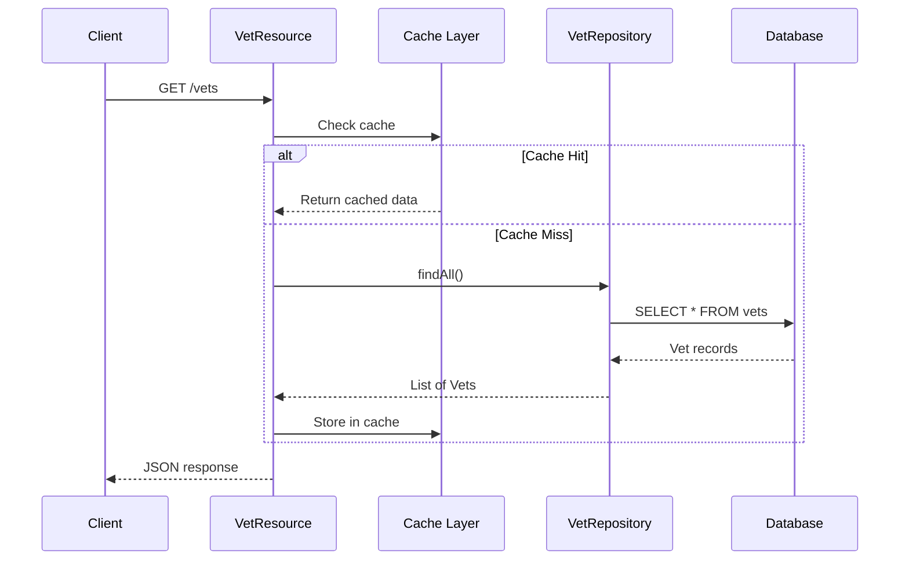
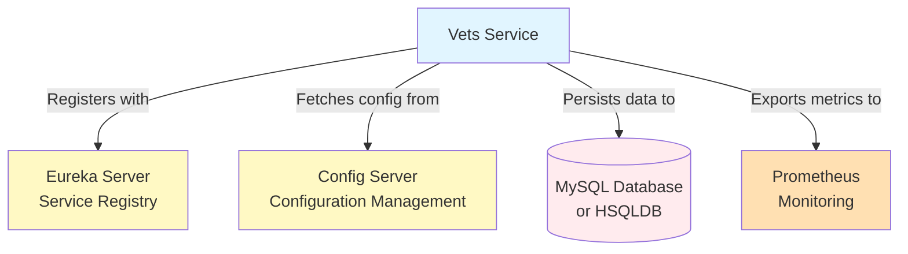

# Architecture Diagram - Spring PetClinic Vets Service

## Overview

| Property | Value |
|----------|-------|
| **Application Name** | Spring PetClinic Vets Service |
| **Application Type** | Microservice / REST API |
| **Framework** | Spring Boot 3.4.1 |
| **Java Version** | 17 |
| **Build Tool** | Maven |
| **Packaging** | JAR |

## Application Architecture

### High-Level Architecture



### Layered Architecture



## Code Structure

### Component Overview

| Component | Package | Purpose |
|-----------|---------|---------|
| **VetsServiceApplication** | `vets` | Main application entry point |
| **VetResource** | `vets.web` | REST controller for vet endpoints |
| **VetRepository** | `vets.model` | JPA repository for data access |
| **Vet** | `vets.model` | Domain model for veterinarian |
| **Specialty** | `vets.model` | Domain model for vet specialties |
| **CacheConfig** | `vets.system` | Cache configuration |
| **VetsProperties** | `vets.system` | Application properties |

### Folder Structure

```
src/main/java/org/springframework/samples/petclinic/vets/
├── VetsServiceApplication.java         # Main application class
├── model/                               # Domain models and repositories
│   ├── Vet.java
│   ├── Specialty.java
│   └── VetRepository.java
├── web/                                 # REST controllers
│   └── VetResource.java
└── system/                              # System configuration
    ├── CacheConfig.java
    └── VetsProperties.java

src/main/resources/
├── application.yml                      # Application configuration
├── db/                                  # Database schemas and data
│   ├── hsqldb/
│   └── mysql/
└── logback-spring.xml                   # Logging configuration
```

## Technology Stack

### Core Technologies

| Technology | Version | Purpose |
|------------|---------|---------|
| **Spring Boot** | 3.4.1 | Application framework |
| **Java** | 17 | Programming language |
| **Maven** | - | Build tool |
| **Spring Cloud** | 2024.0.0 | Microservices support |

### Spring Ecosystem

| Component | Purpose |
|-----------|---------|
| **Spring Boot Starter Web** | REST API support |
| **Spring Boot Starter Data JPA** | Data access layer |
| **Spring Boot Starter Cache** | Caching abstraction |
| **Spring Boot Starter Actuator** | Health checks and metrics |
| **Spring Cloud Config** | Centralized configuration |
| **Spring Cloud Netflix Eureka Client** | Service discovery |

### Data & Caching

| Technology | Version | Purpose |
|------------|---------|---------|
| **MySQL Connector** | Runtime | MySQL database driver |
| **HSQLDB** | Runtime | In-memory database for testing |
| **Azure JDBC Starter for MySQL** | 5.20.1 | Azure MySQL integration |
| **Caffeine** | - | High-performance caching library |
| **javax.cache API** | - | JSR-107 caching specification |

### Monitoring & Observability

| Technology | Purpose |
|------------|---------|
| **Micrometer Prometheus** | Metrics export to Prometheus |
| **Spring Boot Actuator** | Health endpoints and metrics |
| **Jolokia** | JMX-HTTP bridge |
| **Chaos Monkey** | Resilience testing |

### Additional Libraries

| Library | Version | Purpose |
|---------|---------|---------|
| **Lombok** | - | Code generation (reduce boilerplate) |
| **Jakarta XML Bind API** | - | XML binding |
| **JUnit Jupiter** | - | Unit testing framework |

## Data Flow



## External Integrations

### Service Dependencies



### Integration Points

| Service | Protocol | Purpose |
|---------|----------|---------|
| **Eureka Server** | HTTP | Service registration and discovery |
| **Config Server** | HTTP | Centralized configuration management |
| **Database** | JDBC | Data persistence (MySQL or HSQLDB) |
| **Prometheus** | HTTP | Metrics collection and monitoring |

## Deployment Considerations

### Port Configuration

- **Application Port**: 8081 (Docker exposed port)
- **Actuator Endpoints**: Available via Spring Boot Actuator

### Database Support

The application supports multiple database configurations:

1. **HSQLDB** (Development/Testing)
   - In-memory database
   - Schema and data scripts in `db/hsqldb/`

2. **MySQL** (Production)
   - Azure MySQL integration via Azure JDBC Starter
   - Schema and data scripts in `db/mysql/`

### Profiles

- **Default Profile**: `production`
- **Docker Profile**: Uses Config Server at `http://config-server:8888`

### Spring Cloud Integration

- **Service Discovery**: Registers with Eureka for service discovery
- **Configuration**: Fetches configuration from Config Server
- **Config Server URL**: Configurable via `CONFIG_SERVER_URL` environment variable (default: `http://localhost:8888/`)

## Assessment Findings Summary

Based on the AppCAT assessment, the following key findings were identified:

### Mandatory Issues (6 locations)
- **Caching**: Spring Boot Cache library usage (3 locations)
- **Network Protocols**: Use of unsecured network protocols (2 locations)
- **Containerization**: No Dockerfile found (1 location)

### Potential Issues (1 location)
- **Eureka Client**: Embedded framework dependency (1 location)

### Optional Issues (4 locations)
- **Spring Cloud Config**: Usage detected (1 location)
- **Jakarta EE**: Version not latest stable (1 location)
- **Hardcoded URLs**: HTTP protocol URLs in source code (2 locations)

For detailed assessment results, refer to the assessment report at `.github/modernize/report.json`.
