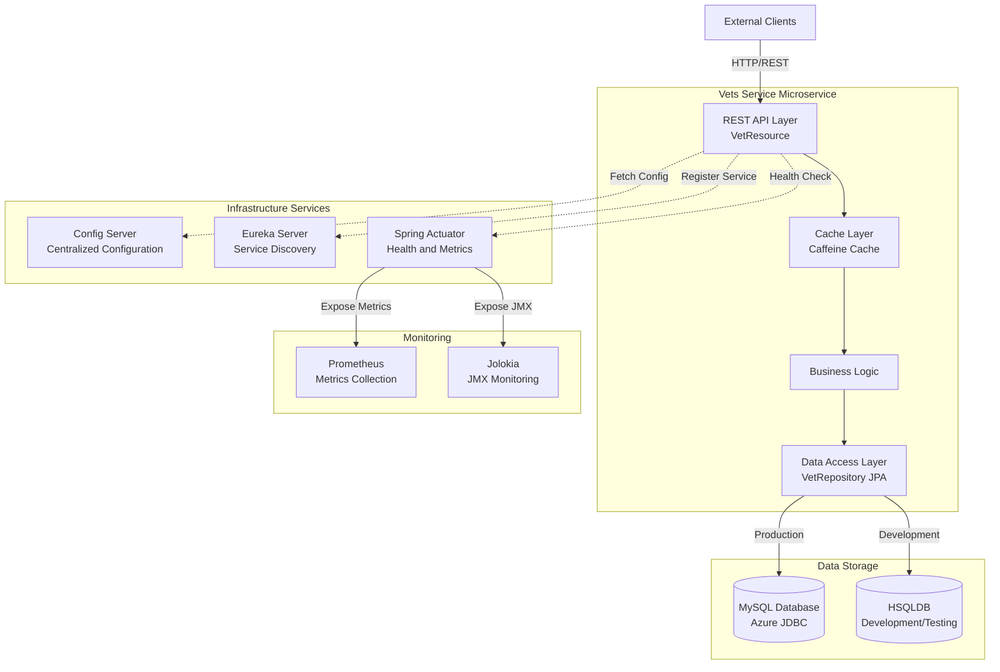
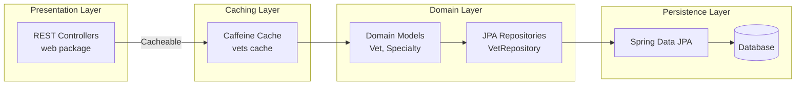

# Spring PetClinic Vets Service - Architecture Diagram

## Overview

| Property | Value |
|----------|-------|
| **Application Name** | Spring PetClinic Vets Service |
| **Application Type** | Microservice (REST API) |
| **Framework** | Spring Boot 3.4.1, Spring Cloud 2024.0.0 |
| **Java Version** | 17 |
| **Build Tool** | Maven |
| **Package** | JAR |

## Application Architecture

### High-Level Architecture



### Layered Architecture



## Code Structure

### Package Organization

| Package | Purpose | Key Components |
|---------|---------|----------------|
| `org.springframework.samples.petclinic.vets` | Root package | VetsServiceApplication |
| `org.springframework.samples.petclinic.vets.web` | REST API endpoints | VetResource |
| `org.springframework.samples.petclinic.vets.model` | Domain model and repositories | Vet, Specialty, VetRepository |
| `org.springframework.samples.petclinic.vets.system` | System configuration | CacheConfig, VetsProperties |

### Folder Structure

```
src/
├── main/
│   ├── java/
│   │   └── org/springframework/samples/petclinic/vets/
│   │       ├── VetsServiceApplication.java
│   │       ├── model/
│   │       │   ├── Vet.java
│   │       │   ├── Specialty.java
│   │       │   └── VetRepository.java
│   │       ├── web/
│   │       │   └── VetResource.java
│   │       └── system/
│   │           ├── CacheConfig.java
│   │           └── VetsProperties.java
│   └── resources/
│       ├── application.yml
│       └── db/
└── test/
    ├── java/
    └── resources/
```

## Technology Stack

### Core Framework

| Technology | Version | Purpose |
|------------|---------|---------|
| Spring Boot | 3.4.1 | Application framework |
| Spring Cloud | 2024.0.0 | Microservices infrastructure |
| Java | 17 | Programming language |
| Maven | - | Build tool |

### Spring Modules

| Module | Purpose |
|--------|---------|
| spring-boot-starter-web | REST API development |
| spring-boot-starter-data-jpa | Data persistence with JPA |
| spring-boot-starter-cache | Caching support |
| spring-boot-starter-actuator | Application monitoring and management |
| spring-cloud-starter-config | Centralized configuration client |
| spring-cloud-starter-netflix-eureka-client | Service discovery client |

### Data Access

| Technology | Version | Purpose |
|------------|---------|---------|
| Spring Data JPA | - | JPA repositories |
| MySQL Connector | Runtime | Production database driver |
| Azure JDBC MySQL Starter | - | Azure-managed MySQL connectivity |
| HSQLDB | Runtime | In-memory database for development/testing |
| Jakarta Persistence API | - | JPA specification |
| Jakarta XML Bind | - | XML binding for API responses |

### Caching

| Technology | Purpose |
|------------|---------|
| Caffeine | High-performance in-memory cache |
| JSR-107 (JCache API) | Standard caching API |

### Monitoring and Observability

| Technology | Version | Purpose |
|------------|---------|---------|
| Micrometer Prometheus | - | Metrics registry for Prometheus |
| Spring Boot Actuator | - | Health checks, metrics endpoints |
| Jolokia | 1.7.1 | JMX over HTTP |

### Cloud and Azure

| Technology | Version | Purpose |
|------------|---------|---------|
| Azure Spring Cloud | 5.20.1 | Azure integration |
| Azure JDBC MySQL Starter | - | Managed identity for Azure MySQL |

### Development and Testing

| Technology | Purpose |
|------------|---------|
| Lombok | Reduces boilerplate code |
| JUnit Jupiter | Testing framework |
| Spring Boot Test | Integration testing support |

### Additional Tools

| Technology | Version | Purpose |
|------------|---------|---------|
| Chaos Monkey for Spring Boot | 3.1.0 | Chaos engineering |
| Docker Maven Plugin | 1.2.0 | Container image building |

## Key Architectural Patterns

### Microservice Patterns

- **Service Discovery**: Uses Netflix Eureka for dynamic service registration and discovery
- **Centralized Configuration**: Loads configuration from Spring Cloud Config Server
- **API Gateway Pattern**: Designed to work behind an API Gateway (not included in this service)
- **Health Check Pattern**: Exposes health and readiness endpoints via Spring Actuator

### Data Access Patterns

- **Repository Pattern**: Uses Spring Data JPA repositories for data access
- **Entity Pattern**: Domain entities (Vet, Specialty) mapped to database tables
- **Lazy/Eager Loading**: Many-to-many relationship with EAGER fetching for specialties

### Caching Strategy

- **Cache-Aside Pattern**: Implements @Cacheable on GET endpoints
- **Named Cache**: Uses "vets" cache for veterinarian data
- **In-Memory Cache**: Caffeine provides high-performance local caching

### REST API Design

- **Resource-Based URLs**: `/vets` endpoint for veterinarian resources
- **RESTful Operations**: GET operation for listing all veterinarians
- **Stateless**: No session state maintained in the service

## External Dependencies

### Required Services

1. **Config Server** (http://localhost:8888 or http://config-server:8888)
   - Provides centralized configuration
   - Can be optional based on configuration

2. **Eureka Server**
   - Service registry for microservice discovery
   - Enables dynamic service location

3. **MySQL Database** (Production)
   - Stores veterinarian and specialty data
   - Azure JDBC starter provides managed identity support

### Optional Services

1. **Prometheus Server**
   - Scrapes metrics from /actuator/prometheus endpoint
   - Provides monitoring and alerting

2. **Chaos Monkey**
   - Introduces controlled failures for resilience testing
   - Configurable via application properties

## Deployment Considerations

### Container Support

- Docker support via docker-maven-plugin
- Dockerfile directory: `../docker`
- Exposed port: 8081 (configurable)

### Configuration Profiles

- **Default Profile**: Production
- **Docker Profile**: Uses config-server:8888 for configuration
- **Test Profile**: Uses HSQLDB in-memory database

### Azure Integration

- Azure JDBC MySQL Starter for managed MySQL connectivity
- Supports Azure Managed Identity for passwordless authentication
- Compatible with Azure Spring Cloud, Azure App Service, AKS

## API Endpoints

### Veterinarians API

- **GET /vets**: List all veterinarians with their specialties
  - Cached with "vets" cache
  - Returns JSON array of veterinarian objects
  - Each vet includes: id, firstName, lastName, specialties[]

### Actuator Endpoints

- **/actuator/health**: Health check endpoint
- **/actuator/prometheus**: Prometheus metrics
- **/actuator/info**: Application information
- Additional actuator endpoints as configured
