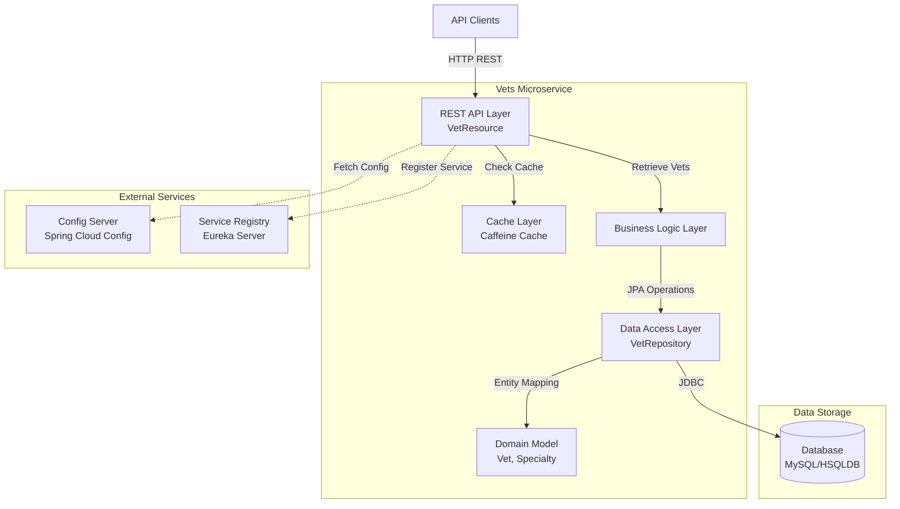
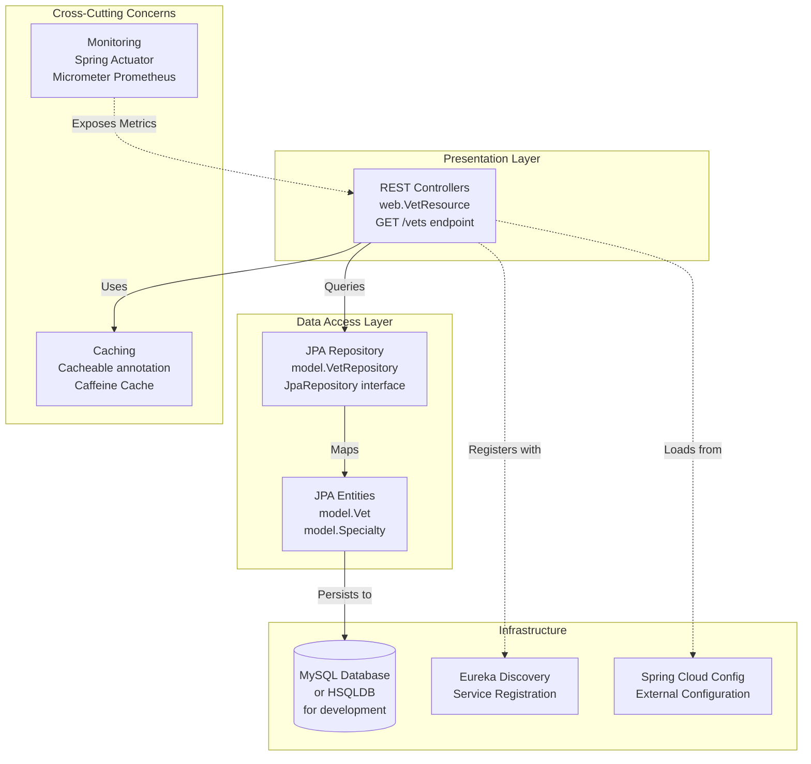

# Spring PetClinic Vets Service - Architecture Diagram

## Overview

| Property | Value |
|----------|-------|
| **Application Name** | Spring PetClinic Vets Service |
| **Application Type** | Spring Boot Microservice |
| **Framework** | Spring Boot 3.4.1 |
| **Java Version** | 17 |
| **Build Tool** | Maven |
| **Package** | JAR |
| **Port** | 8081 |

## Application Architecture

### High-Level Architecture

### Layered Architecture

## Code Structure

### Components

| Component | Package | Description |
|-----------|---------|-------------|
| **VetsServiceApplication** | org.springframework.samples.petclinic.vets | Main Spring Boot application class with service discovery enabled |
| **VetResource** | org.springframework.samples.petclinic.vets.web | REST controller exposing veterinarian endpoints |
| **VetRepository** | org.springframework.samples.petclinic.vets.model | Spring Data JPA repository for Vet entities |
| **Vet** | org.springframework.samples.petclinic.vets.model | JPA entity representing veterinarian |
| **Specialty** | org.springframework.samples.petclinic.vets.model | JPA entity representing vet specialty |
| **CacheConfig** | org.springframework.samples.petclinic.vets.system | Cache configuration |
| **VetsProperties** | org.springframework.samples.petclinic.vets.system | Configuration properties |

### Folder Structure

| Path | Purpose |
|------|---------|
| `src/main/java/org/springframework/samples/petclinic/vets` | Root package for vets service |
| `src/main/java/.../vets/web` | REST API controllers |
| `src/main/java/.../vets/model` | Domain model and repositories |
| `src/main/java/.../vets/system` | System configuration classes |
| `src/main/resources` | Application configuration files |
| `src/test/java` | Unit and integration tests |

## Technology Stack

### Core Technologies

| Technology | Version | Purpose |
|------------|---------|---------|
| **Java** | 17 | Runtime platform |
| **Spring Boot** | 3.4.1 | Application framework |
| **Spring Cloud** | 2024.0.0 | Microservices infrastructure |
| **Maven** | Latest | Build and dependency management |

### Spring Framework Components

| Component | Purpose |
|-----------|---------|
| **Spring Boot Starter Web** | REST API development |
| **Spring Boot Starter Data JPA** | Database access with JPA |
| **Spring Boot Starter Cache** | Caching abstraction |
| **Spring Boot Starter Actuator** | Monitoring and management endpoints |
| **Spring Cloud Config** | Centralized configuration management |
| **Spring Cloud Netflix Eureka Client** | Service discovery and registration |

### Azure Integration

| Component | Version | Purpose |
|-----------|---------|---------|
| **Spring Cloud Azure Dependencies** | 5.20.1 | Azure services integration |
| **Spring Cloud Azure Starter JDBC MySQL** | Latest | Azure MySQL integration with passwordless auth |

### Data Access & Storage

| Technology | Purpose |
|------------|---------|
| **Spring Data JPA** | ORM and data access |
| **Hibernate** | JPA implementation (via Spring Boot) |
| **MySQL Connector** | Production database driver |
| **HSQLDB** | In-memory database for development/testing |

### Caching

| Technology | Purpose |
|------------|---------|
| **Caffeine** | High-performance in-memory cache |
| **javax.cache API** | JSR-107 caching standard |

### Observability & Monitoring

| Technology | Purpose |
|------------|---------|
| **Spring Boot Actuator** | Health checks and metrics |
| **Micrometer** | Metrics collection |
| **Micrometer Prometheus** | Prometheus metrics exporter |
| **Jolokia** | JMX-HTTP bridge |

### Additional Libraries

| Library | Version | Purpose |
|---------|---------|---------|
| **Lombok** | Latest | Reduce boilerplate code |
| **Jakarta XML Bind API** | Latest | XML binding support |
| **Chaos Monkey for Spring Boot** | 3.1.0 | Chaos engineering testing |

### Testing

| Technology | Purpose |
|------------|---------|
| **Spring Boot Starter Test** | Testing framework |
| **JUnit Jupiter** | Unit testing framework |

## API Endpoints

| Endpoint | Method | Description |
|----------|--------|-------------|
| `/vets` | GET | Retrieve list of all veterinarians with their specialties (cached) |
| `/actuator/health` | GET | Health check endpoint |
| `/actuator/prometheus` | GET | Prometheus metrics endpoint |

## External Dependencies

### Required Services

| Service | Purpose | Configuration |
|---------|---------|---------------|
| **Config Server** | Centralized configuration | Default: http://localhost:8888 |
| **Eureka Server** | Service discovery and registration | Managed by Spring Cloud |
| **MySQL Database** | Production data storage | Azure MySQL compatible |

### Optional Services

| Service | Purpose |
|---------|---------|
| **HSQLDB** | Development/testing database |

## Configuration

### Application Profiles

| Profile | Purpose |
|---------|---------|
| `production` | Default production profile |
| `docker` | Docker container deployment |

### Key Configuration Properties

- **Application Name**: `vets-service`
- **Cache Names**: `vets`
- **Config Server Import**: Optional with fallback to localhost
- **Docker Profile Config Server**: `http://config-server:8888`

## Deployment Considerations

### Container Support

- Docker build profile available (`buildDocker`)
- Spotify Docker Maven plugin configured
- Exposed port: 8081

### Azure Compatibility

- Azure Spring Cloud JDBC MySQL starter included
- Passwordless authentication support
- Compatible with Azure App Service, Azure Container Apps, and Azure Kubernetes Service

## Architecture Patterns

### Design Patterns Used

1. **Layered Architecture**: Clear separation between web, business, and data layers
2. **Repository Pattern**: Spring Data JPA repositories for data access
3. **DTO Pattern**: Domain entities used as data transfer objects
4. **Service Discovery Pattern**: Eureka client for microservice registration
5. **Externalized Configuration**: Spring Cloud Config for centralized configuration
6. **Cache-Aside Pattern**: Caffeine cache with `@Cacheable` annotations

### Best Practices

- RESTful API design
- Domain-driven design with clear entity models
- Dependency injection with Spring
- Configuration management with profiles
- Monitoring and observability built-in
- Chaos engineering ready for resilience testing
