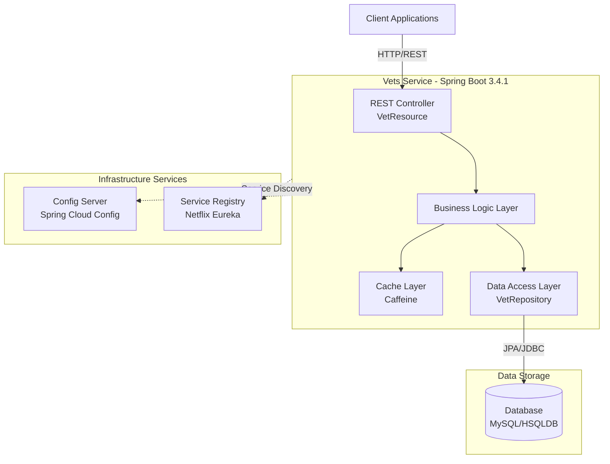
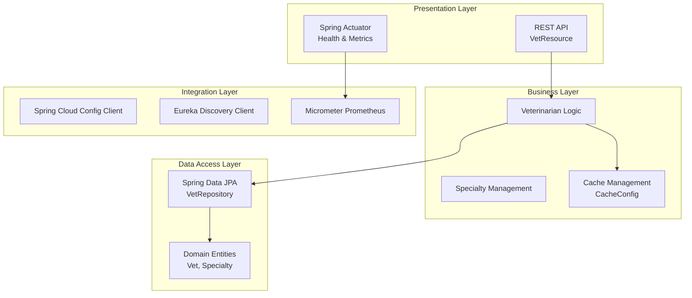

# Spring PetClinic Vets Service - Architecture Diagram

## Overview

| Property | Value |
|----------|-------|
| Application Name | vets-service |
| Application Type | Microservice |
| Framework | Spring Boot 3.4.1 |
| Java Version | 17 |
| Build Tool | Maven |
| Primary Purpose | Veterinarian management service in Spring PetClinic microservices architecture |

## Application Architecture

### High-Level Architecture



### Layered Architecture



## Code Structure

### Main Components

| Component | Package | Purpose |
|-----------|---------|---------|
| VetsServiceApplication | org.springframework.samples.petclinic.vets | Main application entry point |
| VetResource | org.springframework.samples.petclinic.vets.web | REST API controller for vet operations |
| VetRepository | org.springframework.samples.petclinic.vets.model | JPA repository for data access |
| Vet | org.springframework.samples.petclinic.vets.model | Domain entity for veterinarians |
| Specialty | org.springframework.samples.petclinic.vets.model | Domain entity for specialties |
| CacheConfig | org.springframework.samples.petclinic.vets.system | Cache configuration |
| VetsProperties | org.springframework.samples.petclinic.vets.system | Configuration properties |

### Folder Structure

```
src/main/
├── java/org/springframework/samples/petclinic/vets/
│   ├── VetsServiceApplication.java       # Application entry point
│   ├── model/                             # Domain models and repositories
│   │   ├── Vet.java
│   │   ├── Specialty.java
│   │   └── VetRepository.java
│   ├── web/                               # REST controllers
│   │   └── VetResource.java
│   └── system/                            # System configuration
│       ├── CacheConfig.java
│       └── VetsProperties.java
└── resources/
    ├── application.yml                    # Application configuration
    ├── logback-spring.xml                # Logging configuration
    └── db/                                # Database scripts
        ├── hsqldb/                        # HSQLDB scripts
        │   ├── schema.sql
        │   └── data.sql
        └── mysql/                         # MySQL scripts
            ├── schema.sql
            └── data.sql
```

## Technology Stack

### Core Technologies

| Technology | Version | Purpose |
|------------|---------|---------|
| Java | 17 | Runtime platform |
| Spring Boot | 3.4.1 | Application framework |
| Spring Cloud | 2024.0.0 | Microservices infrastructure |
| Maven | - | Build tool |

### Frameworks & Libraries

| Framework/Library | Version | Purpose |
|-------------------|---------|---------|
| Spring Boot Starter Web | 3.4.1 | REST API development |
| Spring Boot Starter Data JPA | 3.4.1 | Data persistence with JPA |
| Spring Boot Starter Actuator | 3.4.1 | Application monitoring and management |
| Spring Boot Starter Cache | 3.4.1 | Caching abstraction |
| Spring Cloud Config | 2024.0.0 | Centralized configuration management |
| Spring Cloud Netflix Eureka Client | 2024.0.0 | Service discovery |
| Spring Cloud Azure JDBC MySQL | 5.20.1 | Azure MySQL integration |

### Data Management

| Technology | Version | Purpose |
|------------|---------|---------|
| MySQL Connector | Latest | Production database driver |
| HSQLDB | Latest | Development/testing in-memory database |
| Caffeine | Latest | High-performance caching library |
| Spring Data JPA | 3.4.1 | Data access abstraction |

### Monitoring & Operations

| Technology | Version | Purpose |
|------------|---------|---------|
| Micrometer Prometheus | Latest | Metrics collection for Prometheus |
| Spring Boot Actuator | 3.4.1 | Health checks and operational endpoints |
| Jolokia | 1.7.1 | JMX over HTTP |
| Chaos Monkey | 3.1.0 | Chaos engineering for resilience testing |

### Development Tools

| Technology | Version | Purpose |
|------------|---------|---------|
| Lombok | Latest | Reduce boilerplate code |
| JUnit Jupiter | Latest | Unit testing framework |
| Spring Boot Test | 3.4.1 | Integration testing |

### Azure Integration

| Technology | Version | Purpose |
|------------|---------|---------|
| Spring Cloud Azure | 5.20.1 | Azure services integration |
| Azure JDBC MySQL Starter | 5.20.1 | Managed MySQL database connectivity |

## Architecture Characteristics

### Microservice Patterns

- **Service Discovery**: Uses Netflix Eureka for service registration and discovery
- **Centralized Configuration**: Spring Cloud Config for external configuration
- **API Gateway**: Designed to work behind an API gateway (not included in this service)
- **Health Monitoring**: Spring Boot Actuator for health checks and metrics

### Data Patterns

- **Repository Pattern**: Spring Data JPA repositories for data access
- **Caching**: Caffeine cache for improved performance
- **Multi-Database Support**: Supports both MySQL (production) and HSQLDB (development)

### Cloud Readiness

- **Containerization**: Includes Docker build profile
- **Azure Integration**: Native support for Azure MySQL and Spring Cloud Azure
- **Observability**: Prometheus metrics and health endpoints
- **Resilience**: Chaos Monkey integration for fault tolerance testing
