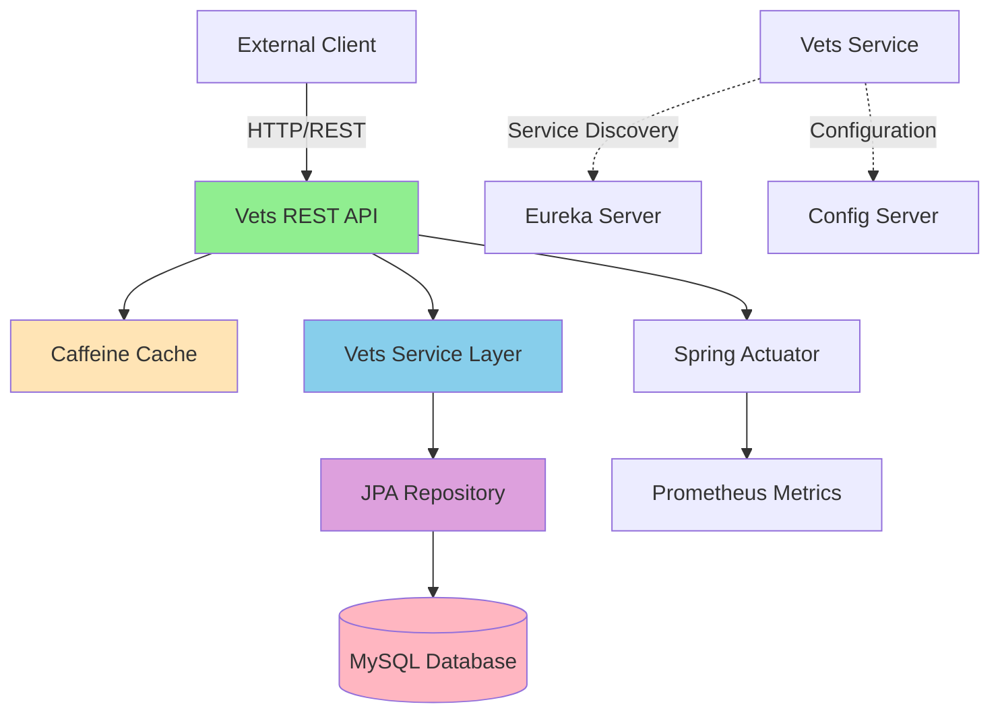

# Application Architecture Diagram

## Overview

| Property | Value |
|----------|-------|
| Application Name | Spring PetClinic Vets Service |
| Application Type | Microservice (REST API) |
| Framework | Spring Boot 3.4.1 |
| Language | Java 17 |
| Build Tool | Maven |
| Packaging | JAR |

## Application Architecture

### High-Level Architecture

### Component Interaction Flow

## Code Structure

### Main Components

| Component | Type | Description |
|-----------|------|-------------|
| VetsServiceApplication | Application Entry Point | Main Spring Boot application class with @EnableDiscoveryClient |
| VetResource | REST Controller | Exposes /vets endpoint with caching |
| VetRepository | JPA Repository | Data access layer for Vet entities |
| Vet | JPA Entity | Domain model for veterinarian |
| Specialty | JPA Entity | Domain model for veterinarian specialties |
| CacheConfig | Configuration | Cache configuration for Caffeine |
| VetsProperties | Configuration Properties | Application-specific properties |

### Project Structure

| Directory | Purpose |
|-----------|---------|
| src/main/java/org/springframework/samples/petclinic/vets/model | Domain entities and repositories |
| src/main/java/org/springframework/samples/petclinic/vets/web | REST controllers and web layer |
| src/main/java/org/springframework/samples/petclinic/vets/system | Configuration and system utilities |
| src/main/resources | Application configuration files |
| src/test | Test classes and resources |

## Technology Stack

### Core Technologies

| Category | Technology | Version/Details |
|----------|-----------|-----------------|
| **Framework** | Spring Boot | 3.4.1 |
| **Language** | Java | 17 |
| **Build Tool** | Maven | - |
| **Packaging** | JAR | - |

### Spring Framework Components

| Component | Purpose |
|-----------|---------|
| Spring Boot Starter Web | REST API development |
| Spring Boot Starter Data JPA | Database access with JPA/Hibernate |
| Spring Boot Starter Actuator | Health checks and metrics |
| Spring Boot Starter Cache | Caching abstraction |
| Spring Cloud Config | Externalized configuration |
| Spring Cloud Netflix Eureka Client | Service discovery |
| Spring Cloud Azure JDBC MySQL | Azure MySQL integration |

### Data & Caching

| Technology | Purpose |
|-----------|---------|
| MySQL (mysql-connector-j) | Primary database (production) |
| HSQLDB | In-memory database (development/testing) |
| Caffeine | High-performance caching library |
| JPA/Hibernate | Object-relational mapping |

### Monitoring & Observability

| Technology | Purpose |
|-----------|---------|
| Spring Boot Actuator | Health and metrics endpoints |
| Micrometer | Metrics collection |
| Prometheus Registry | Metrics export for Prometheus |
| Jolokia | JMX-HTTP bridge |

### Third-Party Libraries

| Library | Purpose |
|-----------|---------|
| Lombok | Reduce boilerplate code with annotations |
| Chaos Monkey for Spring Boot | Chaos engineering support |
| Jakarta XML Bind API | XML binding support |

### Testing

| Technology | Purpose |
|-----------|---------|
| Spring Boot Starter Test | Testing framework |
| JUnit Jupiter | Unit testing framework |

## Architecture Patterns

### Design Patterns

- **Layered Architecture**: Clear separation between web, service, and data layers
- **Repository Pattern**: JpaRepository for data access abstraction
- **Microservice Pattern**: Standalone service with REST API
- **Service Discovery**: Integration with Eureka for service registration
- **Externalized Configuration**: Configuration managed by Config Server
- **Caching**: Method-level caching with @Cacheable annotations

### Integration Patterns

- **REST API**: RESTful endpoints for client communication
- **Service Registry**: Eureka client for microservice discovery
- **Centralized Configuration**: Spring Cloud Config for configuration management
- **Health Checks**: Actuator endpoints for monitoring
- **Metrics Export**: Prometheus-compatible metrics

## Azure Migration Considerations

Based on the assessment report, the following Azure services are recommended targets:

### Target Azure Services

1. **Azure Kubernetes Service (AKS)** - Container orchestration
2. **Azure App Service** - PaaS hosting for Java applications
3. **Azure Container Apps** - Serverless container hosting

### Key Dependencies for Azure

- Azure Database for MySQL (production database)
- Azure Cache for Redis (potential replacement for Caffeine)
- Azure Application Insights (monitoring and telemetry)
- Azure Key Vault (secrets management)
- Azure Service Bus (if message queuing is added)

### Migration Effort Summary

- **Total Issues Identified**: 7
- **Total Incidents**: 11
- **Estimated Effort**: 35 story points

### Issue Categories

| Category | Count |
|----------|-------|
| Containerization | 1 |
| Embedded Cache Management | 3 |
| Framework Upgrade | 1 |
| Remote Communication | 4 |
| Spring Migration | 2 |

### Severity Breakdown

| Severity | Count |
|----------|-------|
| Mandatory | 6 |
| Optional | 4 |
| Potential | 1 |
| Information | 0 |
