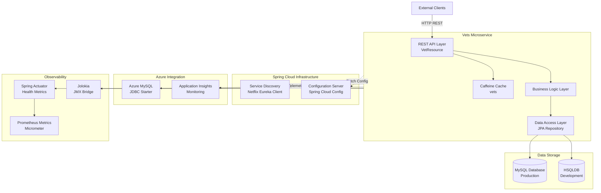
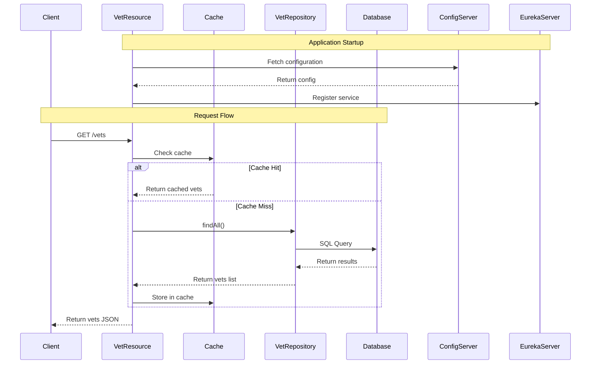

# Architecture Diagram - Spring PetClinic Vets Service

## Overview

| Property | Value |
|----------|-------|
| **Application Name** | Spring PetClinic Vets Service |
| **Application Type** | Microservice - REST API |
| **Framework** | Spring Boot 3.4.1 |
| **Java Version** | 17 |
| **Build Tool** | Maven |
| **Packaging** | JAR |

## Application Architecture

### High-Level Architecture



### Component Architecture

```mermaid
graph LR
    subgraph Presentation["Presentation Layer"]
        REST[VetResource<br/>@RestController]
    end
    
    subgraph Domain["Domain Model"]
        Vet[Vet Entity<br/>@Entity]
        Specialty[Specialty Entity<br/>@Entity]
    end
    
    subgraph Repository["Repository Layer"]
        VetRepo[VetRepository<br/>extends JpaRepository]
    end
    
    subgraph Config["Configuration"]
        AppConfig[VetsServiceApplication<br/>@SpringBootApplication]
        CacheConfig[CacheConfig<br/>Caffeine Setup]
        Props[VetsProperties<br/>@ConfigurationProperties]
    end
    
    REST -->|uses| VetRepo
    REST -->|returns| Vet
    VetRepo -->|manages| Vet
    Vet -->|has many| Specialty
    AppConfig -->|enables| VetRepo
    CacheConfig -->|caches| REST
```

## Code Structure

### Project Layout

| Directory | Description | Key Components |
|-----------|-------------|----------------|
| `/src/main/java/.../vets` | Main application package | VetsServiceApplication.java |
| `/src/main/java/.../vets/model` | Domain entities and repositories | Vet.java, Specialty.java, VetRepository.java |
| `/src/main/java/.../vets/web` | REST controllers | VetResource.java |
| `/src/main/java/.../vets/system` | System configuration | CacheConfig.java, VetsProperties.java |
| `/src/main/resources` | Configuration files | application.yml |
| `/src/test` | Test cases | Unit and integration tests |

### Key Components

| Component | Type | Purpose |
|-----------|------|---------|
| VetsServiceApplication | @SpringBootApplication | Main entry point, enables service discovery |
| VetResource | @RestController | REST API endpoint for vets |
| VetRepository | JpaRepository | Data access for Vet entities |
| Vet | @Entity | Domain model for veterinarian |
| Specialty | @Entity | Domain model for vet specialties |
| CacheConfig | @Configuration | Cache configuration using Caffeine |

## Technology Stack

| Category | Technology | Version | Purpose |
|----------|-----------|---------|---------|
| **Framework** | Spring Boot | 3.4.1 | Application framework |
| **Language** | Java | 17 | Programming language |
| **Cloud** | Spring Cloud | 2024.0.0 | Microservices infrastructure |
| **Service Discovery** | Netflix Eureka Client | - | Service registration and discovery |
| **Configuration** | Spring Cloud Config | - | Centralized configuration management |
| **Data Access** | Spring Data JPA | - | ORM and repository abstraction |
| **Database (Prod)** | MySQL | - | Production database |
| **Database (Dev)** | HSQLDB | - | In-memory development database |
| **Azure Integration** | Azure Spring Cloud JDBC | 5.20.1 | Azure MySQL connectivity |
| **Caching** | Caffeine | - | In-memory caching |
| **Cache API** | javax.cache | - | JSR-107 cache abstraction |
| **Monitoring** | Spring Boot Actuator | - | Health checks and metrics |
| **Metrics** | Micrometer Prometheus | - | Prometheus metrics registry |
| **JMX** | Jolokia | 1.7.1 | JMX over HTTP bridge |
| **Resilience** | Chaos Monkey | 3.1.0 | Chaos engineering support |
| **Utilities** | Lombok | - | Reduce boilerplate code |
| **Build Tool** | Maven | - | Build and dependency management |

## Data Flow



## Architecture Characteristics

### Microservice Patterns

- **Service Registry**: Integrates with Netflix Eureka for service discovery
- **Configuration Management**: Uses Spring Cloud Config for externalized configuration
- **Caching Strategy**: Implements Caffeine-based caching with @Cacheable annotation
- **Health Monitoring**: Exposes Actuator endpoints for health checks and metrics
- **API Design**: RESTful API with JSON responses

### Cloud-Ready Features

- **12-Factor App**: Externalized configuration, stateless design
- **Azure Integration**: Azure MySQL JDBC starter for managed database connectivity
- **Observability**: Prometheus metrics, Application Insights support
- **Containerization**: Docker support with configurable profiles
- **Resilience**: Chaos Monkey integration for testing failure scenarios

### Data Management

- **ORM**: Spring Data JPA with entity relationships
- **Database Flexibility**: Profile-based database switching (MySQL/HSQLDB)
- **Caching**: In-memory cache for frequently accessed vet data
- **Repository Pattern**: Clean separation of data access logic

## Deployment Considerations

### Profiles

- **production**: Default profile for production deployment
- **docker**: Docker-specific configuration with service discovery URLs

### Exposed Ports

- **8081**: HTTP port for REST API

### Azure Recommendations

Based on the architecture and assessment:

1. **Azure Container Apps** or **Azure App Service**: Suitable for hosting this microservice
2. **Azure Database for MySQL**: For production database with managed service benefits
3. **Azure Application Insights**: Already integrated for monitoring and telemetry
4. **Azure Service Bus**: Could replace Config Server for configuration if needed
5. **Azure Cache for Redis**: Could replace Caffeine for distributed caching in multi-instance scenarios

---

*Generated from AppCAT assessment on 2026-02-10*
