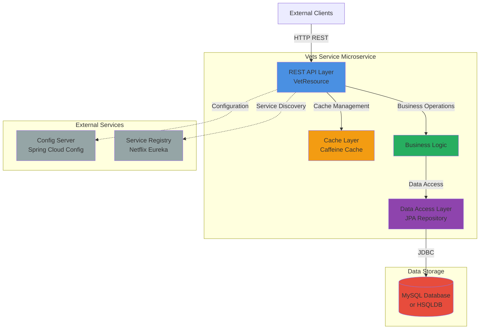
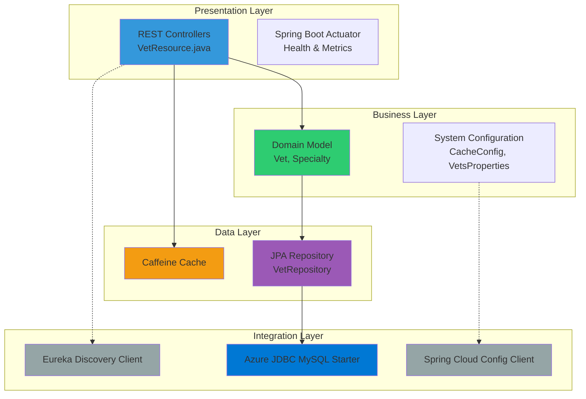
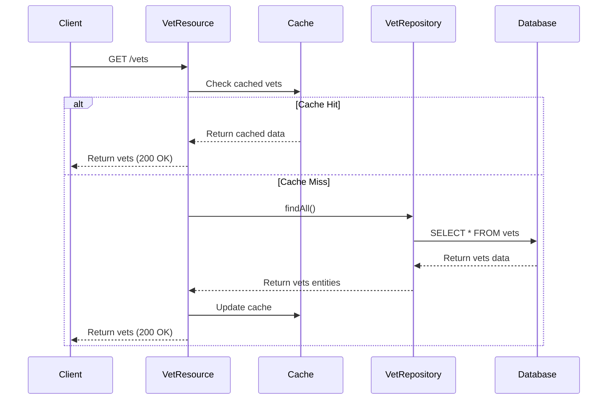

# Architecture Diagram: Spring PetClinic Vets Service

## Overview

| Property | Value |
|----------|-------|
| **Application Name** | Spring PetClinic Vets Service |
| **Application Type** | Microservice (RESTful API) |
| **Language** | Java 17 |
| **Framework** | Spring Boot 3.4.1 |
| **Build Tool** | Maven |
| **Packaging** | JAR |
| **Port** | 8081 |

## Application Architecture

### High-Level Architecture

### Layered Architecture

## Code Structure

### Main Components

| Component | Path | Description |
|-----------|------|-------------|
| Main Application | `VetsServiceApplication.java` | Spring Boot entry point with @EnableDiscoveryClient |
| REST Controller | `web/VetResource.java` | REST API endpoints for veterinarians |
| Domain Model | `model/Vet.java`, `model/Specialty.java` | Entity classes for vets and specialties |
| Repository | `model/VetRepository.java` | JPA repository for data access |
| Cache Configuration | `system/CacheConfig.java` | Caffeine cache configuration |
| Properties | `system/VetsProperties.java` | Application properties configuration |

### Folder Structure

| Directory | Purpose |
|-----------|---------|
| `src/main/java/org/springframework/samples/petclinic/vets` | Main application source code |
| `src/main/java/org/springframework/samples/petclinic/vets/model` | Domain entities and repositories |
| `src/main/java/org/springframework/samples/petclinic/vets/web` | REST controllers |
| `src/main/java/org/springframework/samples/petclinic/vets/system` | System configuration classes |
| `src/main/resources` | Application configuration files |
| `src/main/resources/db` | Database initialization scripts |
| `src/test` | Test code and resources |

## Technology Stack

### Core Technologies

| Technology | Version | Purpose |
|------------|---------|---------|
| Java | 17 | Programming language |
| Spring Boot | 3.4.1 | Application framework |
| Spring Cloud | 2024.0.0 | Microservices infrastructure |
| Maven | - | Build tool |

### Key Dependencies

| Dependency | Version | Purpose |
|------------|---------|---------|
| Spring Boot Starter Web | 3.4.1 | REST API support |
| Spring Boot Starter Data JPA | 3.4.1 | Data persistence |
| Spring Boot Starter Cache | 3.4.1 | Caching support |
| Spring Boot Starter Actuator | 3.4.1 | Monitoring and health checks |
| Spring Cloud Config | 2024.0.0 | Centralized configuration |
| Spring Cloud Netflix Eureka Client | 2024.0.0 | Service discovery |
| Spring Cloud Azure JDBC MySQL | 5.20.1 | Azure MySQL integration |
| Caffeine | - | In-memory cache implementation |
| MySQL Connector/J | - | MySQL JDBC driver |
| HSQLDB | - | Embedded database (dev/test) |
| Lombok | - | Code generation |
| Micrometer Prometheus | - | Metrics export |
| Chaos Monkey Spring Boot | 3.1.0 | Chaos engineering |
| Jolokia Core | 1.7.1 | JMX monitoring |

### Azure Integration

| Component | Purpose |
|-----------|---------|
| Spring Cloud Azure JDBC MySQL | Native Azure MySQL database connectivity |
| Azure App Configuration (Recommended) | Replacement for Spring Cloud Config |
| Azure Service Registry (Recommended) | Replacement for Netflix Eureka |

## Data Flow

## Assessment Summary

Based on the AppCAT assessment report analysis:

### Project Statistics
- **Total Issues**: 7 unique issues
- **Total Incidents**: 11 incidents
- **Total Effort**: 35 story points
- **Analysis Status**: Complete
- **Target Platforms**: Azure Kubernetes Service, Azure App Service, Azure Container Apps

### Issue Breakdown by Severity

| Severity | Count |
|----------|-------|
| Mandatory | 6 issues |
| Optional | 4 issues |
| Potential | 1 issue |
| Information | 0 issues |

### Issue Categories

| Category | Count |
|----------|-------|
| Remote Communication | 4 issues |
| Embedded Cache Management | 3 issues |
| Spring Migration | 2 issues |
| Framework Upgrade | 1 issue |
| Containerization | 1 issue |

### Key Migration Considerations

1. **Containerization** (Mandatory)
   - No Dockerfile found - requires containerization for Azure deployment
   - Effort: 1 story point

2. **Embedded Cache Management** (Mandatory)
   - Spring Boot Cache library detected
   - Recommendation: Migrate to Azure Cache for Redis
   - Effort: 5 story points per incident (3 incidents)

3. **Unsecured Network Protocols** (Mandatory)
   - HTTP URLs found in configuration files
   - Recommendation: Replace with HTTPS
   - Effort: 3 story points per incident (2 incidents)

4. **Spring Cloud Components** (Optional)
   - Spring Cloud Config detected
   - Recommendation: Migrate to Azure App Configuration
   - Effort: 3 story points
   
   - Netflix Eureka Client detected
   - Recommendation: Use Azure Container Apps managed Eureka or Azure Service Discovery
   - Effort: 1 story point

5. **Framework Version** (Optional)
   - Jakarta EE version not latest stable
   - Recommendation: Upgrade to latest Jakarta EE
   - Effort: 3 story points

6. **Hardcoded URLs** (Optional)
   - HTTP URLs hardcoded in application.yml
   - Recommendation: Externalize to environment variables or Azure App Configuration
   - Effort: 3 story points per incident (2 incidents)

### Recommended Azure Migration Path

**Target Platform**: Azure Container Apps (Recommended)
- Native support for Spring Cloud components via managed services
- Eureka Server for Spring integration available
- Configuration via Azure App Configuration
- Scalable containerized deployment

**Alternative Platforms**:
- Azure Kubernetes Service (AKS) - For more complex orchestration needs
- Azure App Service - For simpler deployment without containerization complexity

### Next Steps for Azure Migration

1. **Immediate (Mandatory)**
   - Create Dockerfile for containerization
   - Replace HTTP with HTTPS in configuration
   - Migrate embedded cache to Azure Cache for Redis

2. **High Priority (Optional but Recommended)**
   - Migrate Spring Cloud Config to Azure App Configuration
   - Configure managed Eureka Server in Azure Container Apps
   - Externalize hardcoded URLs to environment variables

3. **Medium Priority**
   - Upgrade Jakarta EE to latest stable version
   - Review and update security protocols

---

*Generated from AppCAT assessment on 2026-02-10*
