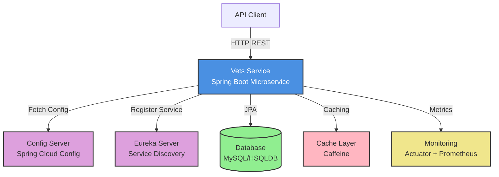
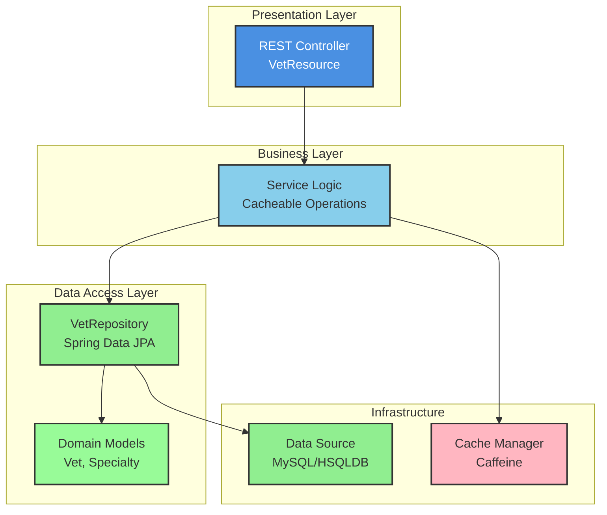
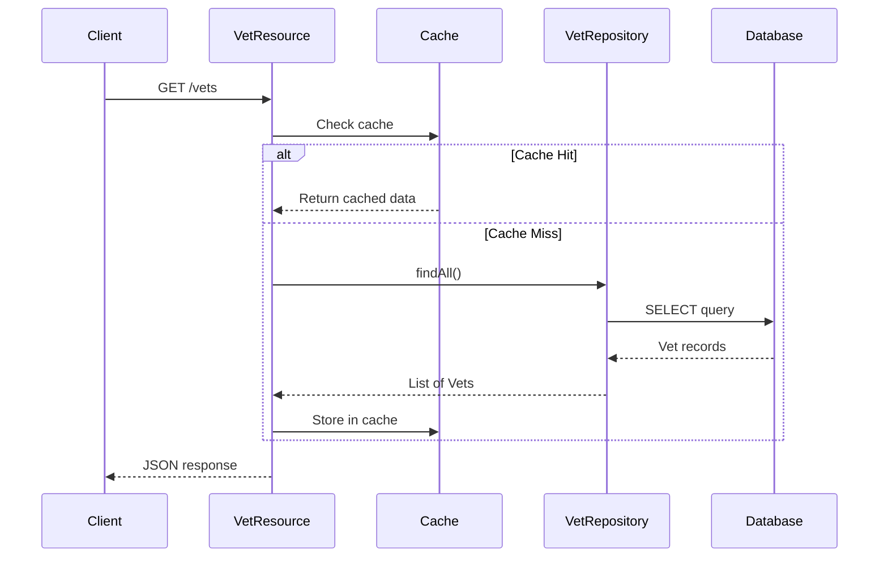
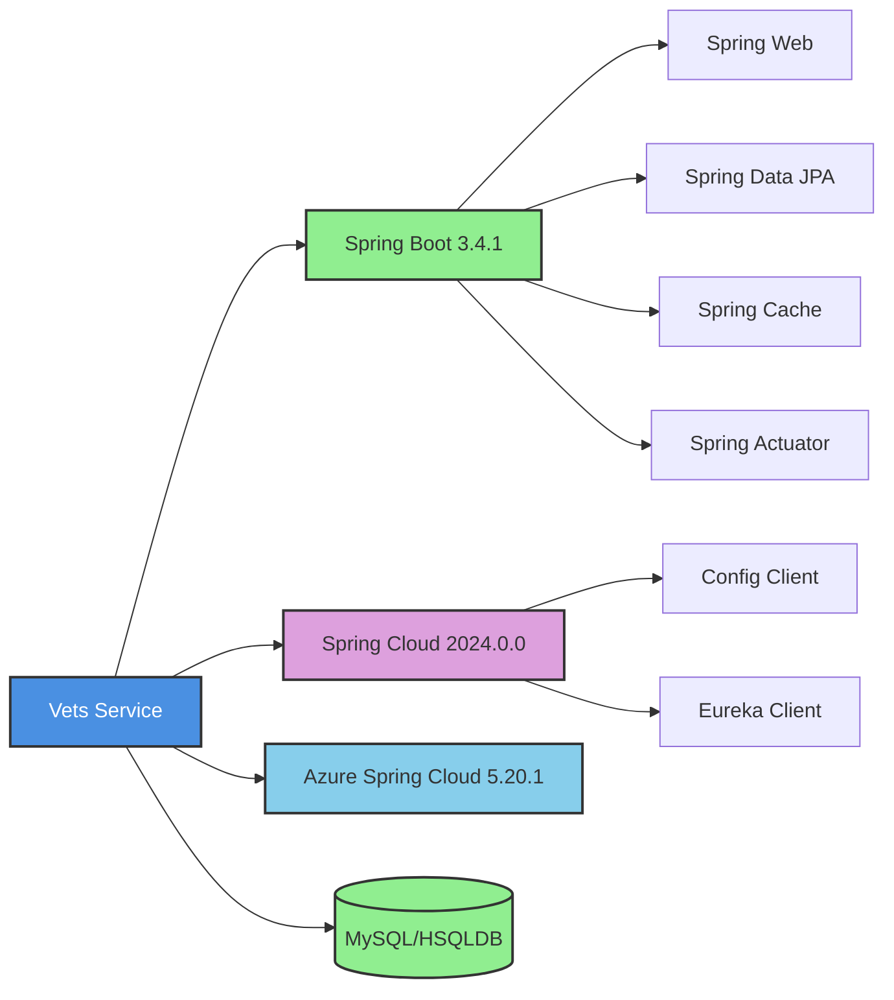

# Spring PetClinic Vets Service - Architecture Diagram

## Overview

| Property | Value |
|----------|-------|
| Application Name | Spring PetClinic Vets Service |
| Application Type | Microservice (REST API) |
| Framework | Spring Boot 3.4.1 |
| Java Version | 17 |
| Build Tool | Maven |
| Packaging | JAR |

## Application Architecture

### High-Level Architecture

### Layered Architecture

## Code Structure

### Components

| Component | Type | Purpose |
|-----------|------|---------|
| VetsServiceApplication | Main Class | Application entry point, enables service discovery |
| VetResource | REST Controller | Exposes `/vets` endpoint for veterinarian data |
| Vet | Entity | Domain model for veterinarian |
| Specialty | Entity | Domain model for veterinary specialties |
| VetRepository | JPA Repository | Data access interface for Vet entities |
| CacheConfig | Configuration | Cache configuration for performance optimization |
| VetsProperties | Configuration | Application-specific properties |

### Project Structure

| Directory | Purpose |
|-----------|---------|
| `src/main/java/.../vets/` | Main application package |
| `src/main/java/.../vets/web/` | REST controllers |
| `src/main/java/.../vets/model/` | Domain entities and repositories |
| `src/main/java/.../vets/system/` | Configuration and system classes |
| `src/main/resources/` | Configuration files and database scripts |
| `src/main/resources/db/` | Database initialization scripts |
| `src/test/` | Test classes |

## Technology Stack

### Core Framework

| Technology | Version | Purpose |
|------------|---------|---------|
| Spring Boot | 3.4.1 | Core application framework |
| Java | 17 | Programming language |
| Maven | - | Build and dependency management |

### Spring Framework Components

| Technology | Purpose |
|------------|---------|
| Spring Web | REST API support |
| Spring Data JPA | Data persistence and repository abstraction |
| Spring Cache | Caching abstraction |
| Spring Boot Actuator | Health checks and metrics |
| Spring Boot Configuration Processor | Configuration metadata |

### Spring Cloud Components

| Technology | Version | Purpose |
|------------|---------|---------|
| Spring Cloud Config | 2024.0.0 | Centralized configuration management |
| Spring Cloud Netflix Eureka | 2024.0.0 | Service discovery and registration |
| Spring Cloud Azure | 5.20.1 | Azure integration support |

### Data Persistence

| Technology | Purpose |
|------------|---------|
| Hibernate/JPA | ORM framework |
| MySQL Connector | Production database driver (runtime) |
| HSQLDB | Embedded database for development (runtime) |
| Spring Cloud Azure JDBC MySQL | Azure MySQL integration |

### Caching

| Technology | Purpose |
|------------|---------|
| Caffeine | High-performance in-memory cache |
| javax.cache API | JCache standard API |

### Monitoring & Observability

| Technology | Version | Purpose |
|------------|---------|---------|
| Micrometer Prometheus | - | Metrics collection for Prometheus |
| Jolokia | 1.7.1 | JMX over HTTP |
| Chaos Monkey | 3.1.0 | Chaos engineering for resilience testing |

### Development Tools

| Technology | Purpose |
|------------|---------|
| Lombok | Reduce boilerplate code |
| Jakarta XML Bind | XML binding support |

### Testing

| Technology | Purpose |
|------------|---------|
| Spring Boot Test | Testing framework |
| JUnit Jupiter | Unit testing framework |

### Build & Deployment

| Technology | Purpose |
|------------|---------|
| Docker Maven Plugin | Docker image creation (optional profile) |
| Spring Boot Maven Plugin | Executable JAR packaging |

## Key Features

### API Endpoints

- **GET /vets**: Returns list of all veterinarians with their specialties (cached)

### Service Discovery

- Registers with Eureka server for service discovery
- Enables microservices communication

### Configuration Management

- Fetches configuration from Spring Cloud Config Server
- Supports multiple profiles (production, docker)

### Caching Strategy

- Caches veterinarian list using Caffeine
- Improves response time for frequently accessed data

### Database Support

- Production: MySQL with Azure JDBC support
- Development: HSQLDB embedded database
- JPA/Hibernate for ORM

### Monitoring & Health

- Actuator endpoints for health checks
- Prometheus metrics export
- Jolokia for JMX monitoring

### Cloud-Ready Features

- Azure Spring Cloud JDBC integration
- Containerization support (Docker)
- Externalized configuration
- Service discovery integration

## Data Flow

## Dependencies Overview

## Azure Migration Readiness

### Current Cloud-Ready Features

✅ **Containerization**: Docker support via Maven plugin  
✅ **Configuration**: Externalized via Spring Cloud Config  
✅ **Service Discovery**: Eureka integration  
✅ **Monitoring**: Actuator + Prometheus metrics  
✅ **Azure Integration**: Azure Spring Cloud JDBC for MySQL  
✅ **Caching**: In-memory caching for performance  
✅ **Resilience**: Chaos Monkey for testing  

### Target Azure Services

- **Azure Kubernetes Service (AKS)**: Container orchestration
- **Azure App Service**: PaaS hosting for Spring Boot
- **Azure Container Apps**: Serverless container platform
- **Azure Database for MySQL**: Managed database
- **Azure Application Insights**: Monitoring and observability
- **Azure Service Bus**: Messaging (if needed for event-driven patterns)

---

*Generated from assessment results for Spring PetClinic Vets Service microservice*
