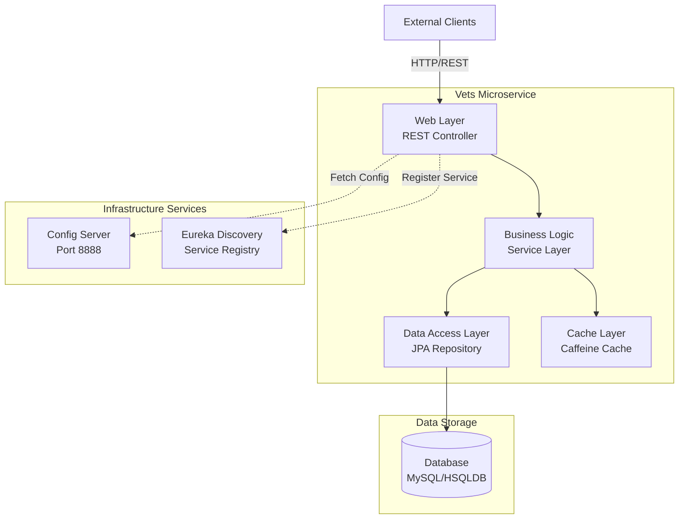
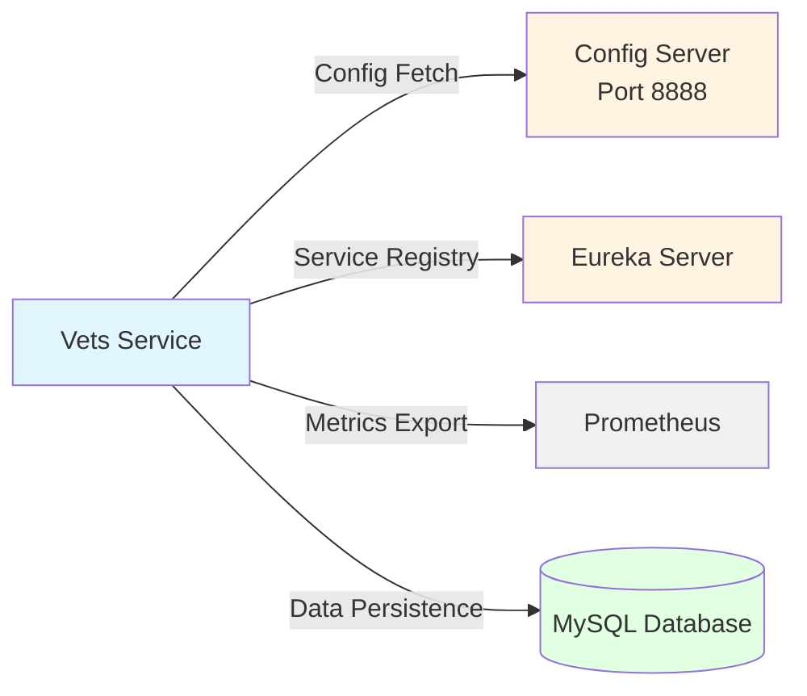
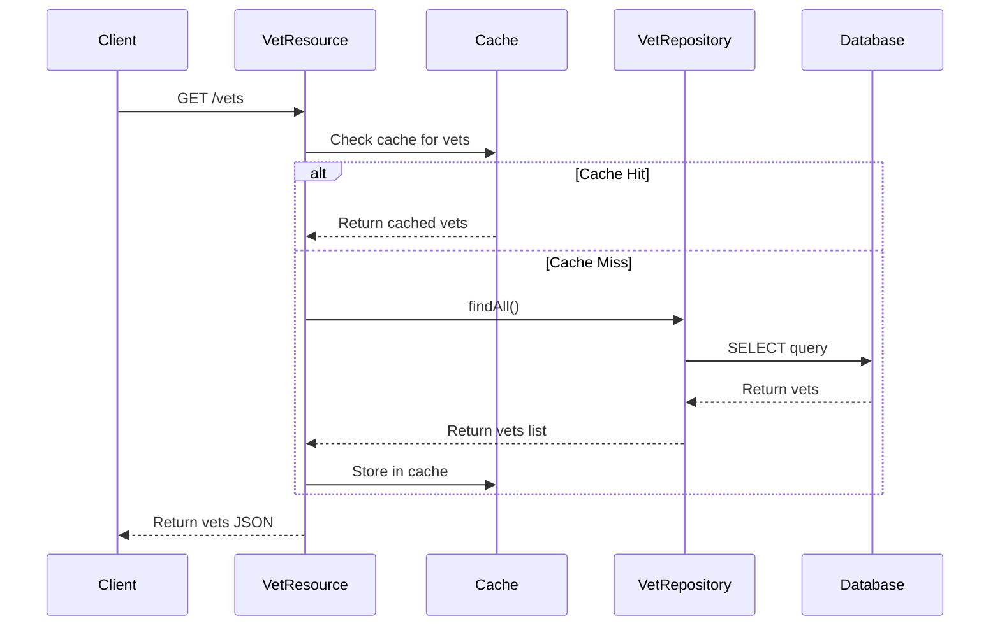

# Spring PetClinic Vets Service - Architecture Diagram

## Overview

| Property | Value |
|----------|-------|
| **Application Name** | Spring PetClinic Vets Service |
| **Application Type** | RESTful Microservice |
| **Framework** | Spring Boot 3.4.1 |
| **Java Version** | 17 |
| **Architecture Pattern** | Layered Architecture (MVC) |
| **Service Discovery** | Netflix Eureka Client |
| **Configuration** | Spring Cloud Config Client |

## Application Architecture

## Component Details

### Web Layer
- **VetResource**: REST controller exposing `/vets` endpoint
- **Technology**: Spring Web MVC, Spring Boot Actuator
- **Functionality**: 
  - GET /vets - List all veterinarians with their specialties
  - Prometheus metrics exposure
  - Health check endpoints

### Business Logic Layer
- **Model**: Domain entities (Vet, Specialty)
- **Caching**: Spring Cache with Caffeine implementation
- **Cache Names**: vets

### Data Access Layer
- **VetRepository**: Spring Data JPA repository
- **ORM**: Hibernate/JPA
- **Database Support**:
  - Production: MySQL (Azure MySQL JDBC Starter)
  - Development: HSQLDB (in-memory)

### Infrastructure Integration
- **Service Discovery**: Netflix Eureka for service registration and discovery
- **Configuration Management**: Spring Cloud Config for centralized configuration
- **Monitoring**: Micrometer with Prometheus registry
- **Chaos Engineering**: Chaos Monkey for resilience testing

## Code Structure

### Main Components

| Component | Location | Purpose |
|-----------|----------|---------|
| VetsServiceApplication | `org.springframework.samples.petclinic.vets` | Main application entry point |
| VetResource | `org.springframework.samples.petclinic.vets.web` | REST API controller |
| VetRepository | `org.springframework.samples.petclinic.vets.model` | Data access interface |
| Vet Entity | `org.springframework.samples.petclinic.vets.model` | Domain model |
| Specialty Entity | `org.springframework.samples.petclinic.vets.model` | Domain model |
| CacheConfig | `org.springframework.samples.petclinic.vets.system` | Cache configuration |
| VetsProperties | `org.springframework.samples.petclinic.vets.system` | Application properties |

### Folder Structure

| Directory | Purpose |
|-----------|---------|
| `src/main/java/org/springframework/samples/petclinic/vets` | Root package |
| `src/main/java/.../vets/web` | REST controllers |
| `src/main/java/.../vets/model` | Domain entities and repositories |
| `src/main/java/.../vets/system` | System configuration |
| `src/main/resources` | Configuration files (application.yml) |
| `src/test` | Test classes |

## Technology Stack

| Category | Technology | Version | Purpose |
|----------|------------|---------|---------|
| **Framework** | Spring Boot | 3.4.1 | Application framework |
| **Language** | Java | 17 | Programming language |
| **Cloud** | Spring Cloud | 2024.0.0 | Microservices infrastructure |
| **Service Discovery** | Netflix Eureka Client | - | Service registration |
| **Configuration** | Spring Cloud Config | - | Centralized config |
| **Data Access** | Spring Data JPA | - | Database abstraction |
| **ORM** | Hibernate | - | Object-relational mapping |
| **Database** | MySQL / HSQLDB | - | Data persistence |
| **Azure Integration** | Spring Cloud Azure JDBC | 5.20.1 | Azure MySQL connector |
| **Caching** | Caffeine | - | In-memory cache |
| **Cache API** | javax.cache | - | Cache abstraction |
| **Monitoring** | Micrometer Prometheus | - | Metrics collection |
| **Management** | Spring Boot Actuator | - | Application monitoring |
| **Chaos Engineering** | Chaos Monkey | 3.1.0 | Resilience testing |
| **JMX** | Jolokia | 1.7.1 | JMX over HTTP |
| **Build Tool** | Maven | - | Dependency management |
| **Testing** | JUnit Jupiter | - | Unit testing framework |
| **Utilities** | Lombok | - | Code generation |

## External Dependencies

## Data Flow

## Assessment Summary

Based on the AppCAT assessment, this application has:
- **Total Issues**: 7
- **Total Incidents**: 11
- **Total Effort**: 35 (story points)

### Issue Categories
- **Containerization**: 1 issue
- **Embedded Cache Management**: 3 issues
- **Framework Upgrade**: 1 issue
- **Remote Communication**: 4 issues
- **Spring Migration**: 2 issues

### Severity Distribution
- **Mandatory**: 6 issues
- **Optional**: 4 issues
- **Potential**: 1 issue

## Azure Migration Readiness

This microservice is designed for cloud deployment with the following Azure-ready features:

✅ **Ready**:
- RESTful API design
- Stateless architecture
- Health check endpoints (Actuator)
- Metrics exposure (Prometheus)
- Externalized configuration (Config Server)
- Service discovery support

⚠️ **Requires Attention**:
- Database migration to Azure Database for MySQL
- Config Server migration to Azure App Configuration or Azure Key Vault
- Service discovery migration to Azure Service Discovery or remove if using Azure Container Apps
- Cache implementation review for Azure Cache for Redis

## Recommended Azure Services

| Current Component | Recommended Azure Service | Notes |
|-------------------|--------------------------|-------|
| Application Hosting | Azure Container Apps / AKS / App Service | All targets compatible |
| MySQL Database | Azure Database for MySQL | Already using MySQL connector |
| Config Server | Azure App Configuration | Centralized configuration |
| Service Discovery | Azure Service Discovery / Built-in ACA | Depending on hosting choice |
| Cache | Azure Cache for Redis | Replace Caffeine for distributed cache |
| Monitoring | Azure Monitor / Application Insights | Replace Prometheus/Actuator |
| Container Registry | Azure Container Registry | For Docker images |

---

*Generated by AppCAT Assessment - Spring PetClinic Vets Service*
