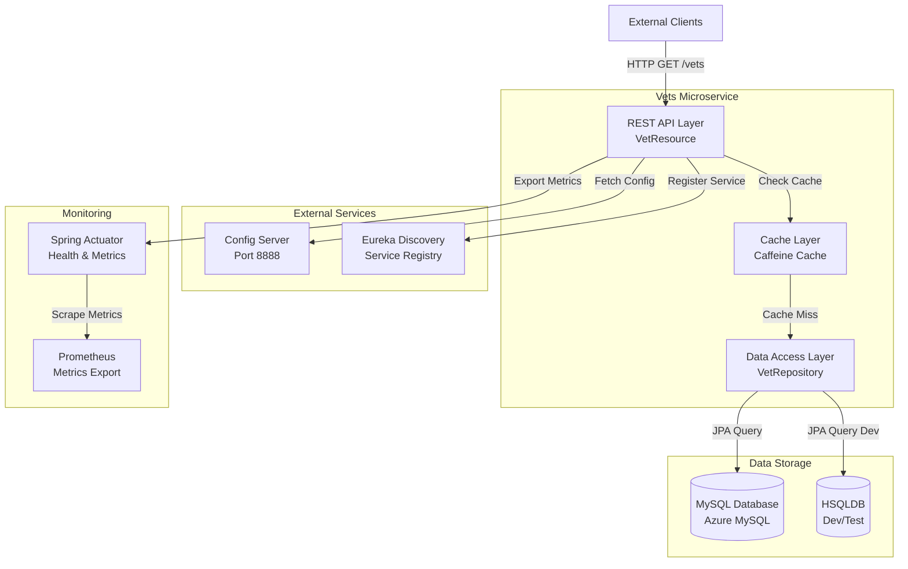
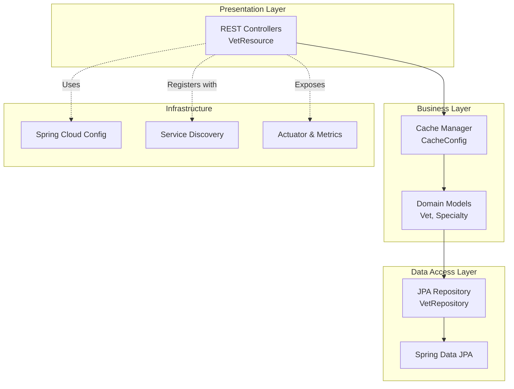
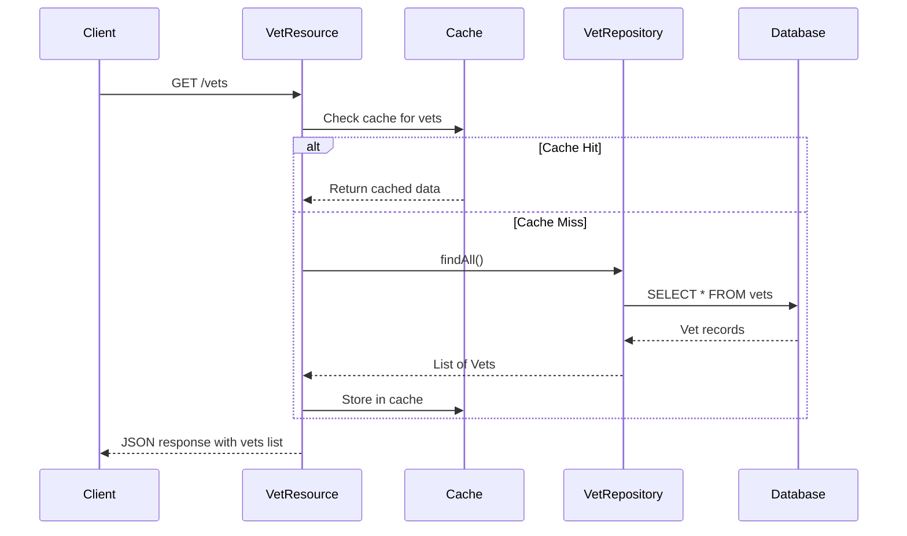

# Spring PetClinic Vets Service - Architecture Diagram

## Overview

| Property | Value |
|----------|-------|
| Application Name | Spring PetClinic Vets Service |
| Application Type | Microservice (REST API) |
| Framework | Spring Boot 3.4.1 |
| Java Version | 17 |
| Build Tool | Maven |
| Packaging | JAR |

## Application Architecture

### High-Level Architecture

### Layered Architecture

## Code Structure

### Components

| Component | Package | Description |
|-----------|---------|-------------|
| VetsServiceApplication | org.springframework.samples.petclinic.vets | Main Spring Boot application class |
| VetResource | org.springframework.samples.petclinic.vets.web | REST controller for vet endpoints |
| Vet | org.springframework.samples.petclinic.vets.model | JPA entity for veterinarian |
| Specialty | org.springframework.samples.petclinic.vets.model | JPA entity for vet specialties |
| VetRepository | org.springframework.samples.petclinic.vets.model | Spring Data JPA repository |
| CacheConfig | org.springframework.samples.petclinic.vets.system | Cache configuration |
| VetsProperties | org.springframework.samples.petclinic.vets.system | Configuration properties |

### Folder Structure

| Directory | Purpose |
|-----------|---------|
| src/main/java/org/springframework/samples/petclinic/vets | Application source code |
| src/main/java/org/springframework/samples/petclinic/vets/web | REST controllers |
| src/main/java/org/springframework/samples/petclinic/vets/model | Domain models and repositories |
| src/main/java/org/springframework/samples/petclinic/vets/system | System configuration classes |
| src/main/resources | Configuration files (application.yml) |
| src/test/java | Unit and integration tests |

## Technology Stack

### Core Technologies

| Technology | Version | Purpose |
|------------|---------|---------|
| Java | 17 | Programming language |
| Spring Boot | 3.4.1 | Application framework |
| Spring Cloud | 2024.0.0 | Microservices framework |
| Maven | Default | Build tool |

### Spring Framework Components

| Component | Purpose |
|-----------|---------|
| Spring Boot Starter Web | REST API development |
| Spring Boot Starter Data JPA | Database access with JPA |
| Spring Boot Starter Cache | Caching support |
| Spring Boot Starter Actuator | Monitoring and health checks |
| Spring Cloud Config Client | Centralized configuration |
| Spring Cloud Netflix Eureka Client | Service discovery |

### Database & Caching

| Technology | Version | Purpose |
|------------|---------|---------|
| MySQL Connector | Runtime | MySQL database driver |
| HSQLDB | Runtime | In-memory database for dev/test |
| Caffeine | Default | High-performance cache implementation |
| Azure Spring Cloud JDBC MySQL | 5.20.1 | Azure MySQL integration |

### Monitoring & Observability

| Technology | Version | Purpose |
|------------|---------|---------|
| Spring Boot Actuator | 3.4.1 | Application monitoring |
| Micrometer Prometheus | Default | Metrics collection and export |
| Chaos Monkey | 3.1.0 | Chaos engineering support |
| Jolokia | 1.7.1 | JMX over HTTP |

### Utilities

| Technology | Version | Purpose |
|------------|---------|---------|
| Lombok | Provided | Reduce boilerplate code |
| Jakarta XML Bind API | Default | XML binding support |
| JUnit Jupiter | Test scope | Testing framework |

## Data Flow

### GET /vets Endpoint Flow

## Key Features

1. **RESTful API**: Exposes `/vets` endpoint to retrieve veterinarian information
2. **Caching**: Uses Caffeine cache to improve performance and reduce database load
3. **Service Discovery**: Registers with Eureka for microservices communication
4. **Centralized Configuration**: Uses Spring Cloud Config Server
5. **Database Support**: MySQL for production, HSQLDB for development
6. **Azure Integration**: Azure Spring Cloud JDBC starter for seamless Azure MySQL connectivity
7. **Monitoring**: Spring Actuator endpoints for health checks and metrics
8. **Metrics Export**: Prometheus integration for metrics collection

## Deployment Considerations

- **Port**: Exposes on port 8081
- **Database**: Requires MySQL database connection (Azure MySQL recommended)
- **Config Server**: Requires connection to Config Server (default: http://localhost:8888)
- **Service Registry**: Requires connection to Eureka Server
- **Docker Support**: Maven profile available for Docker builds
- **Profiles**: Supports `production` and `docker` profiles

## Azure Migration Readiness

### Current Azure Integrations
- Azure Spring Cloud JDBC MySQL starter (version 5.20.1)
- Ready for Azure MySQL Flexible Server deployment

### Recommended Azure Services
- **Compute**: Azure Container Apps or Azure App Service
- **Database**: Azure Database for MySQL - Flexible Server
- **Configuration**: Azure App Configuration
- **Service Discovery**: Azure Spring Apps or Azure Container Apps managed service discovery
- **Monitoring**: Azure Monitor and Application Insights
- **Cache**: Azure Cache for Redis (if needed for distributed caching)
