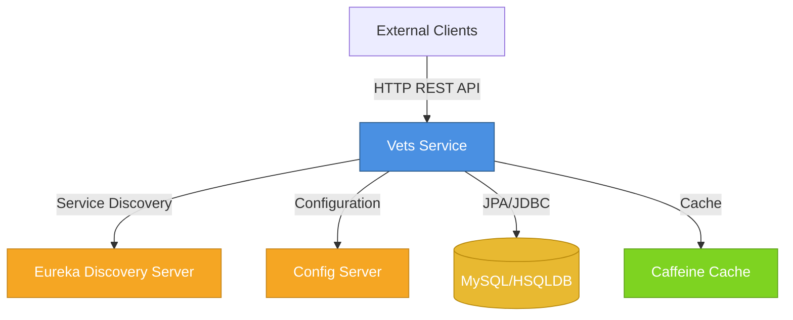
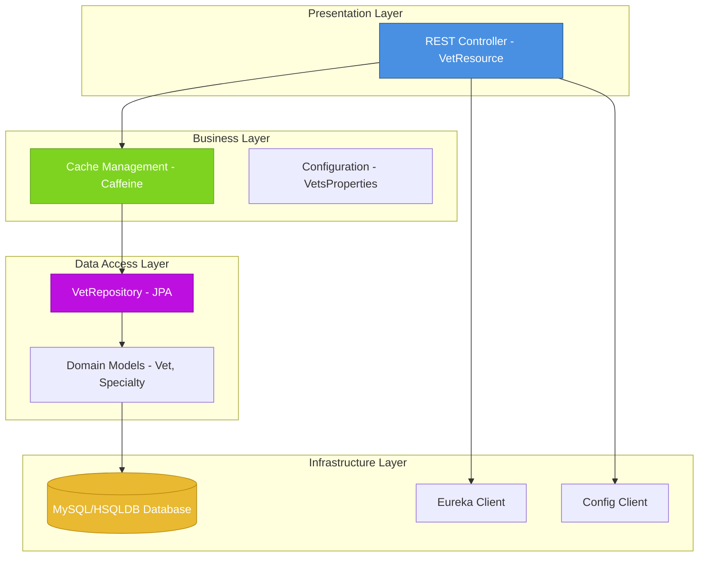
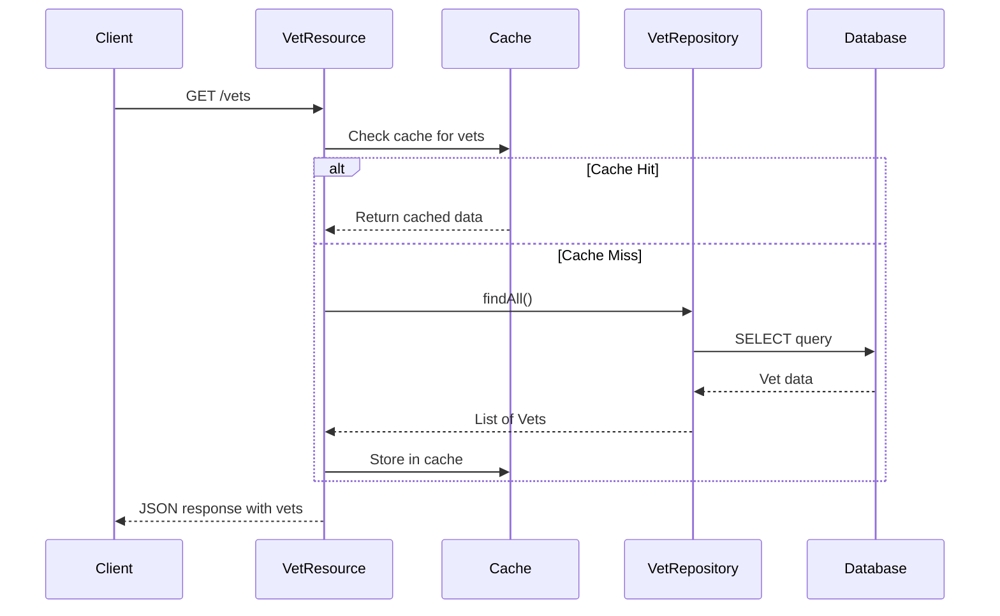

# Spring PetClinic Vets Service - Architecture Diagram

## Overview

| Property | Value |
|----------|-------|
| **Application Name** | Spring PetClinic Vets Service |
| **Application Type** | Microservice (REST API) |
| **Framework** | Spring Boot 3.4.1 |
| **Java Version** | 17 |
| **Build Tool** | Maven |
| **Package** | org.springframework.samples.petclinic.vets |

## Application Architecture

### High-Level Architecture

### Layered Architecture

## Code Structure

### Component Organization

| Layer | Package | Components | Description |
|-------|---------|------------|-------------|
| **Application** | `org.springframework.samples.petclinic.vets` | `VetsServiceApplication` | Main Spring Boot application entry point with service discovery |
| **Web/REST** | `org.springframework.samples.petclinic.vets.web` | `VetResource` | REST controller exposing veterinarian endpoints |
| **Domain Model** | `org.springframework.samples.petclinic.vets.model` | `Vet`, `Specialty`, `VetRepository` | JPA entities and repository interfaces |
| **Configuration** | `org.springframework.samples.petclinic.vets.system` | `VetsProperties`, `CacheConfig` | Application configuration and cache setup |

### Folder Structure

| Path | Purpose |
|------|---------|
| `src/main/java/...vets/` | Main application source code |
| `src/main/java/...vets/model/` | Domain models and repositories |
| `src/main/java/...vets/web/` | REST API controllers |
| `src/main/java/...vets/system/` | System configuration classes |
| `src/main/resources/` | Configuration files and resources |
| `src/main/resources/db/mysql/` | MySQL database schema and data scripts |
| `src/main/resources/db/hsqldb/` | HSQLDB database schema and data scripts |
| `src/test/java/` | Unit and integration tests |

## Technology Stack

### Core Technologies

| Technology | Version | Purpose |
|------------|---------|---------|
| **Spring Boot** | 3.4.1 | Application framework |
| **Spring Cloud** | 2024.0.0 | Microservices infrastructure |
| **Java** | 17 | Programming language |
| **Maven** | - | Build and dependency management |

### Spring Ecosystem

| Component | Purpose |
|-----------|---------|
| **Spring Web** | REST API development |
| **Spring Data JPA** | Database access and ORM |
| **Spring Cache** | Caching abstraction |
| **Spring Actuator** | Monitoring and metrics |
| **Spring Cloud Config** | Centralized configuration management |
| **Spring Cloud Netflix Eureka** | Service discovery and registration |

### Data & Storage

| Technology | Purpose |
|------------|---------|
| **MySQL** | Production database (with Azure MySQL JDBC support) |
| **HSQLDB** | Embedded database for development/testing |
| **Caffeine** | High-performance in-memory cache |
| **Hibernate/JPA** | ORM framework |

### Observability & Monitoring

| Technology | Purpose |
|------------|---------|
| **Micrometer Prometheus** | Metrics collection and export |
| **Spring Actuator** | Health checks and application endpoints |
| **Jolokia** | JMX over HTTP monitoring |
| **Chaos Monkey for Spring Boot** | Resilience testing |

### Azure Integration

| Component | Version | Purpose |
|-----------|---------|---------|
| **Spring Cloud Azure JDBC MySQL** | 5.20.1 | Azure MySQL database integration with managed identity support |

### Additional Libraries

| Library | Purpose |
|---------|---------|
| **Lombok** | Reduce boilerplate code |
| **Jakarta XML Bind API** | XML processing |
| **JUnit Jupiter** | Testing framework |

## Data Flow

### Veterinarian Data Retrieval Flow

## Assessment Summary

### AppCAT Analysis Results

| Metric | Value |
|--------|-------|
| **Total Issues** | 7 |
| **Total Incidents** | 11 |
| **Total Effort** | 35 story points |
| **Analysis Date** | 2026-02-10 |

### Issues by Severity

| Severity | Count |
|----------|-------|
| **Mandatory** | 6 |
| **Optional** | 4 |
| **Potential** | 1 |
| **Information** | 0 |

### Issues by Category

| Category | Count | Description |
|----------|-------|-------------|
| **Remote Communication** | 4 | Service discovery and remote API patterns |
| **Embedded Cache Management** | 3 | Local caching implementations |
| **Spring Migration** | 2 | Spring framework migration considerations |
| **Containerization** | 1 | Container deployment preparation |
| **Framework Upgrade** | 1 | Framework version compatibility |

### Target Azure Services

This application has been assessed for migration to:

1. **Azure Kubernetes Service (AKS)** - Container orchestration platform
2. **Azure App Service** - Managed application hosting
3. **Azure Container Apps** - Serverless container platform

### Key Findings

**Strengths:**
- Modern Spring Boot 3.4.1 framework
- Already uses Azure MySQL JDBC driver
- RESTful API design
- JPA-based data access
- Built-in caching with Caffeine
- Actuator endpoints for monitoring

**Migration Considerations:**
- Service discovery (Eureka) needs Azure-native alternative
- Config Server integration requires adaptation
- Cache management may need distributed solution for scaling
- Remote communication patterns need review for cloud deployment

## Architecture Patterns

### Design Patterns Used

- **Repository Pattern**: Data access abstraction via `VetRepository`
- **RESTful API**: Resource-based HTTP endpoints
- **Caching Pattern**: Method-level caching with `@Cacheable`
- **Dependency Injection**: Spring-managed beans and autowiring
- **Service Discovery**: Eureka client registration
- **Externalized Configuration**: Spring Cloud Config integration

### Microservices Patterns

- **Service Registration**: Eureka client for discovery
- **Centralized Configuration**: Config server integration
- **Health Monitoring**: Actuator endpoints
- **API Gateway Ready**: REST endpoints designed for gateway routing

---

*Generated from AppCAT assessment on 2026-02-10*
