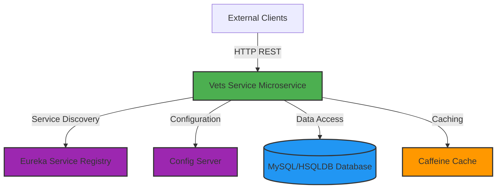
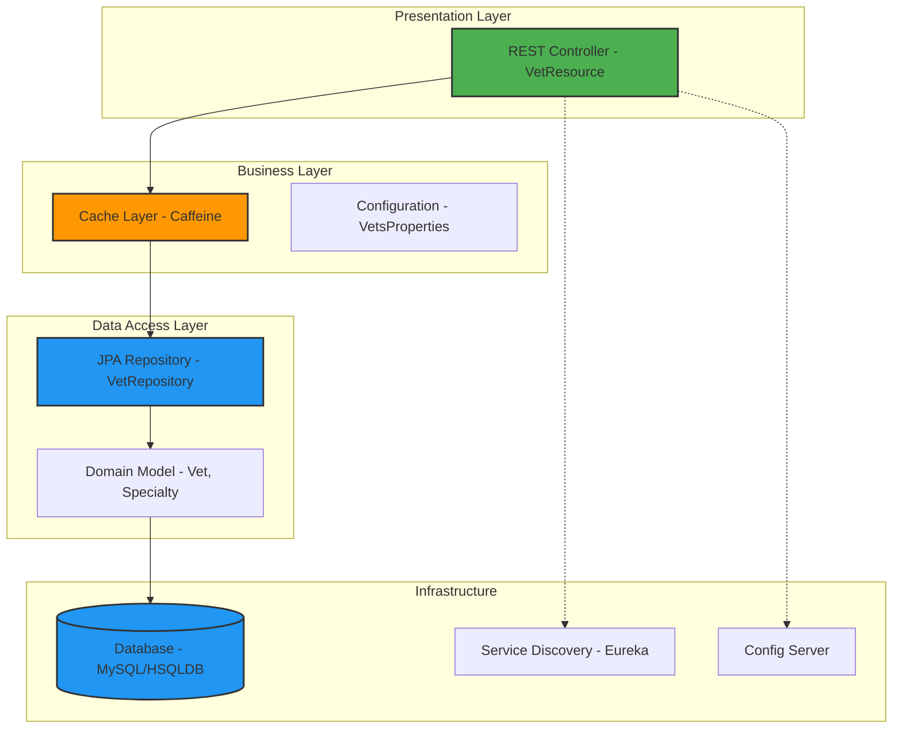

# Spring PetClinic Vets Service - Architecture Diagram

## Overview

| Property | Value |
|----------|-------|
| **Application Name** | Spring PetClinic Vets Service |
| **Application Type** | Microservice |
| **Framework** | Spring Boot 3.4.1 |
| **Java Version** | 17 |
| **Build Tool** | Maven |
| **Port** | 8081 |

## Application Architecture

### High-Level Architecture

### Layered Architecture

## Code Structure

### Components

| Component | Type | Purpose |
|-----------|------|---------|
| VetResource | REST Controller | Exposes veterinarian data via REST API |
| VetRepository | JPA Repository | Data access layer for Vet entities |
| Vet | Domain Entity | Represents veterinarian information |
| Specialty | Domain Entity | Represents veterinarian specialties |
| CacheConfig | Configuration | Configures caching strategy |
| VetsProperties | Configuration | Application-specific properties |

### Folder Structure

| Path | Purpose |
|------|---------|
| `src/main/java/.../web` | REST controllers and web layer |
| `src/main/java/.../model` | Domain entities and repositories |
| `src/main/java/.../system` | System configuration and properties |
| `src/main/resources` | Application configuration files |
| `src/test/java` | Unit and integration tests |

## Technology Stack

### Core Framework

| Technology | Version | Purpose |
|------------|---------|---------|
| Spring Boot | 3.4.1 | Application framework |
| Spring Cloud | 2024.0.0 | Microservices infrastructure |
| Java | 17 | Programming language |
| Maven | - | Build and dependency management |

### Spring Boot Starters

| Dependency | Purpose |
|------------|---------|
| spring-boot-starter-web | REST API development |
| spring-boot-starter-data-jpa | Data persistence with JPA |
| spring-boot-starter-cache | Caching abstraction |
| spring-boot-starter-actuator | Application monitoring and management |

### Spring Cloud Components

| Component | Purpose |
|-----------|---------|
| spring-cloud-starter-config | Centralized configuration management |
| spring-cloud-starter-netflix-eureka-client | Service registration and discovery |

### Azure Integration

| Dependency | Version | Purpose |
|------------|---------|---------|
| spring-cloud-azure-dependencies | 5.20.1 | Azure Spring Cloud integration |
| spring-cloud-azure-starter-jdbc-mysql | - | Azure MySQL managed identity support |

### Data Storage

| Technology | Purpose |
|------------|---------|
| MySQL | Production database (with Azure MySQL support) |
| HSQLDB | In-memory database for testing |
| Caffeine | High-performance caching library |

### Monitoring & Observability

| Technology | Purpose |
|------------|---------|
| Micrometer Prometheus | Metrics collection and exposure |
| Spring Boot Actuator | Health checks and application info |
| Jolokia | JMX over HTTP for monitoring |

### Additional Libraries

| Library | Version | Purpose |
|---------|---------|---------|
| Lombok | - | Boilerplate code reduction |
| Chaos Monkey | 3.1.0 | Chaos engineering for resilience testing |
| JUnit Jupiter | - | Unit testing framework |

## Key Features

1. **RESTful API**: Exposes veterinarian data through HTTP endpoints
2. **Caching**: Uses Caffeine for performance optimization
3. **Service Discovery**: Integrates with Netflix Eureka for service registration
4. **Centralized Configuration**: Uses Spring Cloud Config Server
5. **Cloud-Ready**: Azure MySQL integration with managed identity
6. **Monitoring**: Prometheus metrics and Spring Boot Actuator endpoints
7. **Resilience**: Chaos Monkey integration for testing failure scenarios
8. **Database Flexibility**: Supports both MySQL (production) and HSQLDB (testing)

## API Endpoints

| Endpoint | Method | Description |
|----------|--------|-------------|
| `/vets` | GET | Retrieve list of all veterinarians (cached) |
| `/actuator/health` | GET | Health check endpoint |
| `/actuator/info` | GET | Application information |
| `/actuator/metrics` | GET | Application metrics |

## Deployment Configuration

- **Exposed Port**: 8081
- **Docker Support**: Maven plugin for Docker image building
- **Profiles**: Production, Docker
- **Config Server**: Configurable via environment variable (CONFIG_SERVER_URL)
