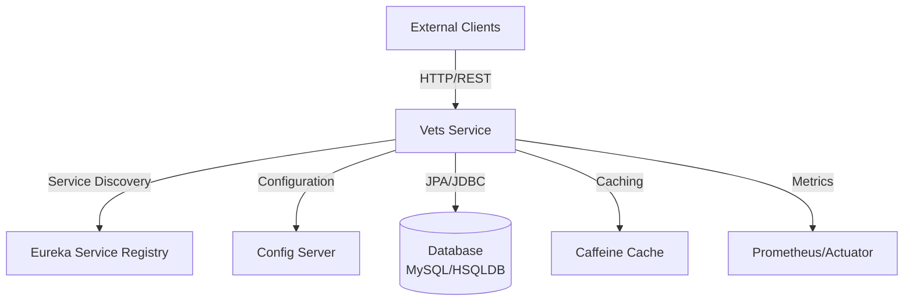
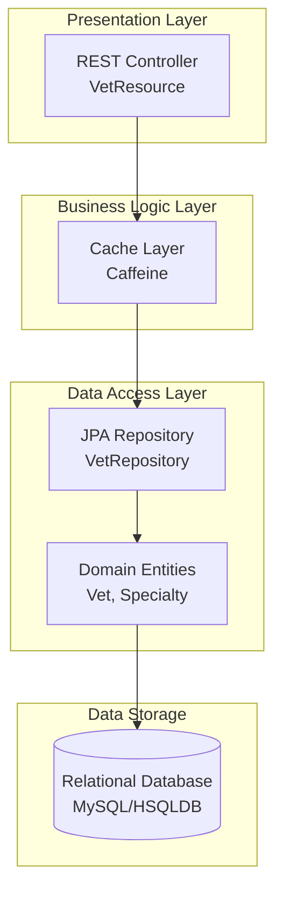

# Architecture Diagram - Spring PetClinic Vets Service

## Overview

| Property | Value |
|----------|-------|
| **Application Name** | Spring PetClinic Vets Service |
| **Application Type** | Microservice (REST API) |
| **Framework** | Spring Boot 3.4.1 |
| **Java Version** | 17 |
| **Build Tool** | Maven |
| **Packaging** | JAR |

## Application Architecture

### High-Level Architecture



### Layered Architecture



## Code Structure

### Main Components

| Component | Package/Path | Purpose |
|-----------|--------------|---------|
| **VetResource** | `org.springframework.samples.petclinic.vets.web` | REST API endpoint for veterinarian data |
| **VetRepository** | `org.springframework.samples.petclinic.vets.model` | JPA repository for data access |
| **Vet** | `org.springframework.samples.petclinic.vets.model` | Domain entity representing a veterinarian |
| **Specialty** | `org.springframework.samples.petclinic.vets.model` | Domain entity for vet specialties |
| **CacheConfig** | `org.springframework.samples.petclinic.vets.system` | Cache configuration |
| **VetsServiceApplication** | `org.springframework.samples.petclinic.vets` | Main Spring Boot application |

### Folder Structure

```
spring-petclinic-microservices-vet-service/
├── src/main/java/
│   └── org/springframework/samples/petclinic/vets/
│       ├── VetsServiceApplication.java
│       ├── model/
│       │   ├── Vet.java
│       │   ├── Specialty.java
│       │   └── VetRepository.java
│       ├── web/
│       │   └── VetResource.java
│       └── system/
│           ├── CacheConfig.java
│           └── VetsProperties.java
├── src/main/resources/
│   ├── application.yml
│   └── db/
│       ├── hsqldb/
│       │   ├── schema.sql
│       │   └── data.sql
│       └── mysql/
│           ├── schema.sql
│           └── data.sql
└── pom.xml
```

## Technology Stack

### Core Technologies

| Technology | Version | Purpose |
|------------|---------|---------|
| **Spring Boot** | 3.4.1 | Application framework |
| **Spring Cloud** | 2024.0.0 | Microservices infrastructure |
| **Java** | 17 | Programming language |
| **Maven** | - | Build tool |

### Spring Framework Components

| Component | Purpose |
|-----------|---------|
| **Spring Web** | REST API endpoints |
| **Spring Data JPA** | Data access layer |
| **Spring Cache** | Caching abstraction |
| **Spring Actuator** | Health checks and metrics |
| **Spring Cloud Config** | Centralized configuration |
| **Spring Cloud Netflix Eureka** | Service discovery |

### Data & Caching

| Technology | Version | Purpose |
|------------|---------|---------|
| **MySQL** | Latest | Production database (Azure MySQL compatible) |
| **HSQLDB** | Latest | In-memory database for development |
| **Caffeine** | Latest | High-performance caching |
| **Hibernate/JPA** | Via Spring Boot | ORM framework |

### Azure Integration

| Technology | Version | Purpose |
|------------|---------|---------|
| **Spring Cloud Azure** | 5.20.1 | Azure services integration |
| **Azure JDBC MySQL Starter** | 5.20.1 | Azure MySQL connectivity |

### Monitoring & Observability

| Technology | Version | Purpose |
|------------|---------|---------|
| **Micrometer** | Latest | Metrics collection |
| **Prometheus** | Latest | Metrics registry |
| **Jolokia** | 1.7.1 | JMX over HTTP |
| **Spring Actuator** | 3.4.1 | Health and info endpoints |

### Testing & Resilience

| Technology | Version | Purpose |
|------------|---------|---------|
| **JUnit Jupiter** | Latest | Unit testing framework |
| **Spring Boot Test** | 3.4.1 | Integration testing |
| **Chaos Monkey** | 3.1.0 | Resilience testing |

### Additional Libraries

| Technology | Version | Purpose |
|------------|---------|---------|
| **Lombok** | Latest | Reduce boilerplate code |
| **Jakarta XML Bind** | Latest | XML serialization |
| **Docker Maven Plugin** | 1.2.0 | Docker image building |

## API Endpoints

| Endpoint | Method | Description |
|----------|--------|-------------|
| `/vets` | GET | Retrieve list of all veterinarians with specialties (cached) |

## Configuration

### Application Properties

- **Service Name**: `vets-service`
- **Config Server URL**: Configurable via `CONFIG_SERVER_URL` (default: `http://localhost:8888/`)
- **Cache Names**: `vets`
- **Active Profile**: `production`
- **Docker Port**: 8081

### Database Support

- **MySQL**: Production-ready with Azure MySQL integration
- **HSQLDB**: Development and testing

## Deployment Readiness

### Containerization

- Docker support via Maven plugin
- Exposed port: 8081
- Profile-based configuration for Docker environments

### Cloud Native Features

- Service discovery via Eureka
- Centralized configuration via Config Server
- Health checks and metrics via Actuator
- Prometheus metrics for monitoring
- Azure MySQL JDBC driver for cloud deployment

### Target Azure Services (from Assessment)

The application has been assessed for deployment to:

1. **Azure Kubernetes Service (AKS)** - Container orchestration
2. **Azure App Service** - PaaS deployment
3. **Azure Container Apps** - Serverless containers

## Assessment Summary

This microservice follows best practices for cloud-native applications:

- ✅ RESTful API design
- ✅ Externalized configuration
- ✅ Service discovery integration
- ✅ Health monitoring and metrics
- ✅ Caching for performance
- ✅ Azure-ready database connectivity
- ✅ Docker containerization support
- ✅ Modern Java and Spring Boot versions
