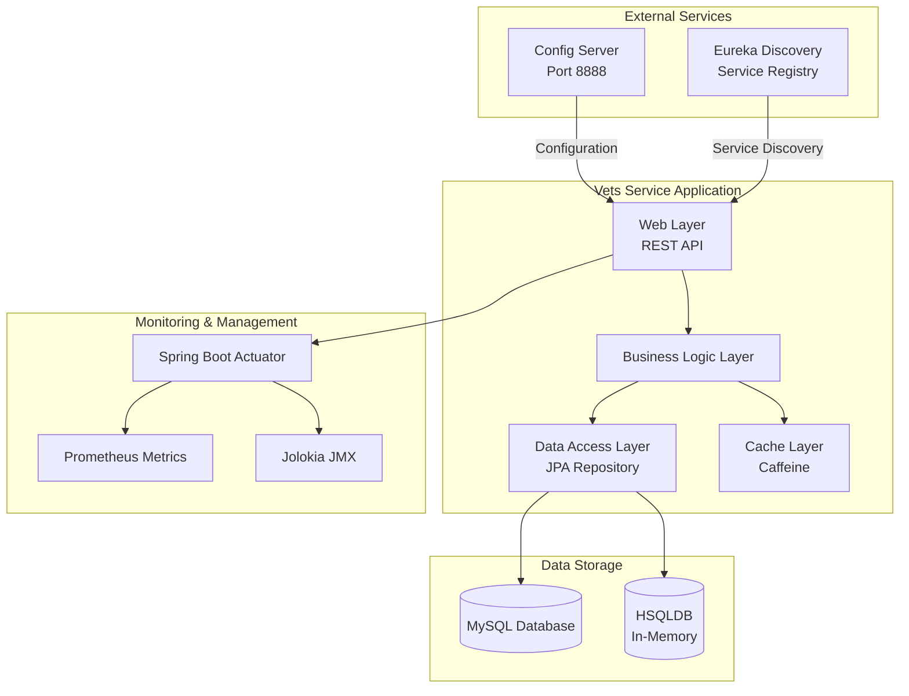
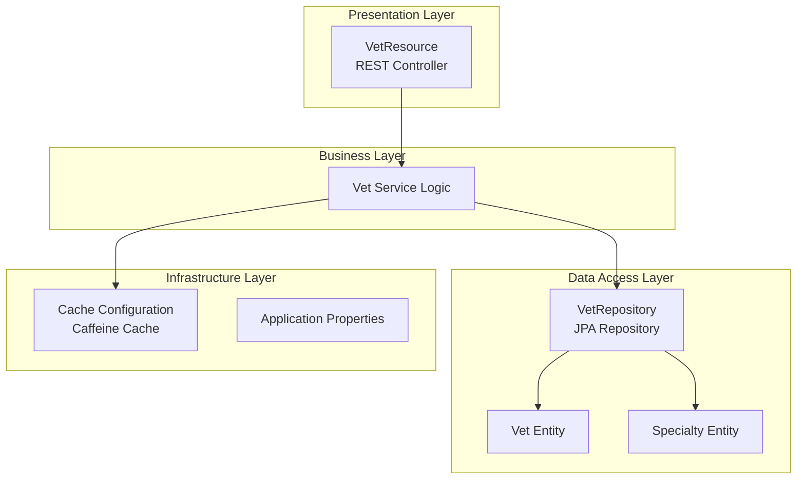
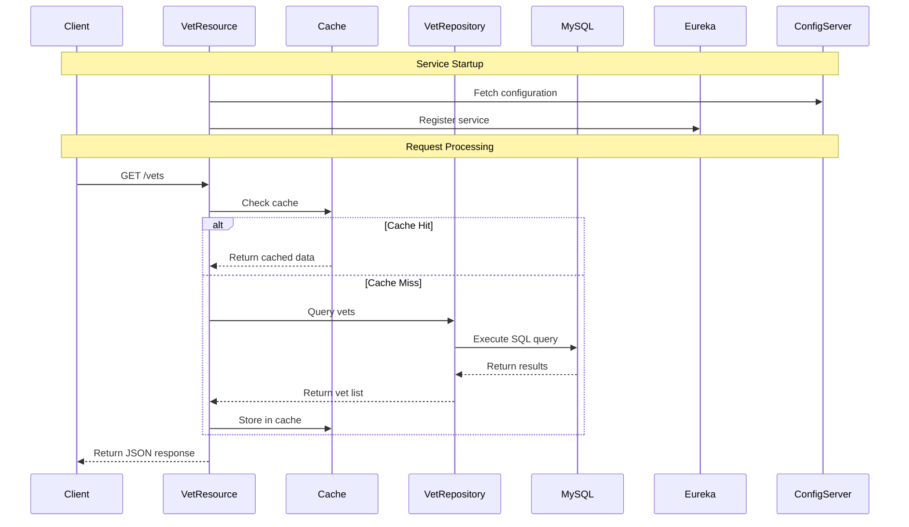

# Spring PetClinic Vets Service - Architecture Assessment Diagram

## Overview

| **Attribute** | **Value** |
|---------------|-----------|
| **Application Name** | vets-service |
| **Type** | Microservice |
| **Framework** | Spring Boot 3.4.1 |
| **Language** | Java 17 |
| **Build Tool** | Maven |
| **Packaging** | JAR |
| **Port** | 8081 |

## High-Level Architecture



## Layered Architecture



## Code Structure

### Main Components

| **Component** | **Location** | **Purpose** |
|---------------|--------------|-------------|
| VetsServiceApplication | org.springframework.samples.petclinic.vets | Main application class with Discovery Client |
| VetResource | org.springframework.samples.petclinic.vets.web | REST API controller for vet operations |
| VetRepository | org.springframework.samples.petclinic.vets.model | JPA repository for data access |
| Vet | org.springframework.samples.petclinic.vets.model | Entity representing a veterinarian |
| Specialty | org.springframework.samples.petclinic.vets.model | Entity for vet specialties |
| CacheConfig | org.springframework.samples.petclinic.vets.system | Cache configuration |
| VetsProperties | org.springframework.samples.petclinic.vets.system | Application properties configuration |

### Project Structure

```
src/
├── main/
│   ├── java/org/springframework/samples/petclinic/vets/
│   │   ├── VetsServiceApplication.java
│   │   ├── model/              # Domain entities and repositories
│   │   ├── web/                # REST controllers
│   │   └── system/             # Configuration and properties
│   └── resources/
│       └── application.yml     # Application configuration
└── test/
    ├── java/                   # Test classes
    └── resources/
        └── application-test.yml
```

## Technology Stack

### Frameworks and Libraries

| **Category** | **Technology** | **Version** | **Purpose** |
|--------------|---------------|-------------|-------------|
| **Core Framework** | Spring Boot | 3.4.1 | Application framework |
| **Cloud Framework** | Spring Cloud | 2024.0.0 | Microservices capabilities |
| **Web** | Spring Boot Web | 3.4.1 | REST API support |
| **Data Access** | Spring Data JPA | 3.4.1 | Database operations |
| **Caching** | Spring Cache + Caffeine | 3.4.1 | In-memory caching |
| **Service Discovery** | Netflix Eureka Client | - | Service registration |
| **Configuration** | Spring Cloud Config | - | External configuration |
| **Monitoring** | Spring Boot Actuator | 3.4.1 | Health checks and metrics |
| **Metrics** | Micrometer Prometheus | - | Metrics collection |
| **JMX** | Jolokia | 1.7.1 | JMX over HTTP |
| **Utilities** | Lombok | - | Code generation |
| **Testing** | JUnit 5 | - | Unit testing |
| **Chaos Engineering** | Chaos Monkey | 3.1.0 | Resilience testing |

### Azure Integration

| **Component** | **Version** | **Purpose** |
|---------------|-------------|-------------|
| Spring Cloud Azure | 5.20.1 | Azure services integration |
| Azure JDBC MySQL Starter | 5.20.1 | MySQL connectivity with Azure |

### Database Support

| **Database** | **Version** | **Scope** | **Purpose** |
|--------------|-------------|-----------|-------------|
| MySQL | - | Runtime | Production database |
| HSQLDB | - | Runtime | In-memory testing database |

## Data Flow



## Assessment Summary

Based on the AppCAT assessment report:

### Total Assessment Metrics

| **Metric** | **Count** |
|------------|-----------|
| Total Issues | 7 |
| Total Incidents | 11 |
| Total Effort (Story Points) | 35 |

### Issues by Severity

| **Severity** | **Count** |
|--------------|-----------|
| Mandatory | 6 |
| Optional | 4 |
| Potential | 1 |
| Information | 0 |

### Issues by Category

| **Category** | **Count** | **Description** |
|--------------|-----------|-----------------|
| Remote Communication | 4 | Service-to-service communication patterns |
| Embedded Cache Management | 3 | Caching strategy considerations |
| Spring Migration | 2 | Spring framework migration topics |
| Framework Upgrade | 1 | Framework version updates |
| Containerization | 1 | Container deployment considerations |

### Key Findings

1. **Eureka Service Discovery**: The application uses Netflix Eureka for service discovery, which may need adaptation for Azure deployment scenarios
2. **Jakarta EE**: Contains Jakarta EE dependencies that may need version alignment
3. **Embedded Caching**: Uses Caffeine cache which needs consideration in distributed scenarios
4. **Spring Cloud Config**: Relies on external configuration server for centralized configuration
5. **MySQL Integration**: Already integrated with Azure Spring Cloud JDBC MySQL starter

### Migration Targets Supported

- ✅ Azure App Service
- ✅ Azure Container Apps
- ✅ Azure Kubernetes Service (AKS)

### Recommendations

1. **Service Discovery**: Consider migrating from Eureka to Azure-native service discovery (Azure Container Apps environment, AKS service mesh, or Azure API Management)
2. **Configuration Management**: Evaluate Azure App Configuration as alternative to Spring Cloud Config Server
3. **Caching**: For distributed deployments, consider Azure Cache for Redis instead of in-memory Caffeine cache
4. **Database**: Already configured for Azure MySQL with appropriate JDBC starter
5. **Monitoring**: Leverage Azure Monitor and Application Insights alongside existing Actuator endpoints

---

**Generated on**: 2026-02-10  
**Assessment Tool**: Java AppCAT CLI  
**Report Location**: `.github/modernize/report.json`
