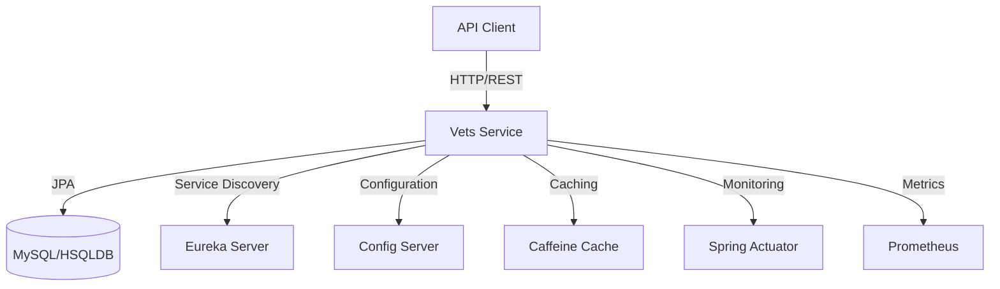
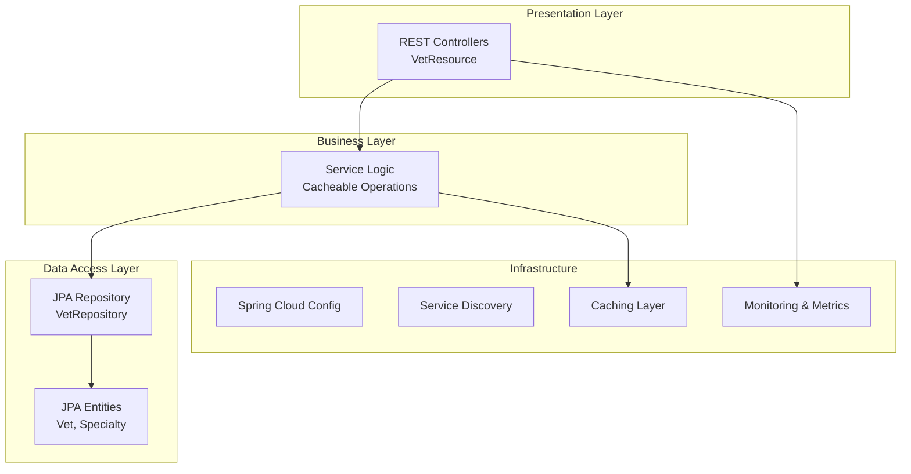

# Spring PetClinic Vets Service - Architecture Diagram

## Overview

| Property | Value |
|----------|-------|
| **Application Name** | Spring PetClinic Vets Service |
| **Application Type** | RESTful Microservice |
| **Framework** | Spring Boot 3.4.1 |
| **Java Version** | 17 |
| **Build Tool** | Maven |
| **Packaging** | JAR |

## Application Architecture

### High-Level Architecture

### Layered Architecture

## Code Structure

### Main Components

| Component | Package | Description |
|-----------|---------|-------------|
| **VetsServiceApplication** | org.springframework.samples.petclinic.vets | Main Spring Boot application class with service discovery |
| **VetResource** | org.springframework.samples.petclinic.vets.web | REST controller for veterinarian endpoints |
| **VetRepository** | org.springframework.samples.petclinic.vets.model | JPA repository for data access |
| **Vet** | org.springframework.samples.petclinic.vets.model | JPA entity representing veterinarian |
| **Specialty** | org.springframework.samples.petclinic.vets.model | JPA entity representing vet specialty |
| **CacheConfig** | org.springframework.samples.petclinic.vets.system | Cache configuration |
| **VetsProperties** | org.springframework.samples.petclinic.vets.system | Application properties configuration |

### Folder Structure

| Directory | Purpose |
|-----------|---------|
| `/src/main/java/org/springframework/samples/petclinic/vets` | Application source code |
| `/src/main/java/.../vets/web` | REST controllers |
| `/src/main/java/.../vets/model` | Domain models and repositories |
| `/src/main/java/.../vets/system` | Configuration classes |
| `/src/main/resources` | Configuration files (application.yml) |
| `/src/test/java` | Unit and integration tests |

## Technology Stack

### Core Technologies

| Technology | Version | Purpose |
|------------|---------|---------|
| **Java** | 17 | Programming language |
| **Spring Boot** | 3.4.1 | Application framework |
| **Spring Cloud** | 2024.0.0 | Microservices framework |
| **Maven** | - | Build and dependency management |

### Spring Framework Components

| Component | Version | Purpose |
|-----------|---------|---------|
| **Spring Boot Starter Web** | 3.4.1 | RESTful web services |
| **Spring Boot Starter Data JPA** | 3.4.1 | Data persistence layer |
| **Spring Boot Starter Actuator** | 3.4.1 | Application monitoring and health |
| **Spring Boot Starter Cache** | 3.4.1 | Caching abstraction |
| **Spring Cloud Config** | 2024.0.0 | Externalized configuration |
| **Spring Cloud Netflix Eureka Client** | 2024.0.0 | Service discovery |

### Data & Persistence

| Technology | Version | Purpose |
|------------|---------|---------|
| **Spring Data JPA** | 3.4.1 | ORM and data access |
| **HSQLDB** | Runtime | In-memory database (development) |
| **MySQL Connector** | Runtime | MySQL database driver (production) |
| **Azure JDBC MySQL Starter** | 5.20.1 | Azure MySQL integration |

### Caching & Performance

| Technology | Version | Purpose |
|------------|---------|---------|
| **Caffeine** | - | High-performance caching library |
| **JCache API** | - | Java caching standard API |

### Monitoring & Observability

| Technology | Version | Purpose |
|------------|---------|---------|
| **Micrometer Prometheus** | - | Metrics collection and export |
| **Spring Boot Actuator** | 3.4.1 | Health checks and application info |
| **Jolokia Core** | 1.7.1 | JMX-HTTP bridge |

### Development & Testing

| Technology | Version | Purpose |
|------------|---------|---------|
| **Lombok** | - | Reduce boilerplate code |
| **JUnit Jupiter** | - | Unit testing framework |
| **Spring Boot Test** | 3.4.1 | Integration testing |
| **Chaos Monkey Spring Boot** | 3.1.0 | Chaos engineering |

### Cloud & Azure Integration

| Technology | Version | Purpose |
|------------|---------|---------|
| **Azure Spring Cloud Dependencies** | 5.20.1 | Azure service integration |
| **Azure JDBC MySQL Starter** | 5.20.1 | Azure MySQL database connectivity |

## API Endpoints

### Veterinarians API

| Method | Endpoint | Description | Caching |
|--------|----------|-------------|---------|
| GET | `/vets` | List all veterinarians | Yes (Caffeine) |

## Configuration

### Application Configuration

- **Config Server URL**: `http://localhost:8888/` (configurable via `CONFIG_SERVER_URL`)
- **Service Name**: `vets-service`
- **Active Profile**: `production`
- **Docker Profile**: Uses `config-server:8888` for configuration

### Cache Configuration

- **Cache Names**: `vets`
- **Cache Provider**: Caffeine
- **Cache Strategy**: Cache-aside pattern with `@Cacheable` annotation

## Database Schema

### Tables

| Table | Description |
|-------|-------------|
| `vets` | Veterinarian information (id, first_name, last_name) |
| `specialties` | Specialty types |
| `vet_specialties` | Many-to-many relationship between vets and specialties |

## External Dependencies

### Service Dependencies

| Service | Type | Purpose |
|---------|------|---------|
| **Config Server** | Spring Cloud Config | Centralized configuration management |
| **Eureka Server** | Service Registry | Service discovery and registration |
| **MySQL Database** | Relational Database | Data persistence (production) |
| **HSQLDB** | In-memory Database | Data persistence (development/testing) |

### Monitoring & Metrics

| Service | Purpose |
|---------|---------|
| **Prometheus** | Metrics collection and monitoring |
| **Spring Actuator Endpoints** | Health checks, metrics, and application info |

## Deployment Profiles

### Production Profile
- Uses external MySQL database
- Connects to Config Server for configuration
- Service discovery via Eureka

### Docker Profile
- Uses `config-server:8888` for configuration
- Optimized for container deployment
- Docker image exposed on port 8081

## Assessment Targets

This service has been assessed for migration to:

- **Azure Kubernetes Service (AKS)** - Container orchestration platform
- **Azure App Service** - Managed platform for web applications
- **Azure Container Apps** - Serverless container platform

The assessment report contains detailed analysis of migration readiness, potential issues, and recommendations for each target platform.
