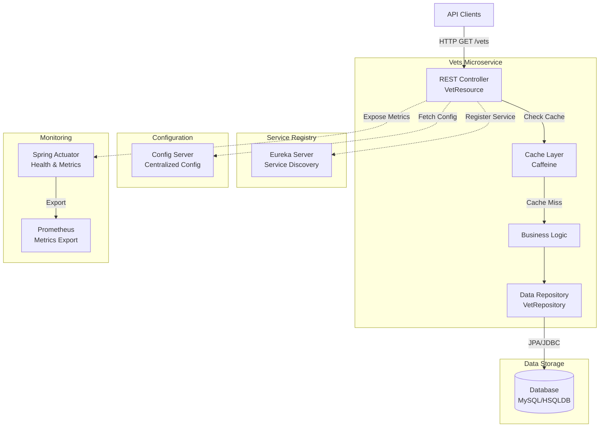
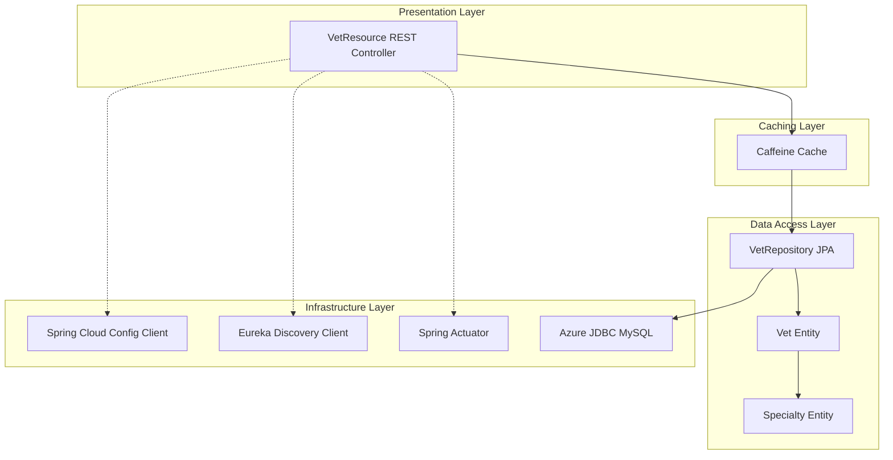

# Spring PetClinic Vets Service - Architecture Diagram

## Overview

| Property | Value |
|----------|-------|
| **Application Name** | Spring PetClinic Vets Service |
| **Application Type** | Microservice - REST API |
| **Framework** | Spring Boot 3.4.1 |
| **Java Version** | 17 |
| **Build Tool** | Maven |
| **Packaging** | JAR |

## Application Architecture

### High-Level Architecture

### Layered Architecture

## Code Structure

### Components

| Component | Type | Description |
|-----------|------|-------------|
| **VetResource** | REST Controller | Exposes `/vets` endpoint to retrieve veterinarian information |
| **VetRepository** | JPA Repository | Data access interface extending JpaRepository for Vet entities |
| **Vet** | Entity | Domain model representing veterinarian with specialties |
| **Specialty** | Entity | Domain model representing veterinary specialties |
| **VetsServiceApplication** | Main Class | Spring Boot application entry point with discovery client enabled |
| **CacheConfig** | Configuration | Cache configuration for veterinarian data |
| **VetsProperties** | Configuration | Application-specific configuration properties |

### Folder Structure

| Path | Purpose |
|------|---------|
| `/src/main/java/.../vets/` | Root package for vets service |
| `/src/main/java/.../vets/model/` | Domain entities and repositories |
| `/src/main/java/.../vets/web/` | REST controllers and web layer |
| `/src/main/java/.../vets/system/` | System configuration and properties |
| `/src/main/resources/db/mysql/` | MySQL database schema and seed data |
| `/src/main/resources/db/hsqldb/` | HSQLDB schema and seed data (for testing) |
| `/src/test/java/` | Unit and integration tests |

## Technology Stack

### Core Technologies

| Technology | Version | Purpose |
|------------|---------|---------|
| **Java** | 17 | Programming language |
| **Spring Boot** | 3.4.1 | Application framework |
| **Spring Cloud** | 2024.0.0 | Microservices infrastructure |
| **Maven** | - | Build and dependency management |

### Spring Framework Components

| Component | Purpose |
|-----------|---------|
| **Spring Web** | REST API development |
| **Spring Data JPA** | Data persistence and ORM |
| **Spring Cache** | Caching abstraction |
| **Spring Actuator** | Application monitoring and health checks |
| **Spring Cloud Config** | Centralized configuration management |
| **Spring Cloud Netflix Eureka** | Service discovery and registration |
| **Spring Cloud Azure** | Azure integration and JDBC support |

### Data and Persistence

| Technology | Purpose |
|------------|---------|
| **MySQL Connector** | Production database driver |
| **HSQLDB** | In-memory database for testing |
| **Jakarta Persistence (JPA)** | Object-relational mapping |
| **Hibernate** | JPA implementation (via Spring Boot) |

### Caching

| Technology | Purpose |
|------------|---------|
| **Caffeine** | High-performance in-memory cache |
| **JSR-107 (JCache)** | Java caching API |

### Azure Integration

| Component | Purpose |
|-----------|---------|
| **Azure JDBC MySQL** | Azure MySQL connectivity with managed identity support |
| **Spring Cloud Azure** | Azure service integration |

### Monitoring and Observability

| Technology | Purpose |
|------------|---------|
| **Micrometer** | Metrics collection |
| **Prometheus** | Metrics export and monitoring |
| **Spring Actuator** | Health checks and application insights |
| **Jolokia** | JMX over HTTP |

### Development and Testing

| Technology | Purpose |
|------------|---------|
| **Lombok** | Reduce boilerplate code |
| **JUnit Jupiter** | Unit testing framework |
| **Spring Boot Test** | Integration testing support |
| **Chaos Monkey** | Resilience testing |

### Additional Libraries

| Library | Version | Purpose |
|---------|---------|---------|
| **Jakarta XML Bind** | - | XML serialization support |
| **Chaos Monkey Spring Boot** | 3.1.0 | Chaos engineering and resilience testing |
| **Jolokia Core** | 1.7.1 | JMX-HTTP bridge |

## Key Architectural Patterns

1. **Microservices Architecture**: Standalone service focused on veterinarian data management
2. **RESTful API**: HTTP-based API using standard REST conventions
3. **Repository Pattern**: Data access abstraction via Spring Data JPA
4. **Caching Strategy**: Cache-aside pattern with Caffeine for performance optimization
5. **Service Discovery**: Dynamic service registration with Eureka
6. **Externalized Configuration**: Centralized configuration via Spring Cloud Config
7. **Cloud-Native**: Designed for cloud deployment with Azure integration

## Deployment Considerations

### Supported Databases
- **MySQL**: Production database with Azure MySQL support
- **HSQLDB**: Development and testing environment

### Service Dependencies
- **Config Server**: Required for centralized configuration (port 8888)
- **Eureka Server**: Required for service discovery
- **Database**: MySQL or HSQLDB based on profile

### Exposed Port
- **8081**: Default application port

### Container Support
- Docker support via Maven plugin
- Dockerfile directory configured at `../docker`

## Azure Migration Readiness

This service is designed with cloud-native principles and includes:
- ✅ Azure MySQL JDBC integration
- ✅ Externalized configuration support
- ✅ Health checks and metrics via Actuator
- ✅ Service discovery for dynamic scaling
- ✅ Containerization support
- ✅ Stateless design (cache is local, can be externalized)

### Recommended Azure Services
1. **Azure Kubernetes Service (AKS)** - Container orchestration
2. **Azure App Service** - PaaS deployment option
3. **Azure Container Apps** - Serverless container platform
4. **Azure Database for MySQL** - Managed database service
5. **Azure Service Bus** - Replace Eureka for service mesh (optional)
6. **Azure Application Insights** - Enhanced monitoring and diagnostics
