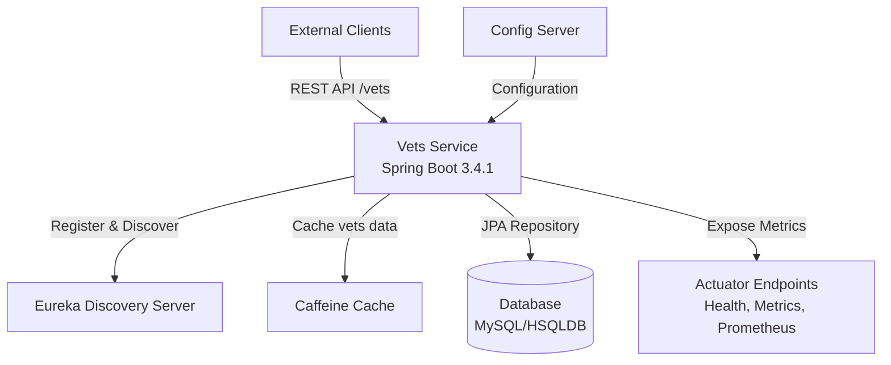
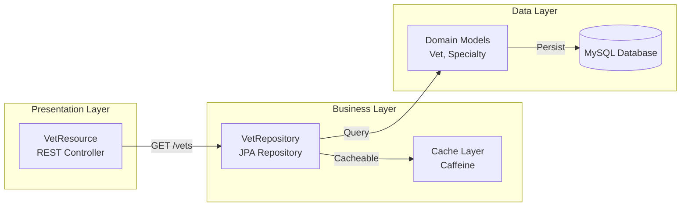

# Architecture Diagram - Spring PetClinic Vets Service

## Overview

| Property | Value |
|----------|-------|
| **Application Name** | Spring PetClinic Vets Service |
| **Application Type** | RESTful Microservice |
| **Framework** | Spring Boot 3.4.1 |
| **Java Version** | 17 |
| **Build Tool** | Maven |
| **Packaging** | JAR |
| **Port** | 8081 |

## Application Architecture

### High-Level Architecture

### Application Layers

## Code Structure

### Component Overview

| Component | Type | Description |
|-----------|------|-------------|
| VetsServiceApplication | Main Class | Spring Boot application entry point with @EnableDiscoveryClient |
| VetResource | REST Controller | Exposes /vets endpoint to retrieve veterinarian list |
| VetRepository | JPA Repository | Data access layer for Vet entities |
| Vet | Entity Model | Domain model representing veterinarian with specialties |
| Specialty | Entity Model | Domain model representing veterinarian specialties |
| CacheConfig | Configuration | Configures Caffeine cache for vets data |
| VetsProperties | Configuration Properties | Application-specific configuration properties |

### Folder Structure

| Folder | Purpose |
|--------|---------|
| src/main/java/.../vets | Root package for vets service |
| src/main/java/.../vets/model | Domain models and repository interfaces |
| src/main/java/.../vets/web | REST controllers and web layer |
| src/main/java/.../vets/system | System configuration and properties |
| src/main/resources | Configuration files (application.yml) |
| src/test | Unit and integration tests |

## Technology Stack

### Core Technologies

| Technology | Version | Purpose |
|------------|---------|---------|
| Spring Boot | 3.4.1 | Application framework |
| Spring Cloud | 2024.0.0 | Cloud-native patterns |
| Java | 17 | Programming language |
| Maven | - | Build tool |

### Spring Framework Components

| Component | Version | Purpose |
|-----------|---------|---------|
| Spring Boot Starter Web | 3.4.1 | REST API development |
| Spring Boot Starter Data JPA | 3.4.1 | Database access layer |
| Spring Boot Starter Actuator | 3.4.1 | Health checks and metrics |
| Spring Boot Starter Cache | 3.4.1 | Caching abstraction |
| Spring Cloud Config | 2024.0.0 | Centralized configuration |
| Spring Cloud Netflix Eureka | 2024.0.0 | Service discovery |
| Spring Cloud Azure JDBC MySQL | 5.20.1 | Azure MySQL integration |

### Data & Caching

| Technology | Version | Purpose |
|------------|---------|---------|
| MySQL Connector | Runtime | Production database driver |
| HSQLDB | Runtime | In-memory database for testing |
| Caffeine | Latest | High-performance caching |
| JPA/Hibernate | Via Spring Boot | Object-relational mapping |

### Monitoring & Observability

| Technology | Version | Purpose |
|------------|---------|---------|
| Micrometer Prometheus | Latest | Metrics collection |
| Spring Boot Actuator | 3.4.1 | Application health & metrics |
| Jolokia | 1.7.1 | JMX over HTTP |

### Development & Testing

| Technology | Version | Purpose |
|------------|---------|---------|
| Lombok | Latest | Reduce boilerplate code |
| JUnit Jupiter | Latest | Unit testing framework |
| Chaos Monkey | 3.1.0 | Resilience testing |

## Key Features

### 1. Service Discovery
- Integrated with Netflix Eureka for service registration and discovery
- Enables dynamic service location in microservices architecture

### 2. Centralized Configuration
- Uses Spring Cloud Config Server for externalized configuration
- Supports multiple profiles (production, docker)

### 3. Caching
- Implements Caffeine cache for vets data
- `@Cacheable` annotation on GET /vets endpoint reduces database load

### 4. Database Support
- Production: MySQL with Azure JDBC integration
- Testing: HSQLDB for in-memory operations
- JPA/Hibernate for object-relational mapping

### 5. Monitoring & Metrics
- Actuator endpoints for health checks
- Prometheus metrics export
- Jolokia for JMX monitoring

### 6. Cloud-Ready
- Azure Spring Cloud integration
- Docker support with configurable ports
- Profile-based configuration for different environments

## API Endpoints

| Endpoint | Method | Description | Caching |
|----------|--------|-------------|---------|
| /vets | GET | Retrieve list of all veterinarians | Yes (Caffeine) |
| /actuator/health | GET | Health check endpoint | No |
| /actuator/metrics | GET | Application metrics | No |
| /actuator/prometheus | GET | Prometheus metrics export | No |

## External Dependencies

### Required Services
1. **Config Server** - Centralized configuration management (port 8888)
2. **Eureka Server** - Service discovery and registration
3. **MySQL Database** - Persistent data storage (production)

### Optional Services
- **Prometheus** - Metrics collection and monitoring
- **Application Insights** - Azure monitoring (when deployed to Azure)

## Deployment Considerations

### Environment Profiles
- **Production**: Uses MySQL database, connects to Config Server
- **Docker**: Configured for containerized deployment with service URLs
- **Test**: Uses HSQLDB in-memory database

### Azure Integration
- Spring Cloud Azure JDBC for MySQL connectivity
- Supports passwordless authentication with Azure Managed Identity
- Compatible with Azure Spring Cloud deployment

## Summary

The **Spring PetClinic Vets Service** is a well-architected, cloud-ready microservice built with Spring Boot 3.4.1 and Java 17. It follows modern microservices patterns including:

- **Service Discovery**: Integration with Eureka for dynamic service location
- **Centralized Configuration**: External configuration via Config Server
- **Caching**: High-performance caching with Caffeine
- **Observability**: Comprehensive monitoring with Actuator and Prometheus
- **Cloud-Ready**: Azure integration and Docker support
- **Clean Architecture**: Clear separation of concerns (web, business, data layers)

The service is designed for scalability, resilience, and cloud deployment, making it suitable for modern cloud platforms like Azure Spring Cloud, Azure Kubernetes Service, or Azure Container Apps.
