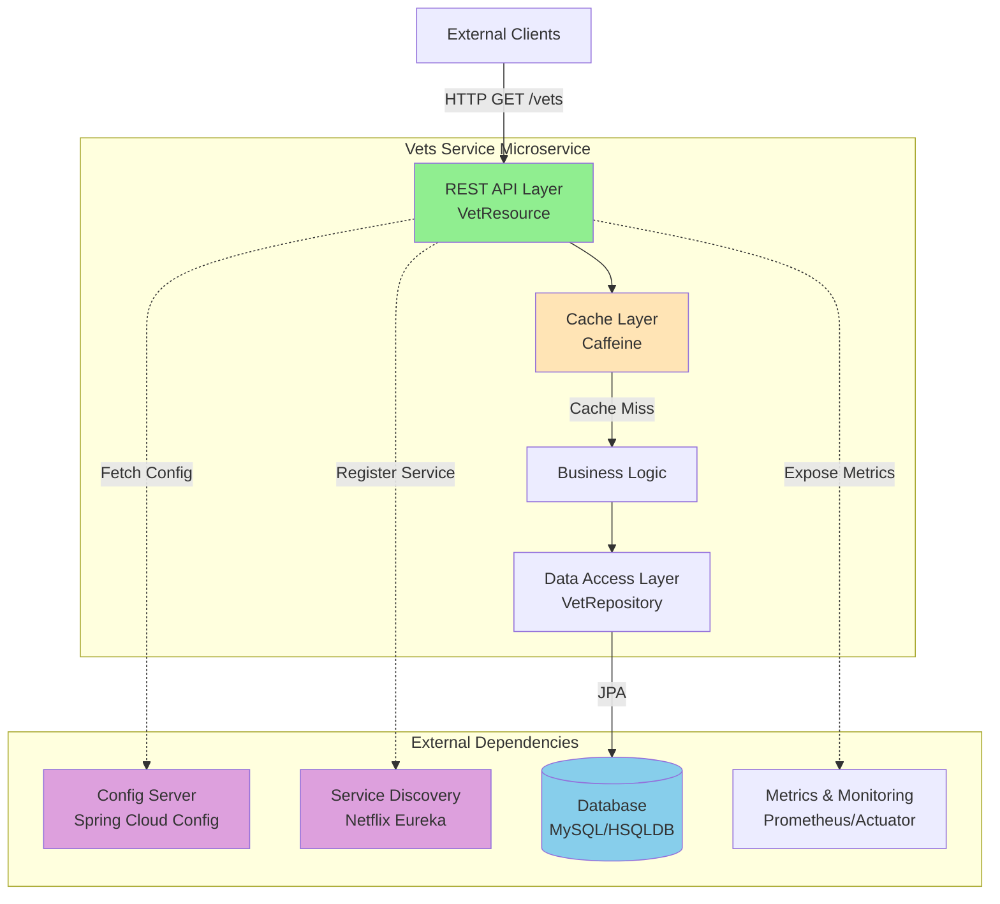
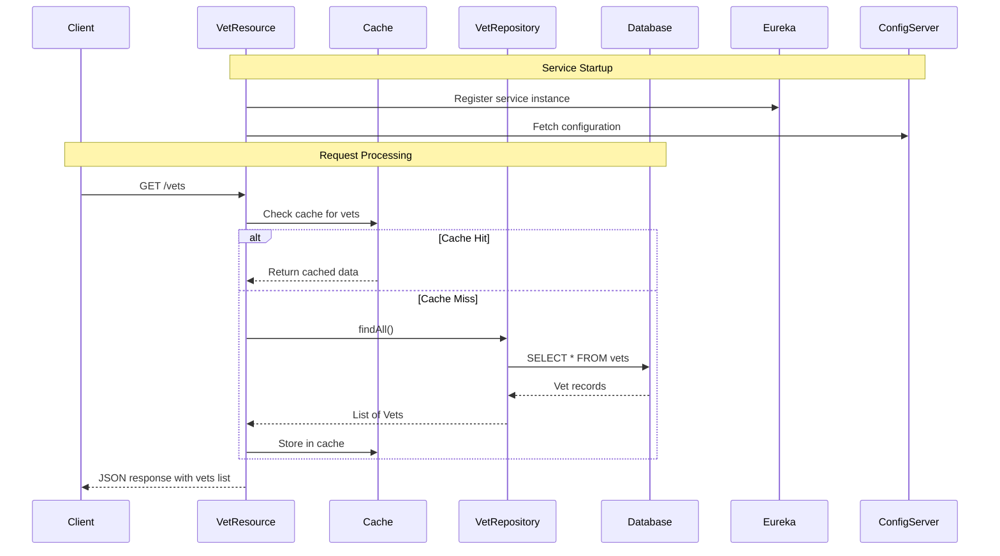

# Architecture Diagram - Spring PetClinic Vets Service

## Overview

| Property | Value |
|----------|-------|
| **Application Name** | Spring PetClinic Vets Service |
| **Application Type** | Microservice (REST API) |
| **Framework** | Spring Boot 3.4.1 |
| **Language** | Java 17 |
| **Build Tool** | Maven |
| **Primary Purpose** | Veterinarian management service for PetClinic microservices application |

## Application Architecture

### High-Level Architecture



### Layered Architecture

```mermaid
graph LR
    subgraph "Presentation Layer"
        REST[REST Controller<br/>@RestController<br/>VetResource]
    end
    
    subgraph "Business Layer"
        Cache[Caching<br/>@Cacheable<br/>Caffeine]
        Service[Business Logic]
    end
    
    subgraph "Data Access Layer"
        Repository[Repository<br/>@Repository<br/>VetRepository]
        JPA[Spring Data JPA]
    end
    
    subgraph "Data Storage"
        DB[(MySQL Database<br/>or HSQLDB)]
    end
    
    REST --> Cache
    Cache --> Service
    Service --> Repository
    Repository --> JPA
    JPA --> DB
    
    style REST fill:#90EE90
    style Cache fill:#FFE4B5
    style Repository fill:#87CEEB
    style DB fill:#B0C4DE
```

### Component Architecture

```mermaid
graph TB
    subgraph "Web Layer"
        VetResource[VetResource<br/>GET /vets endpoint]
    end
    
    subgraph "Model Layer"
        Vet[Vet Entity]
        Specialty[Specialty Entity]
        VetRepo[VetRepository Interface]
    end
    
    subgraph "System Configuration"
        VetsApp[VetsServiceApplication<br/>@SpringBootApplication]
        CacheConfig[CacheConfig<br/>Cache Configuration]
        VetsProps[VetsProperties<br/>@ConfigurationProperties]
    end
    
    subgraph "Infrastructure"
        Discovery[@EnableDiscoveryClient<br/>Eureka Integration]
        ConfigClient[Spring Cloud Config Client]
        ActuatorHealth[Actuator Health Checks]
    end
    
    VetResource --> VetRepo
    VetRepo --> Vet
    Vet --> Specialty
    VetsApp --> VetResource
    VetsApp --> Discovery
    VetsApp --> ConfigClient
    VetsApp --> CacheConfig
    
    style VetResource fill:#90EE90
    style VetRepo fill:#87CEEB
    style VetsApp fill:#FFD700
```

## Code Structure

### Component Breakdown

| Component | Location | Responsibility |
|-----------|----------|----------------|
| **VetsServiceApplication** | `src/main/java/.../VetsServiceApplication.java` | Main application entry point with Spring Boot configuration |
| **VetResource** | `src/main/java/.../web/VetResource.java` | REST controller exposing `/vets` endpoint |
| **VetRepository** | `src/main/java/.../model/VetRepository.java` | JPA repository for Vet entity data access |
| **Vet** | `src/main/java/.../model/Vet.java` | Domain model representing veterinarian |
| **Specialty** | `src/main/java/.../model/Specialty.java` | Domain model for vet specialties |
| **CacheConfig** | `src/main/java/.../system/CacheConfig.java` | Caffeine cache configuration |
| **VetsProperties** | `src/main/java/.../system/VetsProperties.java` | Configuration properties binding |

### Folder Structure

```
spring-petclinic-microservices-vet-service/
├── src/
│   ├── main/
│   │   ├── java/org/springframework/samples/petclinic/vets/
│   │   │   ├── VetsServiceApplication.java       # Application entry point
│   │   │   ├── model/                            # Domain models
│   │   │   │   ├── Vet.java
│   │   │   │   ├── Specialty.java
│   │   │   │   └── VetRepository.java
│   │   │   ├── web/                              # REST controllers
│   │   │   │   └── VetResource.java
│   │   │   └── system/                           # System configuration
│   │   │       ├── CacheConfig.java
│   │   │       └── VetsProperties.java
│   │   └── resources/
│   │       ├── application.yml                   # Application configuration
│   │       ├── db/                               # Database scripts
│   │       │   ├── hsqldb/
│   │       │   │   ├── schema.sql
│   │       │   │   └── data.sql
│   │       │   └── mysql/
│   │       │       ├── schema.sql
│   │       │       └── data.sql
│   │       └── logback-spring.xml               # Logging configuration
│   └── test/
│       └── java/                                 # Unit tests
└── pom.xml                                       # Maven build configuration
```

## Technology Stack

### Frameworks and Libraries

| Technology | Version | Purpose |
|------------|---------|---------|
| **Spring Boot** | 3.4.1 | Application framework and runtime |
| **Spring Cloud** | 2024.0.0 | Cloud-native patterns (Config, Discovery) |
| **Spring Data JPA** | (via Spring Boot) | Data persistence and ORM |
| **Spring Web** | (via Spring Boot) | REST API and web layer |
| **Spring Cloud Config** | (via Spring Cloud) | Centralized configuration management |
| **Netflix Eureka Client** | (via Spring Cloud) | Service discovery and registration |
| **Spring Cloud Azure** | 5.20.1 | Azure integration (JDBC MySQL) |

### Dependencies

| Dependency | Version | Category |
|------------|---------|----------|
| **Caffeine Cache** | (latest) | In-memory caching |
| **MySQL Connector** | (latest) | MySQL database driver |
| **HSQLDB** | (latest) | Embedded database for development |
| **Lombok** | (latest) | Code generation (reduce boilerplate) |
| **Micrometer Prometheus** | (latest) | Metrics collection and export |
| **Spring Boot Actuator** | (via Spring Boot) | Health checks, metrics, monitoring |
| **Chaos Monkey** | 3.1.0 | Resilience testing |
| **Jolokia** | 1.7.1 | JMX over HTTP |
| **JUnit Jupiter** | (latest) | Unit testing framework |

### Azure Integration

| Azure Service | Integration | Usage |
|---------------|-------------|-------|
| **Azure Database for MySQL** | Spring Cloud Azure JDBC Starter | Database connectivity with managed identity support |
| **Azure Spring Apps** | Compatible deployment target | Microservices hosting platform |
| **Azure Application Insights** | Via Micrometer/Actuator | Application monitoring and diagnostics |
| **Azure Container Apps** | Containerization support | Serverless container deployment option |
| **Azure Kubernetes Service (AKS)** | K8s deployment ready | Orchestrated container deployment |

## Data Flow

### Request Processing Flow



### Database Schema

The service manages two main entities:

- **Vets**: Veterinarian information
- **Specialties**: Veterinarian specialties (many-to-many relationship with Vets)

Database scripts are provided for both MySQL (production) and HSQLDB (development).

## Assessment Summary

### Migration Readiness Analysis

**Assessment Date**: 2026-02-10

**Target Platforms**:
- Azure Kubernetes Service (AKS)
- Azure App Service
- Azure Container Apps

**Overall Assessment**:
- **Total Issues**: 7
- **Total Incidents**: 11
- **Total Effort**: 35 story points

### Issue Severity Breakdown

| Severity | Count | Description |
|----------|-------|-------------|
| **Mandatory** | 6 | Must be addressed for successful migration |
| **Optional** | 4 | Recommended for optimization |
| **Potential** | 1 | May need attention depending on configuration |
| **Information** | 0 | Informational only |

### Issue Category Breakdown

| Category | Count | Focus Area |
|----------|-------|------------|
| **Remote Communication** | 4 | Service discovery, config server integration |
| **Embedded Cache Management** | 3 | Cache configuration for cloud environments |
| **Spring Migration** | 2 | Spring Cloud to Azure service mapping |
| **Framework Upgrade** | 1 | Framework version compatibility |
| **Containerization** | 1 | Container deployment considerations |

### Key Migration Considerations

1. **Spring Cloud Config Server** (3 story points)
   - Consider migrating to Azure App Configuration
   - Maintain centralized configuration management in Azure

2. **Netflix Eureka Service Discovery** (1 story point)
   - Consider Azure-native service discovery mechanisms
   - Options: Azure Spring Apps Service Registry, Kubernetes DNS, Azure Service Fabric

3. **Embedded Cache (Caffeine)** (3 incidents)
   - Evaluate Azure Cache for Redis for distributed caching
   - Consider cache consistency across multiple instances

4. **Database Connectivity**
   - Already using Azure-compatible MySQL connector
   - Well-positioned for Azure Database for MySQL migration

5. **Containerization**
   - Application is containerization-ready
   - Minimal changes needed for container deployment

### Recommended Migration Path

1. **Phase 1: Containerization**
   - Package application as Docker container
   - Test with existing Spring Cloud dependencies

2. **Phase 2: Azure Service Integration**
   - Replace Spring Cloud Config with Azure App Configuration
   - Replace Eureka with Azure-native service discovery
   - Migrate to Azure Database for MySQL

3. **Phase 3: Deployment**
   - Deploy to Azure Container Apps or AKS
   - Configure Azure Application Insights for monitoring
   - Set up Azure Cache for Redis for distributed caching

4. **Phase 4: Optimization**
   - Enable managed identity for secure Azure service access
   - Configure auto-scaling based on load
   - Implement Azure-native health checks and monitoring

## Architecture Strengths

✅ **Clean Separation of Concerns**: Well-defined layers (Web, Business, Data)
✅ **Modern Framework**: Using latest Spring Boot 3.4.1 and Java 17
✅ **Cloud-Ready Patterns**: Service discovery, config management, health checks
✅ **Caching Strategy**: Reduces database load with Caffeine cache
✅ **Azure Integration**: Already using Azure Spring Cloud JDBC starter
✅ **Observability**: Actuator, Prometheus metrics, health endpoints
✅ **Resilience Testing**: Chaos Monkey integration for testing failure scenarios

## Next Steps

1. Review assessment report details at `.github/modernize/report.json`
2. Prioritize addressing mandatory migration issues
3. Create containerization plan (Dockerfile, Kubernetes manifests)
4. Plan Azure service replacements for Spring Cloud components
5. Design migration strategy with minimal downtime
6. Set up Azure infrastructure (AKS/Container Apps, Database, Cache, App Config)
7. Implement configuration changes for Azure services
8. Execute phased migration with testing at each stage
