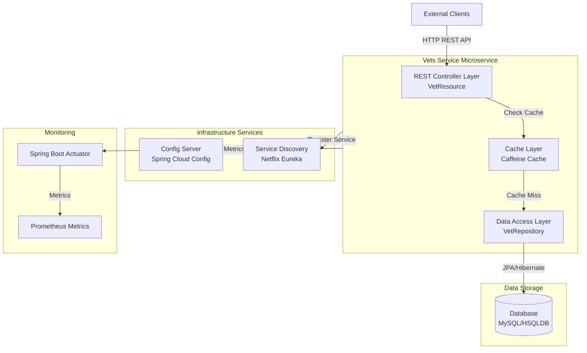
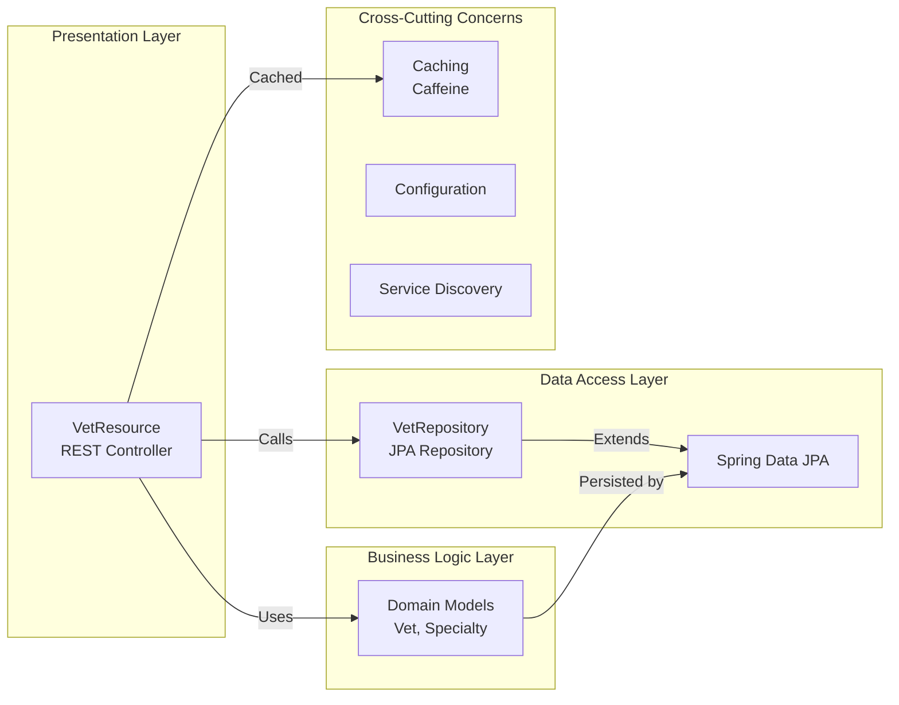

# Spring PetClinic Vets Service - Architecture Diagram

## Overview

| Property | Value |
|----------|-------|
| Application Name | Spring PetClinic Vets Service |
| Application Type | Microservice (REST API) |
| Primary Language | Java 17 |
| Framework | Spring Boot 3.4.1 |
| Packaging | JAR |
| Build Tool | Maven |
| Architecture Pattern | Layered Architecture (MVC + Repository) |

## Application Architecture

### High-Level Architecture

### Component Architecture

## Code Structure

### Component Organization

| Component | Package | Description |
|-----------|---------|-------------|
| Application Entry Point | `org.springframework.samples.petclinic.vets` | Main Spring Boot application class |
| REST Controllers | `org.springframework.samples.petclinic.vets.web` | REST API endpoints for vet resources |
| Domain Models | `org.springframework.samples.petclinic.vets.model` | JPA entities (Vet, Specialty) |
| Data Repositories | `org.springframework.samples.petclinic.vets.model` | Spring Data JPA repositories |
| System Configuration | `org.springframework.samples.petclinic.vets.system` | Application configuration and properties |

### Folder Structure

| Folder | Purpose |
|--------|---------|
| `/src/main/java` | Java source code |
| `/src/main/resources` | Application configuration files (application.yml) |
| `/src/test/java` | Test source code |
| `/src/test/resources` | Test configuration files |
| `pom.xml` | Maven project configuration and dependencies |

## Technology Stack

### Core Technologies

| Category | Technology | Version | Purpose |
|----------|-----------|---------|---------|
| Language | Java | 17 | Programming language |
| Framework | Spring Boot | 3.4.1 | Application framework |
| Cloud Framework | Spring Cloud | 2024.0.0 | Microservices framework |
| Build Tool | Maven | N/A | Dependency management and build |

### Spring Boot Components

| Component | Technology | Purpose |
|-----------|-----------|---------|
| Web Framework | Spring Boot Starter Web | REST API implementation |
| Data Access | Spring Boot Starter Data JPA | Database access and ORM |
| Caching | Spring Boot Starter Cache | Caching support |
| Monitoring | Spring Boot Starter Actuator | Health checks and metrics |
| Service Discovery | Spring Cloud Starter Netflix Eureka Client | Service registration and discovery |
| Configuration | Spring Cloud Starter Config | Centralized configuration management |

### Data & Storage

| Technology | Purpose | Environment |
|-----------|---------|-------------|
| MySQL | Production database | Production (via Azure JDBC) |
| HSQLDB | In-memory database | Development/Testing |
| Caffeine | Local cache implementation | All environments |

### Azure Integration

| Technology | Version | Purpose |
|-----------|---------|---------|
| Spring Cloud Azure | 5.20.1 | Azure services integration |
| Azure JDBC MySQL Starter | N/A | Azure Database for MySQL connectivity |

### Monitoring & Observability

| Technology | Purpose |
|-----------|---------|
| Spring Boot Actuator | Application health and metrics |
| Micrometer Registry Prometheus | Prometheus metrics export |
| Jolokia | JMX over HTTP |
| Chaos Monkey for Spring Boot | Chaos engineering support |

### Additional Libraries

| Library | Purpose |
|---------|---------|
| Lombok | Reduce boilerplate code |
| Jakarta XML Bind API | XML binding support |
| JUnit Jupiter | Testing framework |

## Deployment Characteristics

### Container Configuration

- **Exposed Port**: 8081
- **Containerization**: Docker support via Spotify Docker Maven plugin
- **Profile Support**: Multiple profiles (production, docker)

### Service Integration

- **Config Server**: Connects to Spring Cloud Config Server (default: localhost:8888)
- **Service Registry**: Registers with Netflix Eureka for service discovery
- **Database**: Supports both MySQL (production) and HSQLDB (local development)

### Monitoring & Health

- **Actuator Endpoints**: Provides health checks and application metrics
- **Prometheus Integration**: Exports metrics in Prometheus format
- **Chaos Engineering**: Optional chaos monkey support for resilience testing

## Architecture Patterns

1. **Layered Architecture**: Clear separation between presentation (REST), business logic (models), and data access (repositories)
2. **Microservices**: Designed as an independent microservice within the PetClinic ecosystem
3. **Service Registry Pattern**: Uses Eureka for service discovery
4. **Configuration Management**: Centralized configuration via Spring Cloud Config
5. **Caching**: Implements caching at the service layer to improve performance
6. **Externalized Configuration**: Environment-specific configurations through Spring profiles

## Key Features

- **RESTful API**: Exposes veterinarian data via REST endpoints
- **Caching**: Implements caching to reduce database load
- **Service Discovery**: Auto-registers with Eureka for dynamic service location
- **Health Monitoring**: Comprehensive health checks and metrics via Actuator
- **Cloud-Ready**: Designed for cloud deployment with Azure integration
- **Database Flexibility**: Supports multiple database backends (MySQL, HSQLDB)
- **Containerized**: Ready for Docker and Kubernetes deployment
