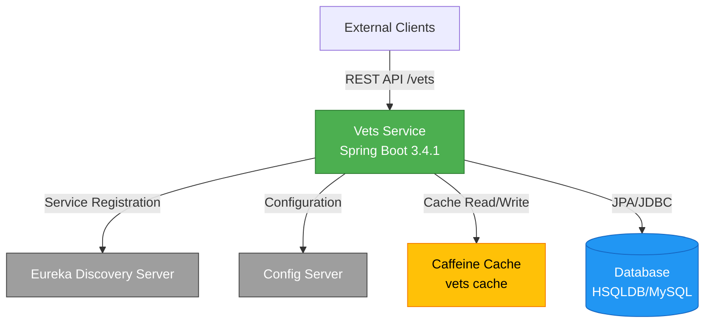
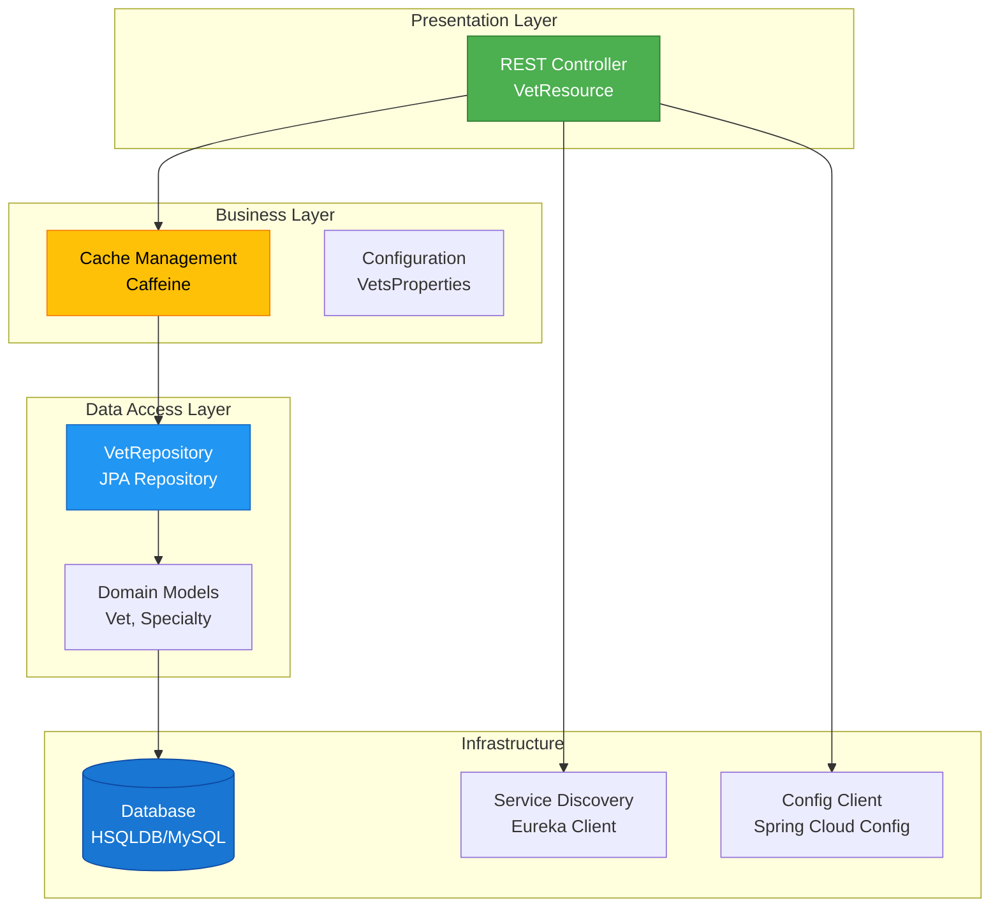

# Spring PetClinic Vets Service - Architecture Diagram

## Overview

| Property | Value |
|----------|-------|
| Application Name | vets-service |
| Application Type | Microservice (REST API) |
| Framework | Spring Boot 3.4.1 |
| Java Version | 17 |
| Build Tool | Maven |

## Application Architecture

### High-Level Architecture



### Layered Architecture



## Code Structure

### Component Overview

| Component | Type | Purpose |
|-----------|------|---------|
| VetResource | REST Controller | Exposes /vets endpoint for retrieving veterinarians |
| VetRepository | JPA Repository | Data access layer for Vet entities |
| Vet | Entity | Domain model representing a veterinarian |
| Specialty | Entity | Domain model representing veterinarian specialties |
| CacheConfig | Configuration | Configures Caffeine cache for vets data |
| VetsProperties | Configuration | Application-specific configuration properties |
| VetsServiceApplication | Main Class | Spring Boot application entry point |

### Folder Structure

```
src/main/java/org/springframework/samples/petclinic/vets/
├── model/              # Domain models and repositories
│   ├── Vet.java
│   ├── Specialty.java
│   └── VetRepository.java
├── web/                # REST controllers
│   └── VetResource.java
├── system/             # System configuration
│   ├── CacheConfig.java
│   └── VetsProperties.java
└── VetsServiceApplication.java
```

## Technology Stack

### Core Technologies

| Technology | Version | Purpose |
|------------|---------|---------|
| Java | 17 | Runtime platform |
| Spring Boot | 3.4.1 | Application framework |
| Spring Cloud | 2024.0.0 | Microservices infrastructure |
| Maven | - | Build and dependency management |

### Key Dependencies

| Dependency | Version/Type | Purpose |
|------------|--------------|---------|
| Spring Boot Starter Web | 3.4.1 | REST API development |
| Spring Boot Starter Data JPA | 3.4.1 | Data persistence with JPA |
| Spring Boot Starter Cache | 3.4.1 | Caching abstraction |
| Spring Boot Starter Actuator | 3.4.1 | Production monitoring and management |
| Spring Cloud Config | 2024.0.0 | Centralized configuration management |
| Spring Cloud Netflix Eureka | 2024.0.0 | Service discovery and registration |
| Azure Spring Cloud JDBC MySQL | 5.20.1 | Azure MySQL connectivity with managed identity |
| Caffeine | - | High-performance in-memory cache |
| HSQLDB | runtime | In-memory database for development |
| MySQL Connector | runtime | MySQL database connectivity |
| Lombok | provided | Reduce boilerplate code |
| Micrometer Prometheus | - | Metrics collection and export |
| Chaos Monkey | 3.1.0 | Chaos engineering for resilience testing |

### Data Storage

| Type | Technology | Usage |
|------|------------|-------|
| Primary Database | HSQLDB/MySQL | Veterinarian and specialty data persistence |
| Cache | Caffeine | In-memory caching of vets list |

### External Integrations

| Service | Purpose | Protocol |
|---------|---------|----------|
| Config Server | Centralized configuration management | HTTP/REST |
| Eureka Server | Service discovery and registration | HTTP/REST |
| Azure MySQL | Managed database service | JDBC |

## Data Flow

### Typical Request Flow

1. **Client Request**: External client sends GET request to `/vets`
2. **Cache Check**: VetResource checks Caffeine cache for cached vets list
3. **Cache Hit**: If cached, return immediately from cache
4. **Cache Miss**: If not cached, query VetRepository
5. **Database Query**: VetRepository executes JPA query against database
6. **Cache Update**: Result is cached in Caffeine for subsequent requests
7. **Response**: JSON response returned to client

### Service Registration Flow

1. **Startup**: VetsServiceApplication starts
2. **Configuration**: Fetch configuration from Config Server
3. **Registration**: Register service instance with Eureka Server
4. **Health Checks**: Periodic health checks sent to Eureka
5. **Discovery**: Other services can discover this service via Eureka

## Migration Considerations

Based on the assessment report, the following areas require attention for Azure migration:

### Identified Issues (7 issues, 11 incidents, 35 effort points)

**By Severity:**
- Mandatory: 6 incidents
- Optional: 4 incidents
- Potential: 1 incident

**By Category:**
- Remote Communication: 4 incidents
- Embedded Cache Management: 3 incidents
- Spring Migration: 2 incidents
- Framework Upgrade: 1 incident
- Containerization: 1 incident

### Key Migration Areas

1. **Config Server Migration**: Replace Spring Cloud Config with Azure App Configuration
2. **Service Discovery**: Replace Eureka with Azure-native service discovery or Azure Service Bus
3. **Cache Management**: Consider Azure Cache for Redis for distributed caching
4. **Database**: Migrate to Azure Database for MySQL with managed identity
5. **Monitoring**: Integrate with Azure Application Insights
6. **Containerization**: Prepare for deployment on AKS, App Service, or Container Apps

---

*Generated from assessment results on 2026-02-11*
