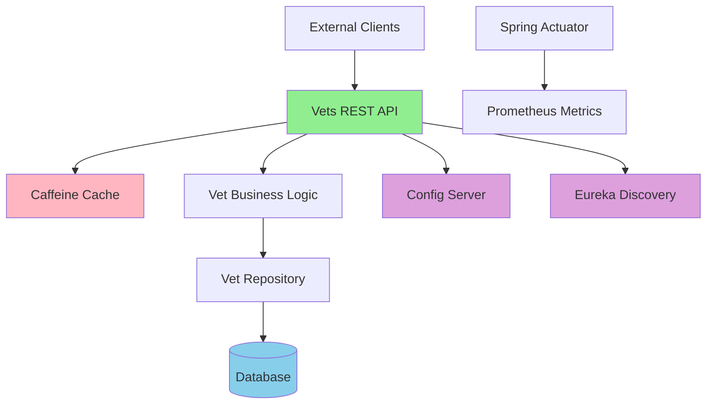
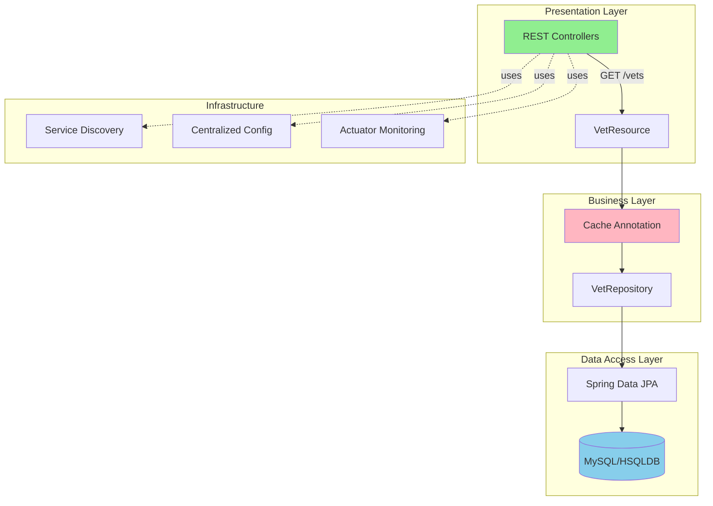
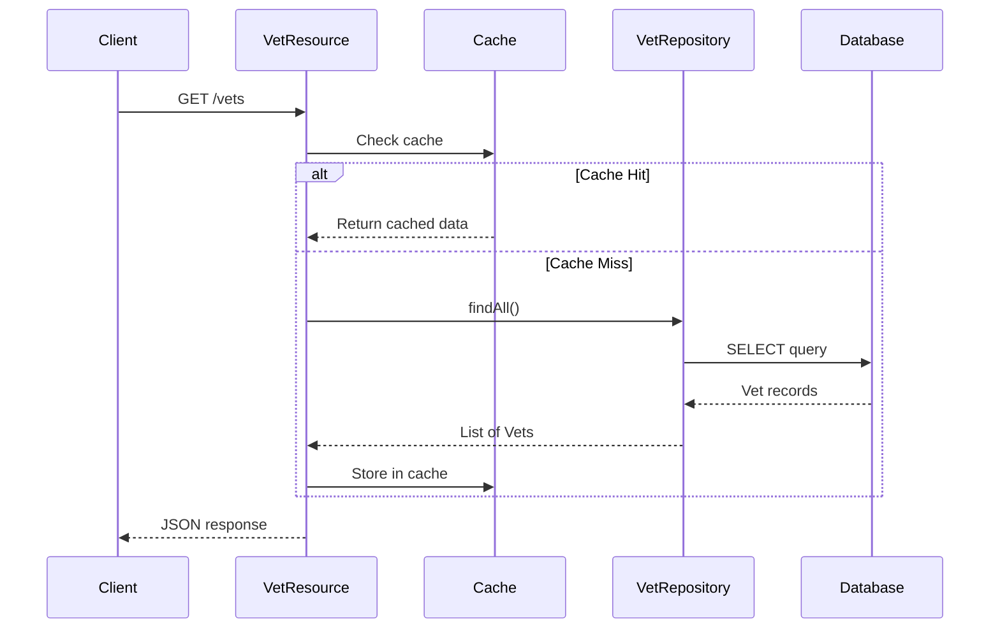

# Spring PetClinic Vets Service - Architecture Diagram

## Overview

| Property | Value |
|----------|-------|
| **Application Name** | Spring PetClinic Vets Service |
| **Application Type** | Microservice (RESTful API) |
| **Framework** | Spring Boot 3.4.1 |
| **Java Version** | Java 17 |
| **Build Tool** | Maven |
| **Packaging** | JAR |
| **Port** | 8081 |

## Application Architecture

### High-Level Architecture



### Layered Architecture



## Code Structure

### Main Components

| Component | Type | Location | Purpose |
|-----------|------|----------|---------|
| VetsServiceApplication | Main Class | `org.springframework.samples.petclinic.vets` | Application entry point with Discovery enabled |
| VetResource | REST Controller | `org.springframework.samples.petclinic.vets.web` | Exposes /vets endpoint with caching |
| VetRepository | JPA Repository | `org.springframework.samples.petclinic.vets.model` | Data access for Vet entities |
| Vet | Entity | `org.springframework.samples.petclinic.vets.model` | Domain model for veterinarians |
| Specialty | Entity | `org.springframework.samples.petclinic.vets.model` | Domain model for vet specialties |
| CacheConfig | Configuration | `org.springframework.samples.petclinic.vets.system` | Cache configuration |
| VetsProperties | Properties | `org.springframework.samples.petclinic.vets.system` | Application properties |

### Folder Structure

```
src/main/java/org/springframework/samples/petclinic/vets/
├── VetsServiceApplication.java (Main Application)
├── model/
│   ├── Vet.java (Entity)
│   ├── Specialty.java (Entity)
│   └── VetRepository.java (Repository)
├── web/
│   └── VetResource.java (REST Controller)
└── system/
    ├── CacheConfig.java (Configuration)
    └── VetsProperties.java (Properties)

src/main/resources/
└── application.yml (Application Configuration)
```

## Technology Stack

### Core Technologies

| Technology | Version | Purpose |
|------------|---------|---------|
| **Spring Boot** | 3.4.1 | Application framework |
| **Java** | 17 | Programming language |
| **Spring Cloud** | 2024.0.0 | Microservices infrastructure |
| **Maven** | - | Build tool |

### Key Dependencies

| Dependency | Version | Category | Purpose |
|------------|---------|----------|---------|
| **Spring Web** | 3.4.1 | Web | REST API development |
| **Spring Data JPA** | 3.4.1 | Data Access | Database operations |
| **Spring Actuator** | 3.4.1 | Monitoring | Health checks and metrics |
| **Spring Cache** | 3.4.1 | Caching | Performance optimization |
| **Spring Cloud Config** | 2024.0.0 | Configuration | Centralized configuration |
| **Netflix Eureka Client** | 2024.0.0 | Discovery | Service registration |
| **Spring Cloud Azure** | 5.20.1 | Cloud Integration | Azure services integration |
| **MySQL Connector** | - | Database | MySQL database driver |
| **HSQLDB** | - | Database | In-memory database (testing) |
| **Caffeine** | - | Caching | High-performance cache |
| **Lombok** | - | Development | Boilerplate reduction |
| **Jolokia** | 1.7.1 | Monitoring | JMX over HTTP |
| **Micrometer Prometheus** | - | Metrics | Metrics export |
| **Chaos Monkey** | 3.1.0 | Resilience | Chaos engineering |

### Azure Integration

| Component | Purpose |
|-----------|---------|
| **spring-cloud-azure-starter-jdbc-mysql** | Azure MySQL JDBC integration |
| **spring-cloud-azure-dependencies** | Azure Spring Cloud BOM |

## Data Flow

### Request Flow for GET /vets



## External Dependencies

### Service Dependencies

| Service | Type | Purpose | Configuration |
|---------|------|---------|---------------|
| **Config Server** | Spring Cloud Config | Centralized configuration management | `http://localhost:8888` or `http://config-server:8888` (docker) |
| **Eureka Server** | Netflix Eureka | Service discovery and registration | Configured via Spring Cloud |
| **Database** | MySQL / HSQLDB | Data persistence | MySQL for production, HSQLDB for testing |

### Monitoring & Observability

| Tool | Purpose |
|------|---------|
| **Spring Actuator** | Application health and metrics endpoints |
| **Prometheus** | Metrics collection and monitoring |
| **Jolokia** | JMX monitoring over HTTP |

## Assessment Summary

Based on the AppCAT assessment report:

- **Total Issues**: 7
- **Total Incidents**: 11
- **Total Effort**: 35 story points

### Issue Categories

| Category | Count |
|----------|-------|
| Remote Communication | 4 |
| Embedded Cache Management | 3 |
| Spring Migration | 2 |
| Framework Upgrade | 1 |
| Containerization | 1 |

### Severity Breakdown

| Severity | Count |
|----------|-------|
| Mandatory | 6 |
| Optional | 4 |
| Potential | 1 |

### Target Platforms Assessed

- Azure Kubernetes Service (AKS)
- Azure App Service
- Azure Container Apps

## Notes

- This is a stateless microservice that can be horizontally scaled
- Caching is implemented at the REST layer for performance optimization
- Service discovery enables dynamic service location in microservices architecture
- Externalized configuration supports different deployment environments
- Spring Actuator provides production-ready monitoring capabilities
- The application is designed for cloud-native deployment with Azure integration
