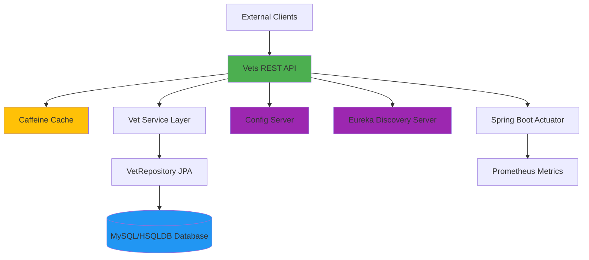
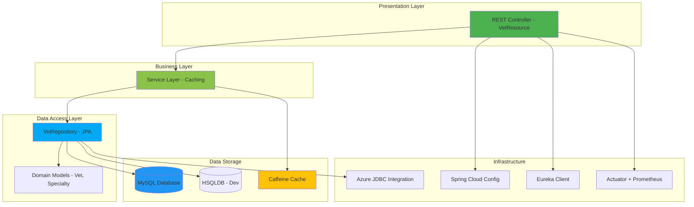

# Architecture Diagram - Spring PetClinic Vets Service

## Overview

| Property | Value |
|----------|-------|
| **Application Name** | vets-service |
| **Application Type** | Microservice (REST API) |
| **Framework** | Spring Boot 3.4.1 |
| **Language** | Java 17 |
| **Build Tool** | Maven |
| **Packaging** | JAR |

## Application Architecture

### High-Level Architecture



### Layered Architecture



## Code Structure

### Component Overview

| Component | Package | Purpose |
|-----------|---------|---------|
| VetsServiceApplication | org.springframework.samples.petclinic.vets | Main Spring Boot application entry point |
| VetResource | org.springframework.samples.petclinic.vets.web | REST controller for vet endpoints |
| VetRepository | org.springframework.samples.petclinic.vets.model | JPA repository for data access |
| Vet, Specialty | org.springframework.samples.petclinic.vets.model | Domain model entities |
| CacheConfig | org.springframework.samples.petclinic.vets.system | Cache configuration |
| VetsProperties | org.springframework.samples.petclinic.vets.system | Configuration properties |

### Folder Structure

```
src/main/
├── java/
│   └── org/springframework/samples/petclinic/vets/
│       ├── VetsServiceApplication.java
│       ├── model/
│       │   ├── Vet.java
│       │   ├── Specialty.java
│       │   └── VetRepository.java
│       ├── web/
│       │   └── VetResource.java
│       └── system/
│           ├── CacheConfig.java
│           └── VetsProperties.java
└── resources/
    ├── application.yml
    ├── db/
    │   ├── hsqldb/
    │   └── mysql/
    └── logback-spring.xml
```

## Technology Stack

| Category | Technology | Version | Purpose |
|----------|-----------|---------|---------|
| **Framework** | Spring Boot | 3.4.1 | Core application framework |
| **Language** | Java | 17 | Programming language |
| **Build Tool** | Maven | - | Dependency and build management |
| **Web** | Spring Web MVC | 3.4.1 | REST API endpoints |
| **Data Access** | Spring Data JPA | 3.4.1 | Database access layer |
| **Database (Prod)** | MySQL | - | Production database |
| **Database (Dev)** | HSQLDB | - | Development/testing database |
| **Cache** | Caffeine | - | In-memory caching |
| **Service Discovery** | Netflix Eureka Client | - | Microservice registration/discovery |
| **Configuration** | Spring Cloud Config | 2024.0.0 | Centralized configuration |
| **Azure Integration** | Azure Spring Cloud JDBC MySQL | 5.20.1 | Azure MySQL connectivity |
| **Monitoring** | Spring Boot Actuator | 3.4.1 | Health checks and metrics |
| **Metrics** | Micrometer Prometheus | - | Metrics collection for Prometheus |
| **Logging** | Logback | - | Application logging |
| **Utilities** | Lombok | - | Code generation (getters/setters) |
| **Management** | Jolokia | 1.7.1 | JMX over HTTP |
| **Chaos Engineering** | Chaos Monkey | 3.1.0 | Resilience testing |

## Key Architecture Patterns

### Design Patterns
- **Repository Pattern**: JpaRepository for data access abstraction
- **RESTful API**: REST controllers for HTTP endpoints
- **Dependency Injection**: Spring's IoC container
- **Configuration Management**: Externalized configuration via Spring Cloud Config
- **Service Discovery**: Netflix Eureka for service registration

### Caching Strategy
- **Cache Provider**: Caffeine (high-performance in-memory cache)
- **Cache Name**: `vets`
- **Cached Endpoint**: `GET /vets` - retrieves all veterinarians
- **Cache Activation**: Enabled in production profile

### Data Access
- **ORM**: Hibernate via Spring Data JPA
- **Repository**: VetRepository extends JpaRepository
- **Database Support**: 
  - MySQL for production (with Azure JDBC integration)
  - HSQLDB for development/testing

### Microservice Integration
- **Service Discovery**: Eureka client for service registration
- **Centralized Config**: Spring Cloud Config for configuration management
- **Health Monitoring**: Spring Boot Actuator endpoints
- **Metrics**: Prometheus metrics export via Micrometer

## API Endpoints

| Endpoint | Method | Description | Caching |
|----------|--------|-------------|---------|
| /vets | GET | Retrieve all veterinarians with their specialties | Yes (Caffeine) |
| /actuator/* | GET | Health checks, metrics, and monitoring endpoints | No |

## Azure Cloud Readiness

### Azure Integration Features
- **Azure JDBC**: Spring Cloud Azure JDBC Starter for MySQL connectivity
- **Managed Identity Support**: Ready for Azure managed identity authentication
- **Cloud Config**: Compatible with Azure App Configuration

### Recommended Azure Services
- **Azure App Service**: For hosting the microservice
- **Azure Container Apps**: For containerized deployment
- **Azure Kubernetes Service (AKS)**: For Kubernetes-based deployment
- **Azure Database for MySQL**: For managed database service
- **Azure Application Insights**: For application monitoring (upgrade from Prometheus)
- **Azure Service Bus**: Can replace in-memory cache with distributed cache if needed

## Assessment Summary

Based on the AppCAT assessment report:

- **Total Issues**: 7
- **Total Incidents**: 11
- **Estimated Effort**: 35 story points
- **Severity Distribution**:
  - Mandatory: 6
  - Optional: 4
  - Potential: 1
- **Categories**:
  - Containerization: 1
  - Embedded Cache Management: 3
  - Framework Upgrade: 1
  - Remote Communication: 4
  - Spring Migration: 2

### Key Migration Considerations
1. **Containerization**: Application is containerization-ready with Dockerfile support
2. **Cache Management**: Consider migrating from in-memory cache to distributed cache (Azure Cache for Redis) for scalability
3. **Configuration**: Already using Spring Cloud Config - can be migrated to Azure App Configuration
4. **Service Discovery**: Eureka can be replaced with Azure-native service discovery
5. **Database**: MySQL is Azure-compatible - migrate to Azure Database for MySQL

---

*This diagram was generated based on code analysis and AppCAT assessment results.*
*Last Updated: 2026-02-11*
