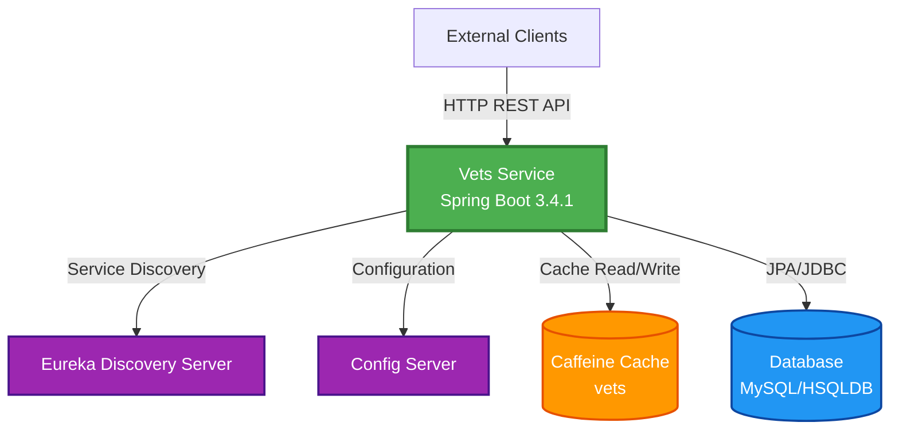
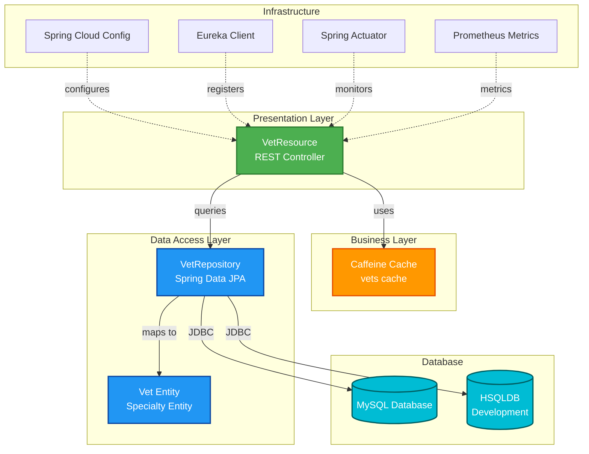
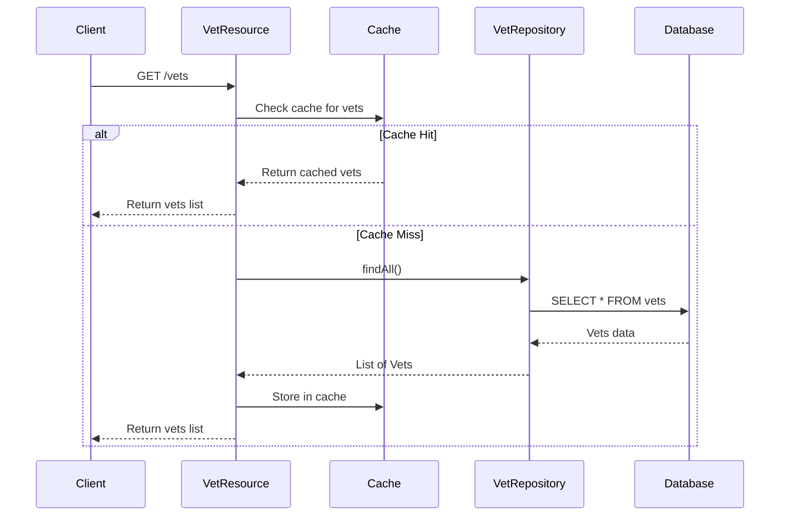

# Spring PetClinic Vets Service - Architecture Diagram

## Overview

| Property | Value |
|----------|-------|
| Application Name | Spring PetClinic Vets Service |
| Application Type | Microservice - REST API |
| Framework | Spring Boot 3.4.1 |
| Java Version | 17 |
| Build Tool | Maven |
| Packaging | JAR |

## Application Architecture

### High-Level Architecture

### Layered Architecture

## Code Structure

### Components

| Component | Type | Purpose |
|-----------|------|---------|
| VetsServiceApplication | Main Class | Spring Boot application entry point |
| VetResource | REST Controller | Exposes GET /vets endpoint |
| VetRepository | Repository | Spring Data JPA repository for Vet entities |
| Vet | Entity | JPA entity representing veterinarian |
| Specialty | Entity | JPA entity representing vet specialty |
| CacheConfig | Configuration | Caffeine cache configuration |
| VetsProperties | Configuration | Application properties binding |

### Folder Structure

| Path | Description |
|------|-------------|
| src/main/java/.../vets | Main application source code |
| src/main/java/.../vets/model | Domain entities (Vet, Specialty) |
| src/main/java/.../vets/web | REST controllers |
| src/main/java/.../vets/system | Configuration classes |
| src/main/resources | Application configuration and SQL scripts |
| src/main/resources/db/mysql | MySQL database schema and data |
| src/main/resources/db/hsqldb | HSQLDB database schema and data |
| src/test/java | Test classes |

## Technology Stack

### Core Technologies

| Technology | Version | Purpose |
|------------|---------|---------|
| Java | 17 | Programming language |
| Spring Boot | 3.4.1 | Application framework |
| Spring Cloud | 2024.0.0 | Microservices infrastructure |
| Maven | Default | Build and dependency management |

### Spring Framework Components

| Component | Purpose |
|-----------|---------|
| Spring Boot Web | REST API development |
| Spring Data JPA | Database access layer |
| Spring Boot Actuator | Health checks and metrics |
| Spring Cache | Caching abstraction |
| Spring Cloud Config | Centralized configuration |
| Spring Cloud Netflix Eureka | Service discovery |
| Spring Cloud Azure | Azure integration |

### Data & Persistence

| Technology | Version | Purpose |
|------------|---------|---------|
| Spring Data JPA | - | ORM framework |
| MySQL Connector | Runtime | MySQL database driver |
| HSQLDB | Runtime | In-memory database for development |
| Azure MySQL JDBC | - | Azure MySQL integration |

### Caching & Performance

| Technology | Version | Purpose |
|------------|---------|---------|
| Caffeine | - | High-performance caching library |
| javax.cache API | - | JSR-107 caching standard |

### Monitoring & Observability

| Technology | Version | Purpose |
|------------|---------|---------|
| Spring Boot Actuator | - | Application health and metrics |
| Micrometer Prometheus | - | Metrics export to Prometheus |
| Jolokia | 1.7.1 | JMX over HTTP |

### Development Tools

| Technology | Version | Purpose |
|------------|---------|---------|
| Lombok | - | Reduce boilerplate code |
| Chaos Monkey | 3.1.0 | Resilience testing |

### Testing

| Technology | Version | Purpose |
|------------|---------|---------|
| Spring Boot Test | - | Testing framework |
| JUnit Jupiter | - | Unit testing |

## Data Flow

## External Dependencies

### Service Dependencies

| Service | Purpose | Configuration |
|---------|---------|---------------|
| Config Server | Centralized configuration management | Default: http://localhost:8888 |
| Eureka Server | Service discovery and registration | Spring Cloud Netflix Eureka |

### Cloud Integrations

| Integration | Purpose |
|-------------|---------|
| Azure Spring Cloud | Azure cloud platform integration |
| Azure MySQL | Managed MySQL database service |

## API Endpoints

| Endpoint | Method | Description | Cache |
|----------|--------|-------------|-------|
| /vets | GET | Get list of all veterinarians | Yes (vets) |

## Database Schema

### Tables

| Table | Description |
|-------|-------------|
| vets | Veterinarian information (id, first_name, last_name) |
| specialties | Specialty types |
| vet_specialties | Many-to-many relationship between vets and specialties |

## Configuration

### Application Properties

- **Application Name**: vets-service
- **Config Import**: Optional config server (http://localhost:8888/)
- **Cache Names**: vets
- **Active Profile**: production
- **Docker Profile**: Uses config-server:8888

### Ports

- **Exposed Port**: 8081 (from pom.xml docker configuration)

## Deployment

### Packaging

- **Type**: JAR
- **Docker Support**: Yes (maven docker plugin available)
- **Build Profile**: buildDocker

### Azure Readiness

Based on the assessment, this application can be deployed to:
- Azure Container Apps
- Azure Kubernetes Service (AKS)
- Azure App Service

---

*Generated from Spring PetClinic Vets Service assessment*
