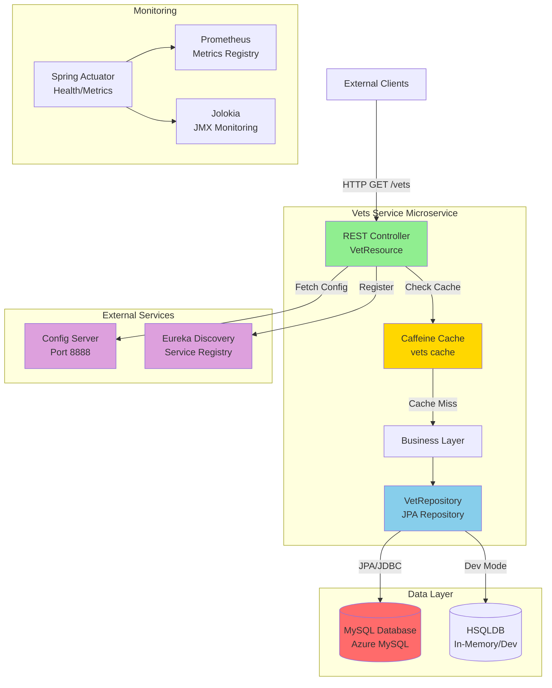
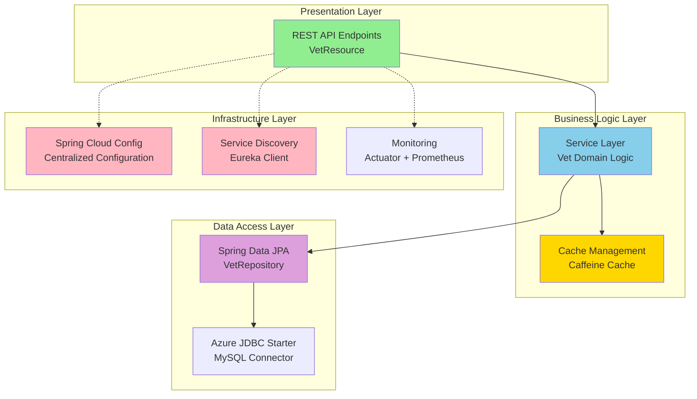
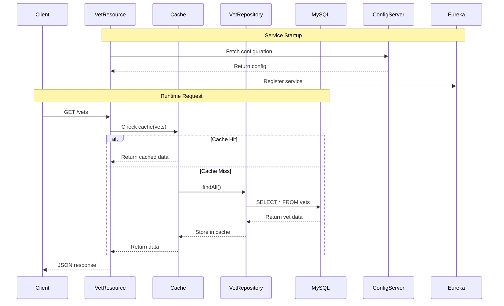

# Spring PetClinic Vets Service - Architecture Diagram

## Overview

| Property | Value |
|----------|-------|
| **Application Name** | vets-service |
| **Application Type** | Spring Boot Microservice |
| **Framework** | Spring Boot 3.4.1 |
| **Java Version** | 17 |
| **Build Tool** | Maven |
| **Packaging** | JAR |
| **Primary Port** | 8081 |

## Application Architecture

### High-Level Architecture



### Layered Architecture



## Code Structure

### Main Components

| Component | Type | Purpose |
|-----------|------|---------|
| VetsServiceApplication | Main Class | Spring Boot application entry point with service discovery |
| VetResource | REST Controller | Exposes GET /vets endpoint with caching |
| VetRepository | JPA Repository | Data access layer for Vet entities |
| Vet | Entity | Domain model for veterinarians |
| Specialty | Entity | Domain model for vet specialties |
| CacheConfig | Configuration | Enables Caffeine caching in production |
| VetsProperties | Configuration | Custom properties binding |

### Folder Structure

```
src/main/java/org/springframework/samples/petclinic/vets/
├── model/               # Domain entities and repositories
│   ├── Vet.java
│   ├── Specialty.java
│   └── VetRepository.java
├── web/                 # REST controllers
│   └── VetResource.java
├── system/              # System configuration
│   ├── CacheConfig.java
│   └── VetsProperties.java
└── VetsServiceApplication.java
```

## Technology Stack

### Core Frameworks

| Technology | Version | Purpose |
|------------|---------|---------|
| Spring Boot | 3.4.1 | Application framework |
| Spring Cloud | 2024.0.0 | Cloud-native capabilities |
| Spring Cloud Azure | 5.20.1 | Azure integration |
| Java | 17 | Programming language |

### Key Dependencies

| Category | Technology | Version | Purpose |
|----------|-----------|---------|---------|
| **Web** | Spring Web | 3.4.1 | REST API |
| **Data** | Spring Data JPA | 3.4.1 | Data persistence |
| **Database** | MySQL Connector | Runtime | Production database driver |
| **Database** | HSQLDB | Runtime | Development/testing database |
| **Cache** | Caffeine | Latest | In-memory caching |
| **Cache** | Spring Cache | 3.4.1 | Cache abstraction |
| **Cloud** | Spring Cloud Config | 2024.0.0 | Centralized configuration |
| **Cloud** | Eureka Client | 2024.0.0 | Service discovery |
| **Azure** | Azure JDBC MySQL | 5.20.1 | Azure MySQL integration |
| **Monitoring** | Spring Actuator | 3.4.1 | Health checks and metrics |
| **Monitoring** | Micrometer Prometheus | Latest | Metrics export |
| **Monitoring** | Jolokia | 1.7.1 | JMX monitoring |
| **Resilience** | Chaos Monkey | 3.1.0 | Chaos engineering |
| **Build** | Lombok | Provided | Code generation |
| **Testing** | JUnit Jupiter | Test | Unit testing |

### Azure Integration

| Azure Service | Integration | Purpose |
|---------------|-------------|---------|
| Azure MySQL | spring-cloud-azure-starter-jdbc-mysql | Managed database connectivity |
| Azure Spring Apps | Spring Cloud Config + Eureka | Microservice hosting (target) |
| Azure Container Apps | Containerization ready | Alternative deployment target |
| Azure Kubernetes Service | Docker support | Container orchestration target |

## Data Flow

### Typical Request Flow



## Assessment Summary

### Migration Readiness Analysis

Based on the AppCAT assessment performed on **2026-02-10**:

| Metric | Value |
|--------|-------|
| **Total Issues** | 7 |
| **Total Incidents** | 11 |
| **Total Effort** | 35 story points |
| **Assessment Status** | Complete |

### Issue Severity Breakdown

| Severity | Count | Description |
|----------|-------|-------------|
| **Mandatory** | 6 | Must be fixed for successful migration |
| **Optional** | 4 | Recommended improvements |
| **Potential** | 1 | Potential issues to review |
| **Information** | 0 | No informational items |

### Issue Category Breakdown

| Category | Count | Focus Area |
|----------|-------|------------|
| **Remote Communication** | 4 | Service-to-service communication patterns |
| **Embedded Cache Management** | 3 | In-memory caching considerations |
| **Spring Migration** | 2 | Spring framework upgrade topics |
| **Containerization** | 1 | Container deployment readiness |
| **Framework Upgrade** | 1 | Framework version considerations |

### Target Azure Services

This application has been assessed for deployment to:

1. **Azure Kubernetes Service (AKS)** - Container orchestration platform
2. **Azure App Service** - Managed PaaS for web applications
3. **Azure Container Apps** - Serverless container platform

### Key Findings

**Strengths:**
- ✅ Modern Spring Boot 3.4.1 with Java 17
- ✅ Cloud-native patterns (Config Server, Service Discovery)
- ✅ RESTful API design
- ✅ Built-in monitoring and health checks
- ✅ Caching strategy implemented
- ✅ Azure MySQL integration ready

**Areas for Attention:**
- ⚠️ Remote communication patterns need review for cloud deployment
- ⚠️ Embedded cache management requires cloud-native alternatives
- ⚠️ Service discovery may need Azure-specific configuration
- ⚠️ Containerization considerations for production deployment

### Recommended Next Steps

1. **Review Assessment Report**: Examine detailed issues in `.github/modernize/report.json`
2. **Address Mandatory Issues**: Focus on 6 mandatory issues (35 story points effort)
3. **Plan Cloud Migration**: Choose target Azure service (AKS/App Service/Container Apps)
4. **Update Dependencies**: Consider Azure-native alternatives for:
   - Service discovery (Azure Service Discovery)
   - Configuration (Azure App Configuration)
   - Caching (Azure Cache for Redis)
5. **Containerization**: Review Docker setup and optimize for Azure deployment

---

*Generated by AppCAT Assessment - Spring PetClinic Vets Service*
