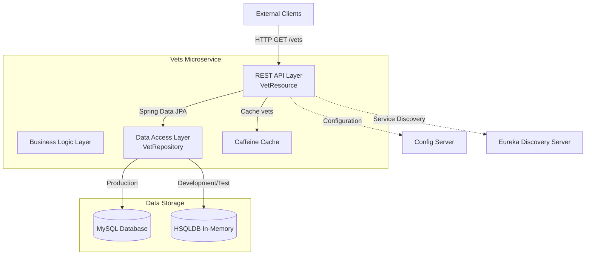
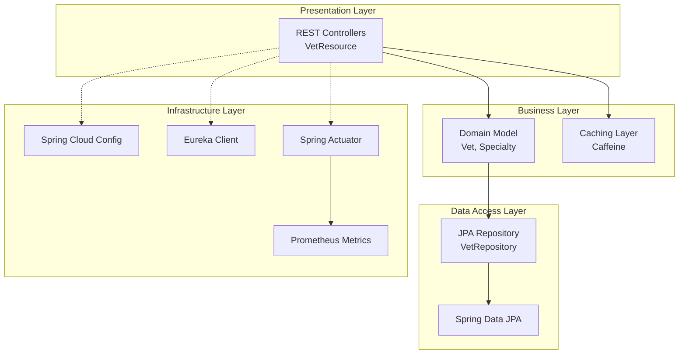

# Spring PetClinic Vets Service - Architecture Diagram

## Overview

| Property | Value |
|----------|-------|
| **Application Name** | Spring PetClinic Vets Service |
| **Application Type** | RESTful Microservice |
| **Framework** | Spring Boot 3.4.1 |
| **Java Version** | 17 |
| **Build Tool** | Maven |
| **Packaging** | JAR |

## Application Architecture

### High-Level Architecture



### Layered Architecture



## Code Structure

### Component Overview

| Component | Package | Description |
|-----------|---------|-------------|
| **VetsServiceApplication** | org.springframework.samples.petclinic.vets | Main Spring Boot application entry point with Discovery Client enabled |
| **VetResource** | org.springframework.samples.petclinic.vets.web | REST controller exposing /vets endpoint with caching |
| **Vet** | org.springframework.samples.petclinic.vets.model | JPA entity representing veterinarians with specialties |
| **Specialty** | org.springframework.samples.petclinic.vets.model | JPA entity representing vet specialties |
| **VetRepository** | org.springframework.samples.petclinic.vets.model | Spring Data JPA repository for vet data access |
| **CacheConfig** | org.springframework.samples.petclinic.vets.system | Cache configuration for Caffeine |
| **VetsProperties** | org.springframework.samples.petclinic.vets.system | Configuration properties for vets service |

### Folder Structure

```
vets-service/
├── src/main/java/
│   └── org/springframework/samples/petclinic/vets/
│       ├── VetsServiceApplication.java
│       ├── model/
│       │   ├── Vet.java
│       │   ├── Specialty.java
│       │   └── VetRepository.java
│       ├── web/
│       │   └── VetResource.java
│       └── system/
│           ├── CacheConfig.java
│           └── VetsProperties.java
├── src/main/resources/
│   ├── application.yml
│   ├── db/hsqldb/
│   │   ├── schema.sql
│   │   └── data.sql
│   └── db/mysql/
│       ├── schema.sql
│       └── data.sql
└── pom.xml
```

## Technology Stack

### Core Technologies

| Technology | Version | Purpose |
|------------|---------|---------|
| **Spring Boot** | 3.4.1 | Application framework and runtime |
| **Java** | 17 | Programming language (LTS version) |
| **Maven** | N/A | Build and dependency management |

### Spring Framework Dependencies

| Dependency | Version | Purpose |
|------------|---------|---------|
| **Spring Boot Starter Web** | 3.4.1 | REST API and web layer |
| **Spring Boot Starter Data JPA** | 3.4.1 | ORM and database access |
| **Spring Boot Starter Actuator** | 3.4.1 | Health checks and monitoring endpoints |
| **Spring Boot Starter Cache** | 3.4.1 | Caching abstraction |
| **Spring Cloud Config** | 2024.0.0 | Externalized configuration |
| **Spring Cloud Netflix Eureka Client** | 2024.0.0 | Service discovery and registration |
| **Spring Cloud Azure JDBC MySQL** | 5.20.1 | Azure MySQL integration |

### Data Storage

| Technology | Scope | Purpose |
|------------|-------|---------|
| **MySQL** | Runtime | Production database (Azure MySQL compatible) |
| **HSQLDB** | Runtime | In-memory database for development/testing |
| **Caffeine** | Runtime | High-performance in-memory cache |

### Observability and Monitoring

| Technology | Version | Purpose |
|------------|---------|---------|
| **Micrometer Prometheus** | N/A | Metrics collection and export |
| **Spring Boot Actuator** | 3.4.1 | Health checks and application insights |
| **Jolokia** | 1.7.1 | JMX over HTTP for monitoring |
| **Chaos Monkey** | 3.1.0 | Resilience testing |

### Additional Libraries

| Library | Version | Purpose |
|---------|---------|---------|
| **Lombok** | Provided | Reduce boilerplate code |
| **Jakarta XML Bind API** | N/A | XML binding support |
| **JCache API** | N/A | Java caching standard |

### Testing

| Framework | Scope | Purpose |
|-----------|-------|---------|
| **JUnit Jupiter** | Test | Unit testing framework |
| **Spring Boot Test** | Test | Integration testing support |

## Azure Migration Readiness

### Current Azure-Compatible Features

- **Spring Cloud Azure JDBC MySQL**: Already configured for Azure MySQL
- **Externalized Configuration**: Uses Spring Cloud Config for environment-specific settings
- **Service Discovery**: Eureka-based discovery can be replaced with Azure Spring Apps discovery
- **Health Checks**: Spring Actuator endpoints ready for Azure health probes
- **Metrics**: Prometheus metrics compatible with Azure Monitor

### Deployment Targets

Based on the assessment, this microservice is suitable for:

1. **Azure Kubernetes Service (AKS)**: Containerized deployment with full control
2. **Azure App Service**: Managed platform for Java applications
3. **Azure Container Apps**: Serverless containers with auto-scaling
4. **Azure Spring Apps**: Fully managed Spring Boot platform with built-in observability

### Database Options

- **Azure Database for MySQL**: Flexible Server for production workloads
- **Azure SQL Database**: Alternative relational database option
- **Azure Cosmos DB**: For global distribution and NoSQL requirements
