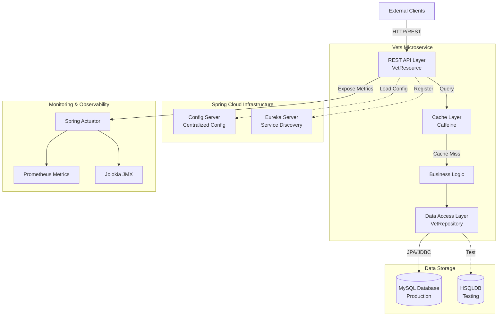
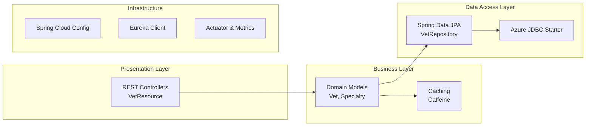
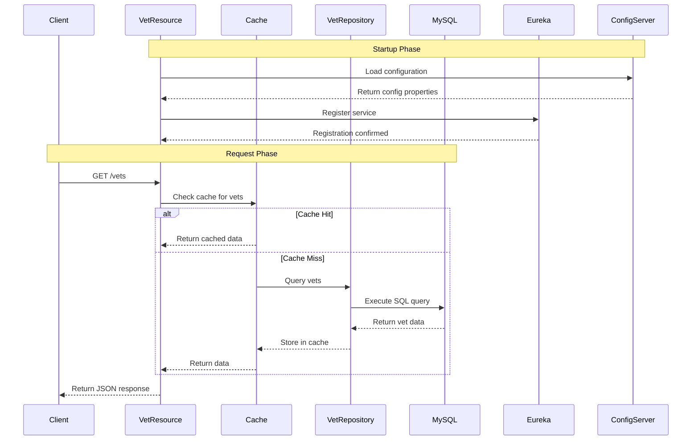

# Spring PetClinic Vets Service - Architecture Assessment

## Overview

| Property | Value |
|----------|-------|
| Application Name | Spring PetClinic Vets Service |
| Application Type | Microservice |
| Primary Language | Java 17 |
| Build Tool | Maven |
| Framework | Spring Boot 3.4.1 |
| Cloud Frameworks | Spring Cloud 2024.0.0 |
| Packaging | JAR |

## Application Architecture

### High-Level Architecture

### Layered Architecture

## Code Structure

### Package Organization

| Package | Purpose | Key Components |
|---------|---------|----------------|
| `org.springframework.samples.petclinic.vets` | Root package | VetsServiceApplication |
| `org.springframework.samples.petclinic.vets.web` | REST API Controllers | VetResource |
| `org.springframework.samples.petclinic.vets.model` | Domain Models & Repositories | Vet, Specialty, VetRepository |
| `org.springframework.samples.petclinic.vets.system` | System Configuration | CacheConfig, VetsProperties |

### Key Source Files

| File | Type | Purpose |
|------|------|---------|
| `VetsServiceApplication.java` | Main Class | Spring Boot application entry point |
| `VetResource.java` | REST Controller | Exposes `/vets` endpoint with caching |
| `VetRepository.java` | Repository Interface | Data access for Vet entities |
| `Vet.java` | Entity Model | Veterinarian domain model |
| `Specialty.java` | Entity Model | Veterinarian specialty domain model |
| `CacheConfig.java` | Configuration | Cache setup and configuration |

## Technology Stack

### Core Frameworks

| Technology | Version | Purpose |
|------------|---------|---------|
| Java | 17 | Programming Language |
| Spring Boot | 3.4.1 | Application Framework |
| Spring Cloud | 2024.0.0 | Cloud-native patterns |
| Spring Data JPA | 3.4.1 | Data persistence |
| Maven | - | Build tool |

### Key Dependencies

| Dependency | Purpose | Notes |
|------------|---------|-------|
| spring-boot-starter-web | REST API | Web MVC framework |
| spring-boot-starter-data-jpa | Data Access | ORM and repository support |
| spring-boot-starter-cache | Caching | Abstraction layer for caching |
| spring-boot-starter-actuator | Monitoring | Health checks and metrics |
| spring-cloud-starter-config | Configuration | Centralized configuration |
| spring-cloud-starter-netflix-eureka-client | Service Discovery | Service registration |
| spring-cloud-azure-starter-jdbc-mysql | Azure Integration | Azure-optimized MySQL connectivity |

### Data & Caching

| Technology | Purpose | Environment |
|------------|---------|-------------|
| MySQL | Primary Database | Production |
| HSQLDB | In-memory Database | Testing/Development |
| Caffeine | Cache Implementation | All environments |
| javax.cache (JSR-107) | Cache API | Abstraction layer |

### Monitoring & Observability

| Tool | Purpose |
|------|---------|
| Spring Boot Actuator | Application health and metrics |
| Micrometer Prometheus | Metrics collection and export |
| Jolokia | JMX over HTTP monitoring |
| Chaos Monkey | Resilience testing |

### Azure Integration

| Component | Purpose |
|-----------|---------|
| spring-cloud-azure-starter-jdbc-mysql | Azure-optimized MySQL connectivity with managed identity support |

## Data Flow

## Assessment Summary

Based on the AppCAT assessment report:

### Assessment Metadata
- **Analysis Date**: February 10, 2026
- **Assessment Tool**: Java AppCAT CLI v1.0.0
- **Target Platforms**: Azure Kubernetes Service (AKS), Azure App Service, Azure Container Apps

### Issue Summary

| Metric | Count |
|--------|-------|
| Total Issues | 7 |
| Total Incidents | 11 |
| Total Effort (Story Points) | 35 |

### Issues by Severity

| Severity | Count |
|----------|-------|
| Mandatory | 6 |
| Optional | 4 |
| Potential | 1 |
| Information | 0 |

### Issues by Category

| Category | Count |
|----------|-------|
| Remote Communication | 4 |
| Embedded Cache Management | 3 |
| Spring Migration | 2 |
| Framework Upgrade | 1 |
| Containerization | 1 |

### Key Findings

1. **Spring Cloud Config Server**: The application uses Spring Cloud Config Server which needs consideration for Azure migration (3 story points, optional)

2. **Eureka Service Discovery**: Netflix Eureka is used for service discovery, which can be replaced with Azure-native alternatives (effort varies by target platform)

3. **Embedded Caching**: Caffeine cache implementation may need review for distributed scenarios in cloud environments

4. **Remote Communication**: Multiple incidents related to inter-service communication patterns that may need adjustment for cloud deployment

### Azure Migration Readiness

The application is generally ready for Azure migration with moderate effort required:

- ✅ Uses Spring Boot 3.4.1 (modern version)
- ✅ Java 17 (LTS version)
- ✅ Already includes Azure JDBC starter for MySQL
- ⚠️ Service discovery (Eureka) needs Azure alternative
- ⚠️ Config server may need Azure App Configuration or similar
- ⚠️ Cache strategy may need review for distributed deployment

**Recommended Target**: Azure Container Apps or Azure Kubernetes Service (AKS) for microservices architecture support.

## Notes

- This is a microservice within a larger PetClinic application ecosystem
- The service provides veterinarian information via REST API
- Designed for cloud-native deployment with Spring Cloud patterns
- Includes comprehensive monitoring and observability features
- Ready for containerization with Docker support
