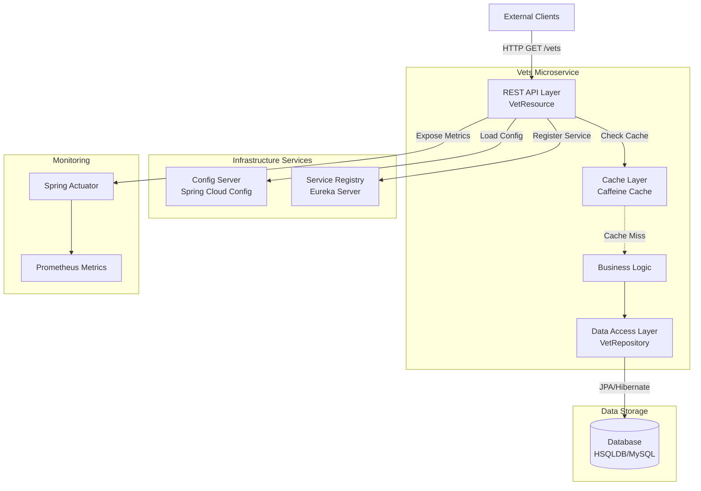
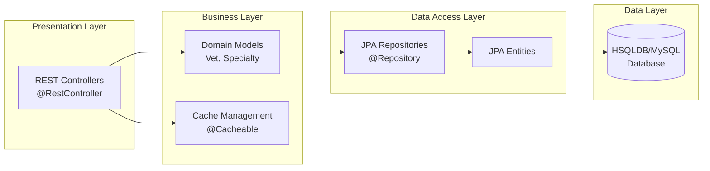

# Spring PetClinic Vets Service - Architecture Diagram

## Overview

| Property | Value |
|----------|-------|
| Application Name | vets-service |
| Application Type | Microservice (REST API) |
| Framework | Spring Boot 3.4.1 |
| Java Version | 17 |
| Build Tool | Maven |
| Architecture Pattern | Layered Architecture |
| Service Discovery | Spring Cloud Eureka |

## Application Architecture

### High-Level Architecture



### Layered Architecture



## Code Structure

### Main Components

| Component | Type | Description | Location |
|-----------|------|-------------|----------|
| VetsServiceApplication | Application Entry | Main Spring Boot application class | org.springframework.samples.petclinic.vets |
| VetResource | REST Controller | Exposes /vets endpoint for veterinarian data | org.springframework.samples.petclinic.vets.web |
| VetRepository | Repository | JPA repository for Vet entity operations | org.springframework.samples.petclinic.vets.model |
| Vet | Domain Entity | Represents a veterinarian with specialties | org.springframework.samples.petclinic.vets.model |
| Specialty | Domain Entity | Represents a veterinarian's specialty | org.springframework.samples.petclinic.vets.model |
| CacheConfig | Configuration | Caffeine cache configuration | org.springframework.samples.petclinic.vets.system |
| VetsProperties | Configuration | Custom properties for vets service | org.springframework.samples.petclinic.vets.system |

### Folder Structure

```
vets-service/
├── src/
│   ├── main/
│   │   ├── java/
│   │   │   └── org/springframework/samples/petclinic/vets/
│   │   │       ├── VetsServiceApplication.java
│   │   │       ├── model/
│   │   │       │   ├── Vet.java
│   │   │       │   ├── Specialty.java
│   │   │       │   └── VetRepository.java
│   │   │       ├── web/
│   │   │       │   └── VetResource.java
│   │   │       └── system/
│   │   │           ├── CacheConfig.java
│   │   │           └── VetsProperties.java
│   │   └── resources/
│   │       ├── application.yml
│   │       ├── logback-spring.xml
│   │       └── db/
│   │           ├── hsqldb/ (schema.sql, data.sql)
│   │           └── mysql/ (schema.sql, data.sql)
│   └── test/
│       └── java/
│           └── org/springframework/samples/petclinic/vets/web/
│               └── VetResourceTest.java
└── pom.xml
```

## Technology Stack

### Core Technologies

| Technology | Version | Purpose |
|------------|---------|---------|
| Spring Boot | 3.4.1 | Application framework and runtime |
| Java (JDK) | 17 | Programming language |
| Maven | - | Build and dependency management |

### Spring Framework

| Library | Version | Purpose |
|---------|---------|---------|
| Spring Cloud | 2024.0.0 | Cloud-native patterns and services |
| Spring Cloud Config | - | Centralized configuration management |
| Spring Cloud Eureka Client | - | Service discovery and registration |
| Spring Data JPA | - | Data persistence and ORM |
| Spring Web | - | REST API and web functionality |
| Spring Actuator | - | Production monitoring and management |
| Spring Cache | - | Caching abstraction |

### Azure Integration

| Library | Version | Purpose |
|---------|---------|---------|
| Spring Cloud Azure | 5.20.1 | Azure service integration |
| Azure JDBC MySQL | - | Azure MySQL database connectivity |

### Data & Caching

| Library | Version | Purpose |
|---------|---------|---------|
| Hibernate (JPA Provider) | - | ORM implementation |
| HSQLDB | - | Embedded database for development |
| MySQL Connector | - | MySQL database driver |
| Caffeine | - | High-performance in-memory cache |
| javax.cache API | - | JSR-107 caching standard |

### Monitoring & Observability

| Library | Version | Purpose |
|---------|---------|---------|
| Micrometer Prometheus | - | Metrics collection for Prometheus |
| Jolokia | 1.7.1 | JMX over HTTP for monitoring |
| Chaos Monkey | 3.1.0 | Resilience testing |

### Utilities

| Library | Version | Purpose |
|---------|---------|---------|
| Lombok | - | Reduce boilerplate code |
| Jakarta XML Bind API | - | XML binding support |

### Testing

| Library | Version | Purpose |
|---------|---------|---------|
| Spring Boot Test | - | Spring Boot testing support |
| JUnit Jupiter | - | Unit testing framework |

## Assessment Summary

Based on the AppCAT assessment report:

- **Total Issues Identified**: 7
- **Total Incidents**: 11
- **Estimated Effort**: 35 story points
- **Target Platforms**: Azure AKS, Azure App Service, Azure Container Apps

### Issue Categories

| Category | Count | Description |
|----------|-------|-------------|
| Remote Communication | 4 | Issues related to service communication patterns |
| Embedded Cache Management | 3 | Cache configuration and implementation concerns |
| Spring Migration | 2 | Spring framework upgrade considerations |
| Containerization | 1 | Container deployment readiness |
| Framework Upgrade | 1 | Framework version compatibility |

### Severity Distribution

| Severity | Count |
|----------|-------|
| Mandatory | 6 |
| Optional | 4 |
| Potential | 1 |

## Key Findings

1. **Spring Cloud Config**: Application uses Spring Cloud Config Server which needs migration to Azure App Configuration
2. **Service Discovery**: Eureka-based service discovery should be replaced with Azure-native solutions
3. **Cache Management**: Caffeine cache implementation should be evaluated for Azure Cache for Redis
4. **Database**: Currently supports both HSQLDB (dev) and MySQL (prod) - ready for Azure Database for MySQL

## Recommendations

1. **For Azure Container Apps**:
   - Migrate Spring Cloud Config to Azure App Configuration
   - Replace Eureka with Azure Container Apps service discovery
   - Consider Azure Cache for Redis for distributed caching

2. **For Azure Kubernetes Service (AKS)**:
   - Containerize the application (Dockerfile ready)
   - Use Azure Kubernetes native service discovery
   - Implement Azure-managed services for config and caching

3. **For Azure App Service**:
   - Configure Azure App Service for Spring Boot applications
   - Integrate with Azure App Configuration
   - Use Azure Cache for Redis for session management

---

*Generated on: 2026-02-11*  
*Assessment Tool: Java AppCAT CLI v1.0.0*
