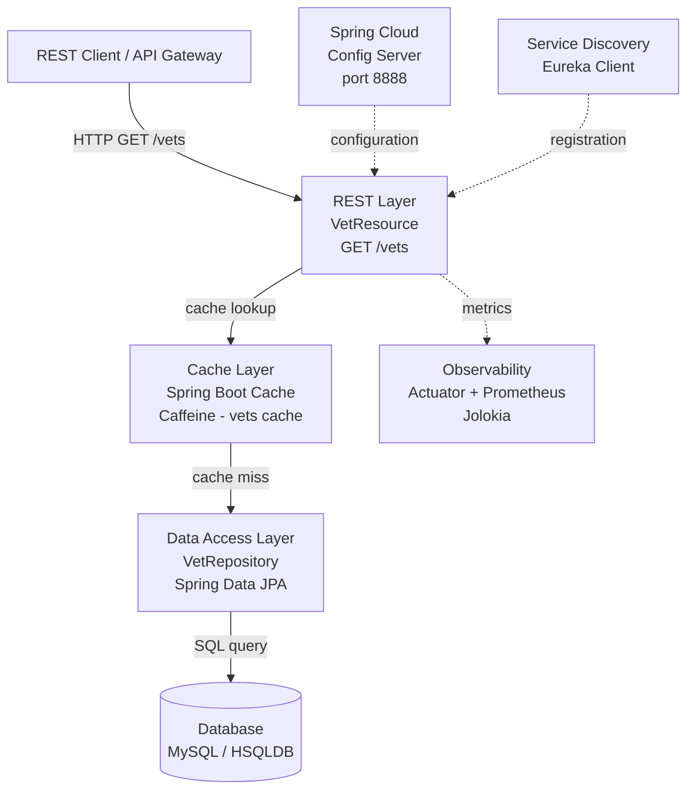
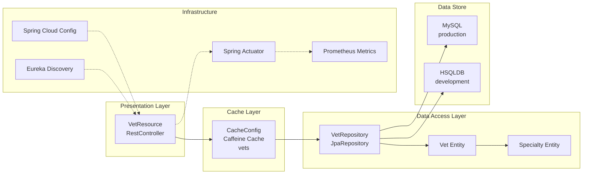

# Architecture Diagram: Spring PetClinic Vets Service

## Overview

| Property      | Value                        |
|---------------|------------------------------|
| App Name      | vets-service                 |
| Type          | Microservice (REST API)      |
| Framework     | Spring Boot 3.4.1            |
| Java Version  | 17                           |
| Build Tool    | Maven                        |
| Port          | 8081                         |

---

## Application Architecture

### High-Level Architecture

```mermaid
flowchart TD
    Client["REST Client / API Gateway"]
    VetResource["REST Layer\nVetResource\nGET /vets"]
    Cache["Cache Layer\nSpring Boot Cache\nCaffeine - vets cache"]
    VetRepo["Data Access Layer\nVetRepository\nSpring Data JPA"]
    DB[("Database\nMySQL / HSQLDB")]
    ConfigServer["Spring Cloud\nConfig Server\nport 8888"]
    Eureka["Service Discovery\nEureka Client"]
    Actuator["Observability\nActuator + Prometheus\nJolokia"]

    Client -->|HTTP GET /vets| VetResource
    VetResource -->|cache lookup| Cache
    Cache -->|cache miss| VetRepo
    VetRepo -->|SQL query| DB
    VetResource -.->|metrics| Actuator
    ConfigServer -.->|configuration| VetResource
    Eureka -.->|registration| VetResource
```

### Layered Architecture

```mermaid
flowchart LR
    subgraph Presentation["Presentation Layer"]
        RC["VetResource\nRestController"]
    end

    subgraph Caching["Cache Layer"]
        CC["CacheConfig\nCaffeine Cache\nvets"]
    end

    subgraph DataAccess["Data Access Layer"]
        VR["VetRepository\nJpaRepository"]
        VM["Vet Entity"]
        SM["Specialty Entity"]
    end

    subgraph Infrastructure["Infrastructure"]
        CS["Spring Cloud Config"]
        EU["Eureka Discovery"]
        ACT["Spring Actuator"]
        PROM["Prometheus Metrics"]
    end

    subgraph DataStore["Data Store"]
        MYSQL["MySQL\nproduction"]
        HSQL["HSQLDB\ndevelopment"]
    end

    RC --> CC
    CC --> VR
    VR --> VM
    VM --> SM
    VR --> MYSQL
    VR --> HSQL
    RC -.-> ACT
    ACT -.-> PROM
    CS -.-> RC
    EU -.-> RC
```

---

## Code Structure

### Components

| Component           | Class / File                  | Role                                      |
|---------------------|-------------------------------|-------------------------------------------|
| REST Controller     | VetResource                   | Exposes GET /vets endpoint                |
| Cache Configuration | CacheConfig                   | Enables Spring caching (production profile)|
| App Properties      | VetsProperties                | Configuration properties binding          |
| Data Model          | Vet                           | JPA entity for veterinarians              |
| Data Model          | Specialty                     | JPA entity for vet specialties            |
| Repository          | VetRepository                 | Spring Data JPA repository for vets       |
| Entry Point         | VetsServiceApplication        | Spring Boot application class             |

### Folder Structure

| Folder                                                   | Purpose                              |
|----------------------------------------------------------|--------------------------------------|
| src/main/java/.../vets/web                               | REST controllers                     |
| src/main/java/.../vets/model                             | JPA entities and repositories        |
| src/main/java/.../vets/system                            | Configuration and properties         |
| src/main/resources                                       | Application configuration (YAML)     |
| src/main/resources/db/hsqldb                             | HSQLDB SQL init scripts              |
| src/main/resources/db/mysql                              | MySQL SQL init scripts               |
| src/test/java/.../vets/web                               | REST controller unit tests           |

---

## Technology Stack

| Technology                  | Version    | Purpose                                    |
|-----------------------------|------------|--------------------------------------------|
| Java                        | 17         | Primary language                           |
| Spring Boot                 | 3.4.1      | Application framework                      |
| Spring Cloud                | 2024.0.0   | Microservice infrastructure                |
| Spring Cloud Config         | 2024.0.0   | Centralized configuration management       |
| Spring Cloud Netflix Eureka | 2024.0.0   | Service discovery client                   |
| Spring Data JPA             | 3.4.1      | Data access / ORM layer                    |
| Spring Boot Cache           | 3.4.1      | Caching abstraction                        |
| Caffeine                    | 3.x        | In-process cache implementation            |
| MySQL Connector             | runtime    | Production database driver                 |
| Azure JDBC Starter (MySQL)  | 5.20.1     | Azure-integrated MySQL connectivity        |
| HSQLDB                      | runtime    | In-memory database for development         |
| Lombok                      | provided   | Boilerplate code reduction                 |
| Spring Boot Actuator        | 3.4.1      | Health checks and management endpoints     |
| Micrometer Prometheus       | 3.4.1      | Metrics collection and Prometheus export   |
| Jolokia                     | 1.7.1      | JMX over HTTP                              |
| Chaos Monkey                | 3.1.0      | Chaos engineering / resilience testing     |
| Jakarta XML Bind API        | 4.x        | XML binding support                        |
| Maven                       | 3.x        | Build automation tool                      |
