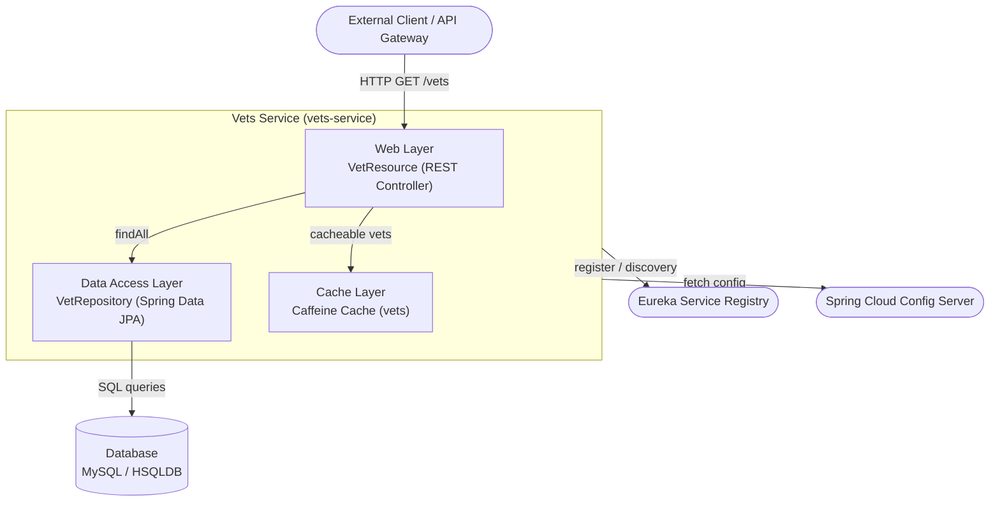
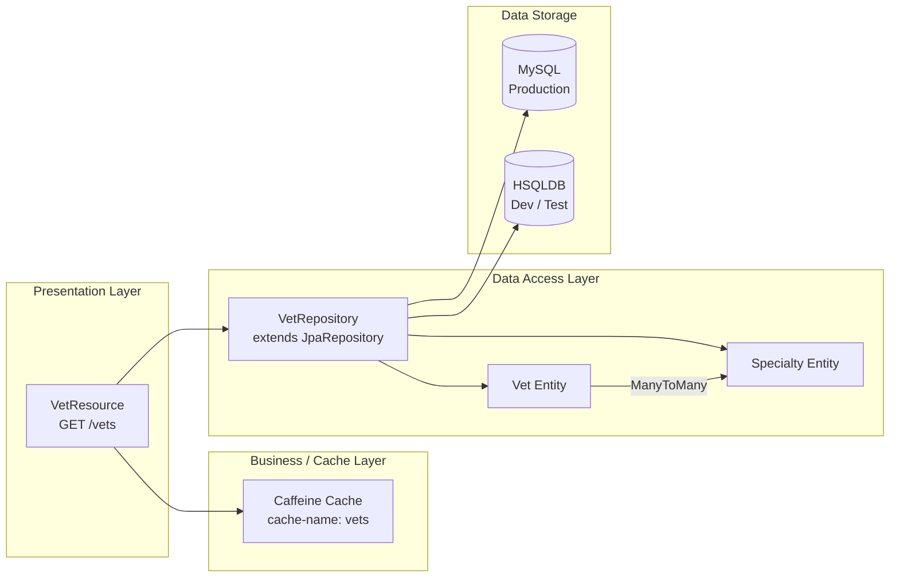

# Architecture Diagram: Spring PetClinic Vets Service

## Overview

| Property | Value |
|---|---|
| Application Name | Spring PetClinic Vets Service |
| Application Type | Microservice |
| Framework | Spring Boot 3.4.1 |
| Java Version | 17 |
| Build Tool | Maven |

---

## Application Architecture

### High-Level Architecture

```mermaid
flowchart TD
    Client([External Client / API Gateway]) -->|HTTP GET /vets| WebLayer

    subgraph VetsService["Vets Service (vets-service)"]
        WebLayer["Web Layer\nVetResource (REST Controller)"]
        DataLayer["Data Access Layer\nVetRepository (Spring Data JPA)"]
        CacheLayer["Cache Layer\nCaffeine Cache (vets)"]

        WebLayer -->|findAll| DataLayer
        WebLayer -->|cacheable vets| CacheLayer
    end

    DataLayer -->|SQL queries| DB[(Database\nMySQL / HSQLDB)]
    VetsService -->|register / discovery| Eureka([Eureka Service Registry])
    VetsService -->|fetch config| ConfigServer([Spring Cloud Config Server])
```

### Layered Architecture

```mermaid
flowchart LR
    subgraph Presentation["Presentation Layer"]
        REST["VetResource\nGET /vets"]
    end

    subgraph Business["Business / Cache Layer"]
        Cache["Caffeine Cache\ncache-name: vets"]
    end

    subgraph DataAccess["Data Access Layer"]
        Repo["VetRepository\nextends JpaRepository"]
        Vet["Vet Entity"]
        Specialty["Specialty Entity"]
    end

    subgraph Storage["Data Storage"]
        MySQL[(MySQL\nProduction)]
        HSQLDB[(HSQLDB\nDev / Test)]
    end

    REST --> Cache
    REST --> Repo
    Repo --> Vet
    Repo --> Specialty
    Vet -->|ManyToMany| Specialty
    Repo --> MySQL
    Repo --> HSQLDB
```

---

## Code Structure

### Components

| Component | Class / Interface | Responsibility |
|---|---|---|
| REST Controller | `VetResource` | Exposes `GET /vets` endpoint, applies caching |
| Domain Model | `Vet` | JPA entity representing a veterinarian |
| Domain Model | `Specialty` | JPA entity representing a vet specialty |
| Repository | `VetRepository` | Spring Data JPA repository for `Vet` |
| Cache Config | `CacheConfig` | Enables Spring caching (production profile) |
| Configuration | `VetsProperties` | Typed config for cache TTL and heap size |
| Entry Point | `VetsServiceApplication` | Spring Boot application bootstrap |

### Folder Structure

| Path | Purpose |
|---|---|
| `src/main/java/.../web` | REST controllers |
| `src/main/java/.../model` | JPA domain entities and repositories |
| `src/main/java/.../system` | Configuration and application properties |
| `src/main/resources` | `application.yml`, database scripts |
| `src/main/resources/db/hsqldb` | HSQLDB schema and seed data |
| `src/main/resources/db/mysql` | MySQL schema and seed data |
| `src/test/java/.../web` | Controller unit tests |

---

## Technology Stack

| Technology | Version | Purpose |
|---|---|---|
| Java | 17 | Runtime language |
| Spring Boot | 3.4.1 | Application framework |
| Spring Web MVC | (via Boot) | REST API layer |
| Spring Data JPA | (via Boot) | Data access abstraction |
| Spring Boot Actuator | (via Boot) | Health checks and metrics endpoints |
| Spring Boot Cache | (via Boot) | Caching abstraction |
| Spring Cloud Config | 2024.0.0 | Externalized configuration |
| Spring Cloud Netflix Eureka Client | 2024.0.0 | Service discovery and registration |
| Azure Spring Cloud JDBC MySQL | 5.20.1 | Azure-managed MySQL connectivity |
| Caffeine | (via Boot) | In-memory cache implementation |
| Hibernate / JPA | (via Boot) | ORM framework |
| MySQL Connector/J | (via Boot) | MySQL JDBC driver (production) |
| HSQLDB | (via Boot) | In-memory database (development/test) |
| Lombok | (via Boot) | Boilerplate reduction |
| Micrometer Prometheus | (via Boot) | Metrics export for Prometheus |
| Chaos Monkey | 3.1.0 | Chaos engineering / resilience testing |
| Jolokia | 1.7.1 | JMX-over-HTTP bridge |
