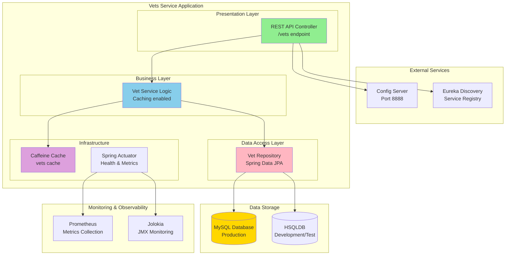

# Architecture Diagram - Spring PetClinic Vets Service

## Overview

| Property | Value |
|----------|-------|
| Application Name | Spring PetClinic Vets Service |
| Project Type | Java Spring Boot Microservice |
| Framework | Spring Boot 3.4.1 |
| Java Version | 17 |
| Build Tool | Maven |
| Packaging | JAR |
| Port | 8081 |

## Application Architecture

### High-Level System Architecture

### Application Component Flow

## Code Structure

### Main Components

| Component | Type | Description |
|-----------|------|-------------|
| VetsServiceApplication | Application | Main Spring Boot application entry point |
| VetResource | Controller | REST controller handling /vets endpoints |
| VetRepository | Repository | Spring Data JPA repository interface |
| Vet | Entity | JPA entity representing veterinarian |
| Specialty | Entity | JPA entity representing vet specialty |
| CacheConfig | Configuration | Caffeine cache configuration |
| VetsProperties | Configuration | Application properties configuration |

### Project Structure

| Directory | Purpose |
|-----------|---------|
| src/main/java/org/springframework/samples/petclinic/vets | Main application code |
| src/main/java/.../vets/model | Domain model (entities, repositories) |
| src/main/java/.../vets/web | REST controllers |
| src/main/java/.../vets/system | System configuration and properties |
| src/main/resources | Application configuration files |
| src/test/java | Unit and integration tests |

## Technology Stack

### Core Technologies

| Technology | Version | Purpose |
|------------|---------|---------|
| Java | 17 | Programming language |
| Spring Boot | 3.4.1 | Application framework |
| Spring Cloud | 2024.0.0 | Microservices framework |
| Maven | - | Build tool |

### Key Dependencies

| Dependency | Version | Purpose |
|------------|---------|---------|
| Spring Boot Starter Web | 3.4.1 | REST API development |
| Spring Boot Starter Data JPA | 3.4.1 | Database access with JPA/Hibernate |
| Spring Boot Starter Actuator | 3.4.1 | Production monitoring and management |
| Spring Boot Starter Cache | 3.4.1 | Caching abstraction |
| Spring Cloud Config | 2024.0.0 | Centralized configuration |
| Spring Cloud Eureka Client | 2024.0.0 | Service discovery |
| Azure Spring Cloud JDBC MySQL | 5.20.1 | Azure MySQL integration |
| MySQL Connector | runtime | MySQL database driver |
| HSQLDB | runtime | In-memory database for dev/test |
| Caffeine | - | High-performance caching library |
| Lombok | provided | Code generation (getters/setters) |
| Micrometer Prometheus | - | Metrics export to Prometheus |
| Jolokia | 1.7.1 | JMX over HTTP |
| Chaos Monkey | 3.1.0 | Chaos engineering testing |

### Testing

| Technology | Purpose |
|------------|---------|
| Spring Boot Starter Test | Testing framework |
| JUnit Jupiter | Unit testing |

## Architecture Patterns

### Microservices Patterns

- **Service Discovery**: Uses Netflix Eureka for service registration and discovery
- **Centralized Configuration**: Uses Spring Cloud Config Server for externalized configuration
- **API Gateway Pattern**: Part of larger microservices architecture (gateway not in this service)
- **Health Checks**: Spring Actuator provides health endpoints for container orchestration

### Design Patterns

- **Repository Pattern**: Data access abstraction using Spring Data JPA
- **REST Resource Pattern**: RESTful API design with VetResource controller
- **Cache-Aside Pattern**: Application-managed caching with Caffeine
- **Dependency Injection**: Spring's IoC container for loose coupling

### Azure-Ready Features

- **Azure MySQL Integration**: Uses Azure-specific JDBC starter for MySQL
- **Cloud-Native**: Stateless design suitable for container deployment
- **12-Factor App**: Externalized config, port binding, disposability
- **Observability**: Metrics, health checks, and monitoring endpoints

## Deployment Considerations

### Container Readiness

- JAR packaging suitable for containerization
- Exposed port: 8081 (configurable)
- Docker build configuration present
- Profile-based configuration (production, docker, test)

### Azure Target Platforms

Based on the assessment configuration, this service can be deployed to:

1. **Azure Kubernetes Service (AKS)**: Full container orchestration
2. **Azure App Service**: Managed application hosting
3. **Azure Container Apps**: Serverless container platform

### External Dependencies

- **Config Server**: Required for application configuration (http://localhost:8888 or http://config-server:8888)
- **Eureka Server**: Required for service discovery and registration
- **MySQL Database**: Required for production data persistence
- **HSQLDB**: Optional, for development/testing only

---

*Generated from AppCAT assessment results*
